# Transform Framework (TF/TF2) trong ROS2

## Mục lục

- [Transform Framework (TF/TF2) trong ROS2](#transform-framework-tftf2-trong-ros2)
  - [Mục lục](#mục-lục)
  - [1. Giới thiệu về TF (Transform Framework)](#1-giới-thiệu-về-tf-transform-framework)
    - [1.1 Tại sao cần TF?](#11-tại-sao-cần-tf)
    - [1.2 TF không truyền dữ liệu cảm biến](#12-tf-không-truyền-dữ-liệu-cảm-biến)
    - [1.3 TF lưu trữ cái gì?](#13-tf-lưu-trữ-cái-gì)
    - [1.4 Cấu trúc cây (Tree) của TF](#14-cấu-trúc-cây-tree-của-tf)
  - [2. Coordinate Frame (Hệ tọa độ)](#2-coordinate-frame-hệ-tọa-độ)
    - [2.1 Định nghĩa](#21-định-nghĩa)
    - [2.2 Frame ≠ Sensor](#22-frame--sensor)
    - [2.3 Frame ≠ Topic](#23-frame--topic)
    - [2.4 Parent và Child Frame](#24-parent-và-child-frame)
  - [3. Transform](#3-transform)
    - [3.1 Định nghĩa](#31-định-nghĩa)
    - [3.2 Thành phần của Transform](#32-thành-phần-của-transform)
    - [3.3 Transform thay đổi theo thời gian](#33-transform-thay-đổi-theo-thời-gian)
  - [4. Pose](#4-pose)
    - [4.1 Định nghĩa](#41-định-nghĩa)
    - [4.2 Position](#42-position)
    - [4.3 Orientation](#43-orientation)
    - [4.4 Ví dụ trực quan về Pose](#44-ví-dụ-trực-quan-về-pose)
  - [5. Twist](#5-twist)
    - [5.1 Định nghĩa](#51-định-nghĩa)
    - [5.2 Pose vs Twist](#52-pose-vs-twist)
    - [5.3 Twist là đạo hàm của Pose?](#53-twist-là-đạo-hàm-của-pose)
    - [5.4 Ví dụ thực tế](#54-ví-dụ-thực-tế)
  - [6. Các ROS Message liên quan](#6-các-ros-message-liên-quan)
    - [6.1 geometry\_msgs/Pose](#61-geometry_msgspose)
    - [6.2 PoseWithCovarianceStamped](#62-posewithcovariancestamped)
    - [6.3 TwistWithCovarianceStamped](#63-twistwithcovariancestamped)
    - [6.4 nav\_msgs/Odometry](#64-nav_msgsodometry)
  - [7. `/odom` Topic và TF `odom → base_link`](#7-odom-topic-và-tf-odom--base_link)
    - [7.1 Hai khái niệm hoàn toàn khác nhau](#71-hai-khái-niệm-hoàn-toàn-khác-nhau)
    - [7.2 Chúng liên quan như thế nào?](#72-chúng-liên-quan-như-thế-nào)
    - [7.3 TF lấy dữ liệu ở đâu?](#73-tf-lấy-dữ-liệu-ở-đâu)
    - [7.4 Ví dụ với Isaac Sim](#74-ví-dụ-với-isaac-sim)
  - [8. TF Tree thay đổi theo thời gian như thế nào?](#8-tf-tree-thay-đổi-theo-thời-gian-như-thế-nào)
    - [8.1 Cấu trúc không đổi](#81-cấu-trúc-không-đổi)
    - [8.2 Giá trị transform thay đổi](#82-giá-trị-transform-thay-đổi)
    - [8.3 `map → odom` cũng thay đổi](#83-map--odom-cũng-thay-đổi)
    - [8.4 Ví dụ toàn bộ quá trình](#84-ví-dụ-toàn-bộ-quá-trình)
  - [9. TF2 tính toán transform như thế nào?](#9-tf2-tính-toán-transform-như-thế-nào)
    - [9.1 Transform Composition](#91-transform-composition)
    - [9.2 Ví dụ thực tế với LiDAR](#92-ví-dụ-thực-tế-với-lidar)
    - [9.3 TF2 sử dụng thời gian](#93-tf2-sử-dụng-thời-gian)
  - [References](#references)

---

## 1. Giới thiệu về TF (Transform Framework)

### 1.1 Tại sao cần TF?

Một robot di động hiện đại thường bao gồm nhiều thành phần:

- Thân robot
- LiDAR
- Camera RGB
- Camera Depth
- IMU
- GPS
- Encoder
- Tay máy (nếu có)

Mỗi cảm biến đều "nhìn" thế giới từ một vị trí khác nhau. LiDAR được lắp phía trước, Camera được lắp cao hơn, IMU nằm ở giữa.

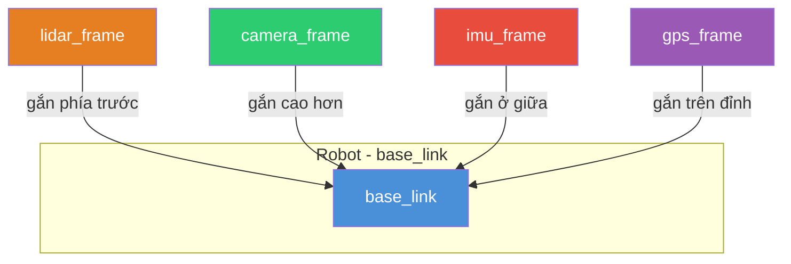

*Hình 1: Mỗi cảm biến trên robot gắn ở một vị trí khác nhau, mỗi vị trí là một coordinate frame riêng.*

Điều này dẫn tới câu hỏi:

> Nếu LiDAR phát hiện vật cản ở (2.0, 0.5), thì đó là tọa độ trong hệ nào?
>
> Nếu Camera phát hiện người ở (2.0, 0.5), thì có phải cùng vị trí không?
>
> Nếu Wheel Encoder nói robot đã đi 1 m, thì 1 m đó được tính từ đâu?

Nếu không có một hệ thống quản lý các hệ tọa độ, mỗi node sẽ phải tự biết cách chuyển đổi giữa hàng chục hệ tọa độ khác nhau. Điều này không thể mở rộng khi robot có nhiều cảm biến.

Chính vì vậy ROS đưa ra **TF (Transform Framework)** để quản lý quan hệ giữa các hệ tọa độ. TF2 là phiên bản hiện đại của thư viện này.

> 📌 **TF2 (Transform Framework v2)**: Thư viện chuẩn trong ROS dùng để quản lý quan hệ hình học giữa các coordinate frame, có khả năng lưu lịch sử transform theo thời gian và thực hiện các phép biến đổi không gian giữa các frame.
> *Nguồn: [Nav2 Documentation — Transforms Introduction](https://docs.nav2.org/setup_guides/transformation/setup_transforms.html)*

---

### 1.2 TF không truyền dữ liệu cảm biến

Một hiểu lầm phổ biến là "TF dùng để truyền dữ liệu robot". Điều này **không đúng**. TF **không truyền dữ liệu cảm biến**.

| Thành phần | Dữ liệu publish | Kiểu message |
|---|---|---|
| LiDAR | `/scan` | `sensor_msgs/LaserScan` |
| Camera | `/image_raw` | `sensor_msgs/Image` |
| IMU | `/imu` | `sensor_msgs/Imu` |
| Wheel Encoder | `/odom` | `nav_msgs/Odometry` |

TF chỉ trả lời câu hỏi: **Frame A đang ở đâu so với Frame B?**

Ví dụ:
- `base_link` so với `lidar` — LiDAR được gắn ở đâu trên thân robot?
- `map` so với `base_link` — Robot đang ở đâu trong bản đồ?

Các topic `/scan`, `/image_raw` chứa *dữ liệu cảm biến* (điểm laser, pixel ảnh). TF chứa *quan hệ hình học* giữa các frame để bạn biết dữ liệu đó được đo từ đâu.

---

### 1.3 TF lưu trữ cái gì?

TF không lưu "robot". TF không lưu "map". TF chỉ lưu:

> **Transform giữa hai Coordinate Frame.**

Một transform chỉ gồm hai thành phần:

1. **Translation** (dịch chuyển) — vị trí tương đối
2. **Rotation** (quay) — hướng tương đối

Ví dụ: LiDAR được gắn cách tâm robot 25 cm về phía trước và 15 cm cao hơn:

```text
Transform base_link → lidar:
  Translation: x = 0.25 m, y = 0 m, z = 0.15 m
  Rotation:    yaw = 0°
```

Con số này không thay đổi trong suốt quá trình robot hoạt động — đây là **static transform** (sẽ nói rõ hơn ở phần 8).

---

### 1.4 Cấu trúc cây (Tree) của TF

ROS quy định các frame phải tạo thành **một cây (tree)**, không phải đồ thị tổng quát.

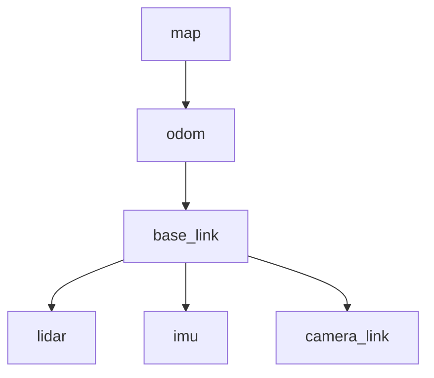

*Hình 2: Cấu trúc cây TF chuẩn của một robot di động. Mỗi frame chỉ có một parent, nhưng có thể có nhiều child.*

Trong cây này:
- Mỗi frame chỉ có **một parent** duy nhất
- Mỗi frame có thể có **nhiều child**

Điều này giúp TF2 luôn tìm được một đường duy nhất giữa hai frame bất kỳ trong cùng cây — yêu cầu thiết kế để tránh mâu thuẫn giữa nhiều transform khác nhau.

> 📌 **REP-105**: ROS Enhancement Proposal quy định các coordinate frame chuẩn cho mobile robot, bao gồm `map`, `odom`, `base_link`, `earth` và mối quan hệ cây giữa chúng.
> *Nguồn: [REP-105 — Coordinate Frames for Mobile Platforms](https://reps.openrobotics.org/rep-0105/)*

---

## 2. Coordinate Frame (Hệ tọa độ)

### 2.1 Định nghĩa

> 📌 **Coordinate Frame**: Một hệ tọa độ dùng làm mốc để biểu diễn vị trí và hướng của các đối tượng khác. Một frame gồm gốc tọa độ (origin) và ba trục X, Y, Z vuông góc.
> *Nguồn: [REP-103 — Standard Units of Measure and Coordinate Conventions](https://reps.openrobotics.org/rep-0103/)*

Mỗi frame có:
- Một **gốc tọa độ** (origin) — điểm (0, 0, 0) của frame đó
- Ba **trục** X, Y, Z — xác định hướng

REP-103 quy định hệ tọa độ thuận (right-handed) với hướng chuẩn:
- **X** — forward (phía trước)
- **Y** — left (bên trái)
- **Z** — up (lên trên)

```text
        Y (left)
        ▲
        │
        │
        O────────► X (forward)
       ╱
      ╱
   Z (up)
```

Mọi pose đều phải được mô tả **trong một frame cụ thể**. Nếu không chỉ rõ frame, thông tin về vị trí là vô nghĩa.

---

### 2.2 Frame ≠ Sensor

Nhiều người nhầm tên frame như `lidar` là cảm biến. Thực tế:
- **LiDAR** là phần cứng (hardware)
- `lidar` trong TF là **Coordinate Frame** gắn trên cảm biến đó

Frame là một hệ tọa độ ảo, không phải thiết bị vật lý.

---

### 2.3 Frame ≠ Topic

Ví dụ:
- `/odom` là **Topic** — luồng dữ liệu ROS
- `odom` là **Frame** — một hệ tọa độ

Hai khái niệm hoàn toàn khác nhau, dù trùng tên. Phần 7 sẽ phân tích chi tiết sự nhầm lẫn này.

---

### 2.4 Parent và Child Frame

Ví dụ transform `odom` → `base_link`:

```text
odom (parent)
  ↓
base_link (child)
```

Quy ước: **Transform từ parent đến child** mô tả **pose của child trong hệ tọa độ parent**.

```text
odom → base_link:
  = Pose của base_link được biểu diễn trong hệ tọa độ odom
```

Đây là quy ước xuyên suốt của TF2 và cũng là cách các message như `nav_msgs/Odometry` sử dụng `header.frame_id` và `child_frame_id`.

---

## 3. Transform

### 3.1 Định nghĩa

> 📌 **Transform**: Phép biến đổi hình học từ một coordinate frame sang frame khác, bao gồm translation (dịch chuyển) và rotation (quay).
> *Nguồn: [Nav2 Setup Transforms Guide](https://docs.nav2.org/setup_guides/transformation/setup_transforms.html)*

Ví dụ transform `odom` → `base_link` mô tả:
- Robot cách gốc `odom` bao xa
- Robot quay bao nhiêu

Nó **không phải** bản thân robot, mà là quan hệ hình học giữa hai frame.

---

### 3.2 Thành phần của Transform

Một transform luôn có hai thành phần:

| Thành phần | Ý nghĩa | Ví dụ |
|---|---|---|
| **Translation** | Khoảng cách tịnh tiến | `x = 2.0 m`, `y = 0 m`, `z = 0 m` |
| **Rotation** | Góc quay (biểu diễn bằng quaternion trong ROS) | `qx=0, qy=0, qz=0.707, qw=0.707` |

```cpp
// Cấu trúc của một transform trong ROS 2
geometry_msgs/msg/Transform
  geometry_msgs/msg/Vector3 translation    // x, y, z
  geometry_msgs/msg/Quaternion rotation   // x, y, z, w
```

Ví dụ robot đi 2 m về phía trước:

```text
t = 0:   odom → base_link:  x = 0
t = 5s:  odom → base_link:  x = 2

→ Translation thay đổi từ 0 → 2 m
```

Nếu robot quay 90°:

```text
→ Quaternion thay đổi (rotation)
```

---

### 3.3 Transform thay đổi theo thời gian

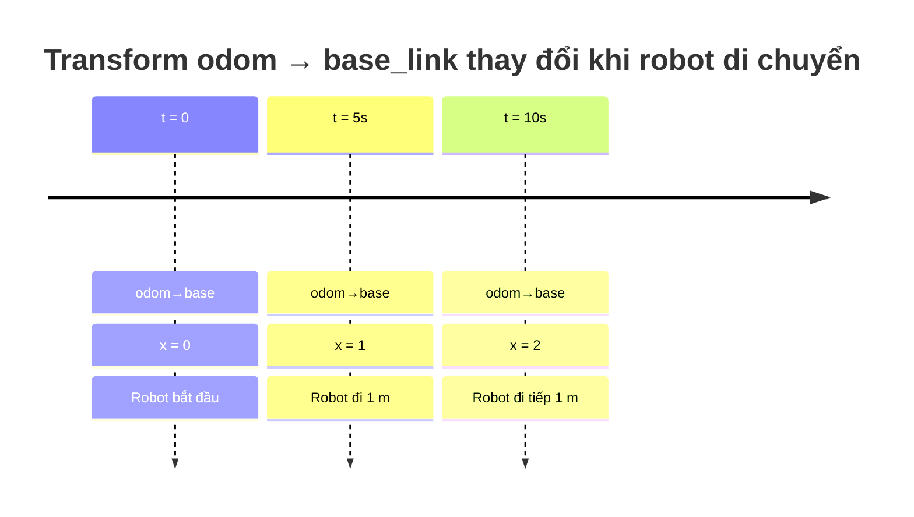

*Hình 3: Transform `odom → base_link` thay đổi giá trị theo thời gian khi robot di chuyển.*

Điều quan trọng: TF2 **không chỉ lưu giá trị hiện tại**. TF2 còn lưu **lịch sử transform theo thời gian** (time-stamped transforms), cho phép các node yêu cầu transform tại đúng thời điểm của dữ liệu cảm biến.

> 📌 **Time-stamped transform**: Transform được gắn timestamp, cho phép TF2 truy vấn quan hệ hình học giữa hai frame tại một thời điểm bất kỳ trong quá khứ. Đây là tính năng cốt lõi giúp TF2 được gọi là thư viện "time-aware transformations".
> *Nguồn: [Nav2 Documentation](https://docs.nav2.org/)*

---

## 4. Pose

### 4.1 Định nghĩa

> 📌 **Pose**: Trạng thái hình học đầy đủ của một vật thể trong không gian, gồm position (vị trí) và orientation (hướng).
> *Nguồn: [geometry_msgs/Pose](https://docs.ros2.org/foxy/api/geometry_msgs/msg/Pose.html)*

```text
Pose = Position + Orientation

Position  →  "Ở đâu?"
Orientation → "Quay như thế nào?"
```

```cpp
// geometry_msgs/msg/Pose
geometry_msgs/msg/Point position      // x, y, z
geometry_msgs/msg/Quaternion orientation // x, y, z, w
```

### 4.2 Position

Position cho biết robot đang ở tọa độ nào trong một frame tham chiếu.

```text
x = 2, y = 1
```

nghĩa là robot đứng cách gốc 2 m theo trục X và 1 m theo trục Y.

Trong ROS 2, position dùng kiểu `geometry_msgs/msg/Point` với ba số float: x, y, z. Đơn vị là **mét** (theo REP-103).

> 📌 **REP-103**: Quy định ROS sử dụng SI units: mét cho khoảng cách, radian cho góc, giây cho thời gian.
> *Nguồn: [REP-103 — Standard Units of Measure and Coordinate Conventions](https://reps.openrobotics.org/rep-0103/)*

### 4.3 Orientation

Orientation mô tả hướng quay của robot. Trong trực giác, chúng ta thường dùng roll-pitch-yaw:

```text
Roll  →  quay quanh trục X
Pitch →  quay quanh trục Y
Yaw   →  quay quanh trục Z
```

Tuy nhiên, ROS lưu orientation bằng **Quaternion** thay vì Euler angles.

> 📌 **Quaternion**: Biểu diễn toán học 4 thành phần (x, y, z, w) dùng để mô tả phép quay trong không gian 3D. Quaternion tránh được hiện tượng gimbal lock và cho phép nội suy quay ổn định, là biểu diễn chuẩn trong ROS theo REP-103.
> *Nguồn: [REP-103 — Standard Units of Measure and Coordinate Conventions](https://reps.openrobotics.org/rep-0103/)*

Ví dụ robot quay trái 90°: Position không đổi, Orientation thay đổi.

### 4.4 Ví dụ trực quan về Pose

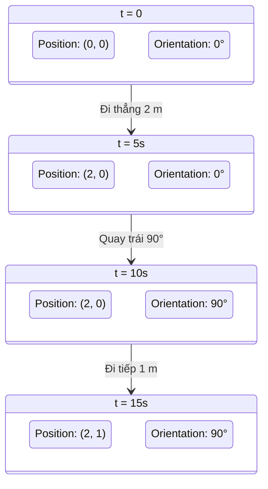

*Hình 4: Ví dụ Pose thay đổi theo thời gian. Position thay đổi khi robot tịnh tiến, Orientation thay đổi khi robot quay.*

Qua ví dụ này có thể thấy:
- **Position** thay đổi khi robot tịnh tiến
- **Orientation** thay đổi khi robot quay
- **Pose** là sự kết hợp của cả hai

Đây cũng chính là đại lượng mà các thuật toán state estimation (EKF/UKF), localization (AMCL, SLAM Toolbox) và Nav2 trao đổi thông qua TF hoặc các message như `nav_msgs/Odometry` và `geometry_msgs/PoseWithCovarianceStamped`.

---

## 5. Twist

### 5.1 Định nghĩa

Nếu **Pose** trả lời "Robot đang ở đâu?", thì **Twist** trả lời "Robot đang chuyển động như thế nào?".

> Pose mô tả **trạng thái (state)** — vị trí và hướng hiện tại.
>
> Twist mô tả **tốc độ thay đổi của state** — vận tốc.

```cpp
// geometry_msgs/msg/Twist
geometry_msgs/msg/Vector3 linear     // linear.x, linear.y, linear.z
geometry_msgs/msg/Vector3 angular    // angular.x, angular.y, angular.z
```

Twist gồm hai thành phần:

```text
Twist = Linear Velocity + Angular Velocity

Linear Velocity  →  "Robot đang chạy nhanh bao nhiêu?"
Angular Velocity →  "Robot đang quay nhanh bao nhiêu?"
```

Đối với robot di động 2D, thường chỉ dùng:

```text
linear.x   →  vận tốc tới
angular.z  →  vận tốc quay (yaw rate)
```

Các thành phần còn lại bằng 0.

---

### 5.2 Pose vs Twist

Đây là nhầm lẫn phổ biến nhất. Ví dụ:

Robot đứng tại `x = 2, y = 1`:

```text
Pose:  (2, 1)   →  vị trí hiện tại
Twist: 0        →  robot đang đứng yên
```

Khi robot bắt đầu chạy với `linear.x = 0.5 m/s`:

```text
Pose vẫn là (2, 1) ở thời điểm hiện tại
Twist đã thay đổi thành 0.5 m/s
```

| Đại lượng | Pose | Twist |
|---|---|---|
| Câu hỏi | Robot đang ở đâu? | Robot đang chạy thế nào? |
| Thành phần | Position + Orientation | Linear + Angular Velocity |
| Thay đổi khi | Robot di chuyển | Vận tốc thay đổi |
| Ví dụ | (2, 1), 90° | linear.x = 0.5, angular.z = 0.1 |

---

### 5.3 Twist là đạo hàm của Pose?

Về mặt toán học: **Đúng**.

```text
Velocity = d(Pose)/dt
```

Ví dụ robot từ `x = 0` lúc `t = 0` đến `x = 5` sau 10 giây:

```text
Twist.linear.x = 5 m / 10 s = 0.5 m/s
```

Controller của Nav2 không cần biết robot đang ở đâu trong quá khứ. Nó chỉ cần biết robot hiện đang di chuyển với vận tốc bao nhiêu để tính toán lệnh điều khiển tiếp theo. Đây là lý do `nav_msgs/Odometry` luôn chứa cả Pose và Twist.

---

### 5.4 Ví dụ thực tế

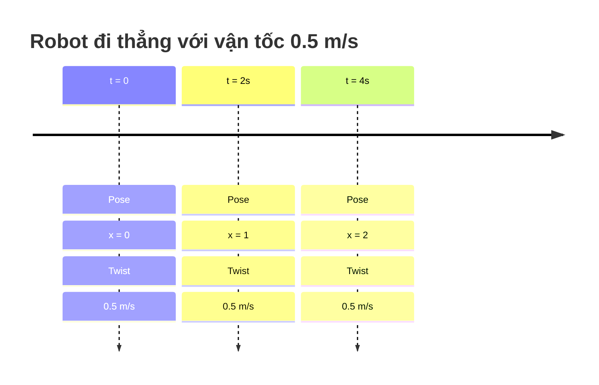

*Hình 5: Pose thay đổi theo thời gian nhưng Twist không đổi nếu robot giữ nguyên vận tốc.*

Khi robot dừng lại: `Pose: x = 2` giữ nguyên, `Twist: 0`.

---

## 6. Các ROS Message liên quan

Trong ROS Navigation, 4 message thường xuất hiện nhất. Nhiều người nhầm rằng chúng gần giống nhau, nhưng thực tế chúng phục vụ các mục đích hoàn toàn khác nhau.

| Message | Chứa | Có covariance? | Có timestamp? | Mục đích |
|---|---|---|---|---|
| `geometry_msgs/Pose` | Position + Orientation | ✗ | ✗ | Đơn giản nhất, chỉ pose thuần |
| `PoseWithCovarianceStamped` | Position + Orientation + Covariance | ✓ | ✓ | Localization output (ví dụ AMCL) |
| `TwistWithCovarianceStamped` | Linear + Angular Velocity + Covariance | ✓ | ✓ | Vận tốc kèm độ tin cậy |
| `nav_msgs/Odometry` | Pose + Twist + Covariance | ✓ | ✓ | Message quan trọng nhất |

### 6.1 geometry_msgs/Pose

Đây là message đơn giản nhất. Chỉ chứa Position và Orientation.

```cpp
geometry_msgs/msg/Pose
  geometry_msgs/msg/Point position      // x, y, z
  geometry_msgs/msg/Quaternion orientation // x, y, z, w
```

Không có velocity. Không có covariance.

### 6.2 PoseWithCovarianceStamped

Đây là Pose + độ tin cậy (Covariance) + Timestamp.

Ví dụ AMCL publish:

```cpp
geometry_msgs/msg/PoseWithCovarianceStamped
  std_msgs/Header header
  geometry_msgs/msg/PoseWithCovariance pose
    geometry_msgs/msg/Pose pose
    float64[36] covariance  // ma trận 6x6
```

Nghĩa là: Robot đang ở `(2, 1)` và thuật toán cũng cho biết nó **tin tưởng** kết quả này ở mức nào thông qua ma trận covariance.

> 📌 **Covariance matrix**: Ma trận 6×6 biểu diễn độ không chắc chắn (uncertainty) của ước lượng pose — 3 thành phần position (x, y, z) và 3 thành phần orientation (roll, pitch, yaw). Giá trị càng nhỏ, độ tin cậy càng cao.
> *Nguồn: [REP-103 — Covariance Representation](https://reps.openrobotics.org/rep-0103/)*

### 6.3 TwistWithCovarianceStamped

Tương tự PoseWithCovarianceStamped nhưng dành cho Twist:

```text
Velocity
  + Covariance
  + Timestamp
```

Ví dụ: `linear.x = 0.5` kèm độ tin cậy của vận tốc đó.

### 6.4 nav_msgs/Odometry

Đây là **message quan trọng nhất** trong Navigation.

```cpp
nav_msgs/msg/Odometry
  std_msgs/Header header           // frame_id = "odom"
  string child_frame_id            // frame_id = "base_link"
  geometry_msgs/msg/PoseWithCovariance pose
  geometry_msgs/msg/TwistWithCovariance twist
```

Một message duy nhất mô tả toàn bộ:
- Robot ở đâu (pose trong `header.frame_id`)
- Robot quay thế nào (orientation trong pose)
- Robot đang chạy bao nhiêu (twist.linear trong `child_frame_id`)
- Robot đang quay bao nhiêu (twist.angular)
- Độ tin cậy của tất cả các giá trị trên (covariance)

> 📌 **nav_msgs/Odometry theo specification**: Trường `pose` được biểu diễn trong frame `header.frame_id` (thường là `odom`), trường `twist` được biểu diễn trong frame `child_frame_id` (thường là `base_link`).
> *Nguồn: [nav_msgs/Odometry](https://docs.ros2.org/foxy/api/nav_msgs/msg/Odometry.html)*

---

<a name="section-7"></a>
## 7. `/odom` Topic và TF `odom → base_link`

<a name="section-7-1"></a>
### 7.1 Hai khái niệm hoàn toàn khác nhau

Nhiều người nghĩ `/odom` chính là `odom → base_link`. Điều này **không đúng**.

| `/odom` (Topic) | `odom → base_link` (TF Transform) |
|---|---|
| ROS Topic | Quan hệ giữa hai frame |
| Kiểu `nav_msgs/Odometry` | Transform (Translation + Rotation) |
| Chứa Pose + Twist + Covariance | Chỉ chứa Translation + Rotation |

Một cái là **Topic**, một cái là **Transform** trong TF tree.

<a name="section-7-2"></a>
### 7.2 Chúng liên quan như thế nào?

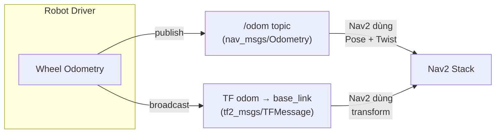

*Hình 6: Robot driver thường publish cả topic `/odom` và TF `odom → base_link`. Hai thành phần này được publish song song.*

Khi robot driver publish `/odom`:

```cpp
// Trong nav_msgs/Odometry message:
header.frame_id = "odom"       // pose được biểu diễn trong frame odom
child_frame_id  = "base_link"  // twist được biểu diễn trong frame base_link
```

Nếu driver cũng broadcast TF `odom → base_link`:
- Transform được tạo từ **cùng nguồn odometry** (dữ liệu encoder)
- Nhưng TF và `/odom` topic là **hai kênh riêng biệt**, không phải TF được tạo từ topic

<a name="section-7-3"></a>
### 7.3 TF lấy dữ liệu ở đâu?

Nếu dùng `robot_localization` package, EKF sẽ publish TF `odom → base_link` thay cho driver:

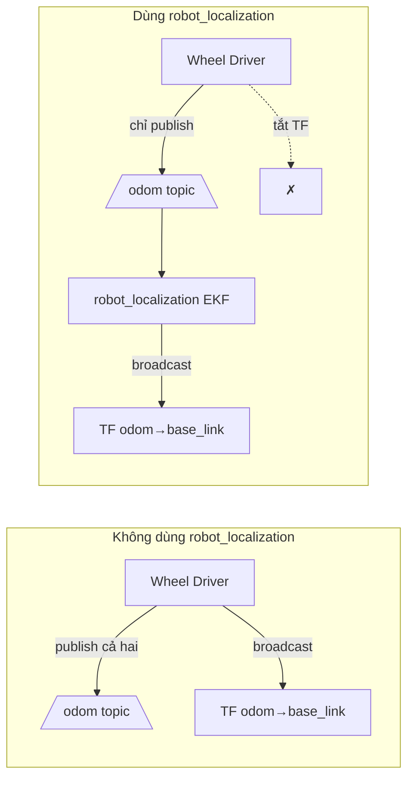

*Hình 7: Khi dùng robot_localization, cần tắt TF broadcaster của driver để tránh xung đột.*

> Nav2 khuyến nghị chỉ nên có **một nguồn** publish transform `odom → base_link`. Nếu dùng `robot_localization` để publish TF thì cần tắt TF broadcaster của driver.

<a name="section-7-4"></a>
### 7.4 Ví dụ với Isaac Sim

Trong Isaac Sim, Action Graph publish:
- `/odom` topic (nav_msgs/Odometry) — chứa pose + twist
- `odom → base_link` transform (TF) — song song

Nav2 **không đọc TF từ `/odom`** cũng **không tạo TF từ message**. Hai thành phần được publish song song, độc lập.

Khi TF bị thiếu:

```text
Nav2 báo lỗi: "No transform from odom to base_link"
mặc dù topic /odom vẫn tồn tại
```

---

<a name="section-8"></a>
## 8. TF Tree thay đổi theo thời gian như thế nào?

<a name="section-8-1"></a>
### 8.1 Cấu trúc không đổi

Rất nhiều người nghĩ "TF Tree là cây tĩnh". Điều này không hoàn toàn đúng.

**Cấu trúc cây** (ai là parent của ai) là tĩnh:

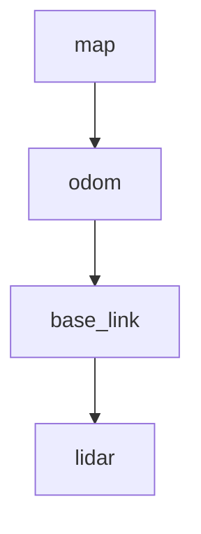

*Hình 8: Cấu trúc cây TF không thay đổi trong suốt quá trình robot hoạt động.*

Trong suốt thời gian robot hoạt động, cây này không đổi. Parent-child không đổi.

<a name="section-8-2"></a>
### 8.2 Giá trị transform thay đổi

Tuy cấu trúc tĩnh, **giá trị transform thay đổi theo thời gian**:

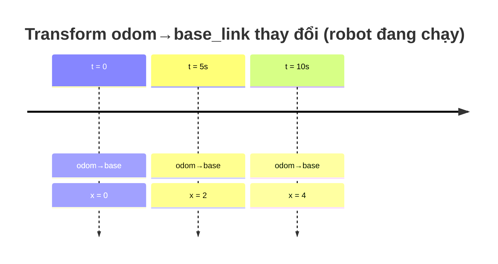

*Hình 9: Giá trị transform `odom → base_link` thay đổi khi robot di chuyển.*

Trong khi đó, `base_link → lidar` luôn cố định:

```text
base_link → lidar: x = 0.25 m  (không đổi)
```

Đây là **Static Transform** — transform giữa frame gắn trên cùng một body (ví dụ LiDAR gắn trên thân robot).

<a name="section-8-3"></a>
### 8.3 `map → odom` cũng thay đổi

Đây là điểm gây nhầm lẫn nhất. `map → odom` cũng thay đổi theo thời gian, nhưng không phải vì robot di chuyển, mà vì **drift của odometry được hiệu chỉnh**.

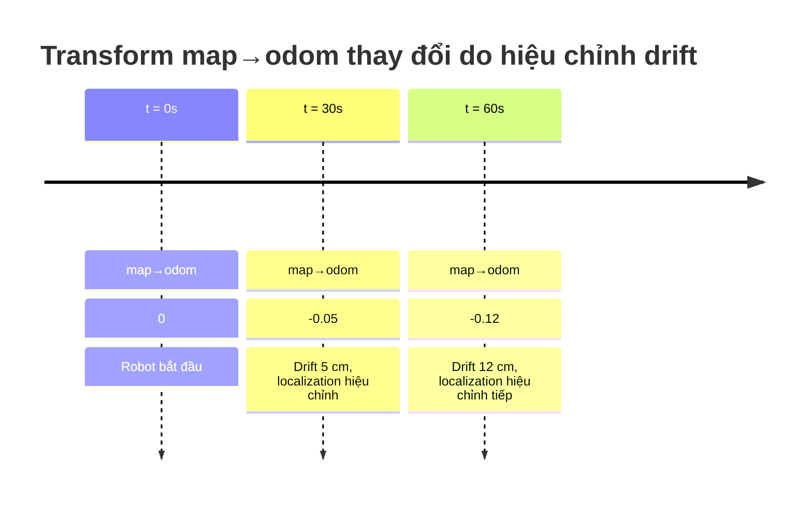

*Hình 10: Transform `map → odom` thay đổi dần do localization hiệu chỉnh sai số tích lũy của odometry.*

> 📌 **`map→odom` không phải tọa độ của `odom`**. Nó là **offset dùng để hiệu chỉnh sai số của odometry**.
>
> REP-105 định nghĩa: `map` là khung toàn cục có thể hiệu chỉnh (có bước nhảy), `odom` là khung cục bộ liên tục (không có bước nhảy) nhưng bị drift.
> *Nguồn: [REP-105 — Coordinate Frames for Mobile Platforms](https://reps.openrobotics.org/rep-0105/)*

<a name="section-8-4"></a>
### 8.4 Ví dụ toàn bộ quá trình

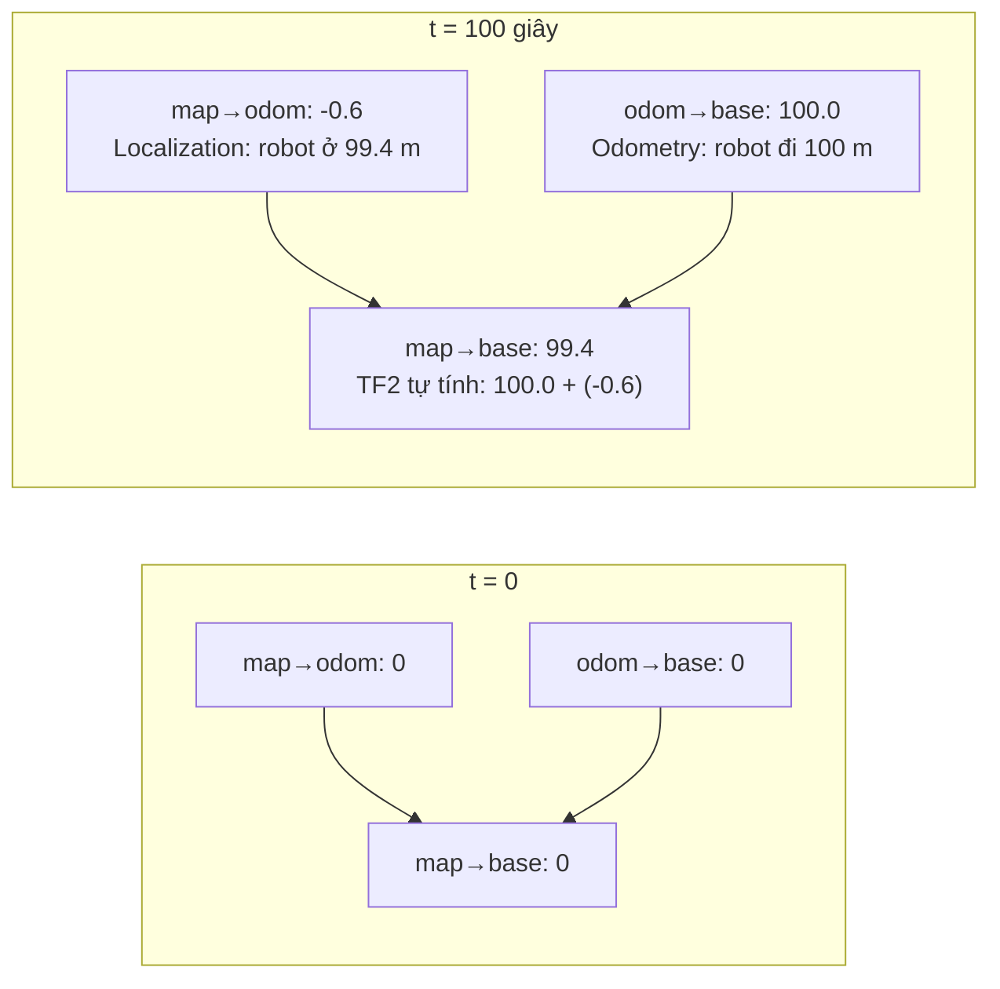

*Hình 11: TF2 kết hợp `odom→base` (từ odometry) và `map→odom` (từ localization) để suy ra `map→base`. Odometry nói robot đi 100 m, localization nói thực tế robot ở 99.4 m, nên offset là -0.6.*

Đây là lý do trong RViz bạn sẽ thấy transform `map → odom` thay đổi dần theo thời gian trên robot thật, trong khi ở mô phỏng lý tưởng (ít drift) transform này gần như bằng identity trong suốt quá trình chạy.

---

<a name="section-9"></a>
## 9. TF2 tính toán transform như thế nào?

TF2 **không "đo" vị trí robot**. TF2 **không chạy EKF**. TF2 **không chạy AMCL**.

TF2 chỉ làm một việc:

> **Ghép (compose) các transform đã tồn tại trong TF tree.**

<a name="section-9-1"></a>
### 9.1 Transform Composition

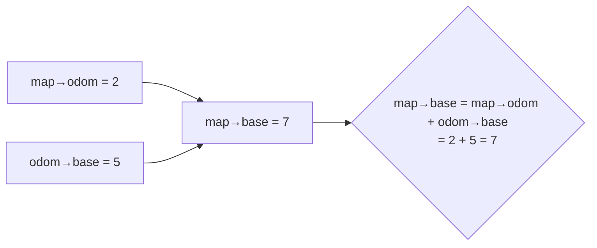

*Hình 12: TF2 tính transform `map→base` bằng cách ghép (compose) `map→odom` và `odom→base`.*

Cho `map→odom = 2` và `odom→base = 5`, TF2 sẽ tính:

```text
map → base = map → odom + odom → base
           = 2 + 5
           = 7
```

Đây chính là phép **hợp thành transform** (transform composition).

<a name="section-9-2"></a>
### 9.2 Ví dụ thực tế với LiDAR

Giả sử TF tree:

```text
map → odom → base_link → lidar
```

Nếu LiDAR phát hiện vật cản cách 1 m phía trước robot (trong frame `lidar`), TF2 có thể suy ra tọa độ vật cản trong frame `map` bằng cách lần lượt đi qua các transform trong cây:

```text
Tọa độ trong map
  = map→odom  +  odom→base_link  +  base_link→lidar  +  (1 m trong frame lidar)
```

Đây là lý do mọi cảm biến đều cần được gắn đúng vào TF tree — nếu `lidar` frame không nằm trong cây, Nav2 không thể suy ra vật cản ở đâu trong map.

<a name="section-9-3"></a>
### 9.3 TF2 sử dụng thời gian

Khác với ma trận biến đổi thông thường, TF2 lưu:

```text
Transform + Timestamp
```

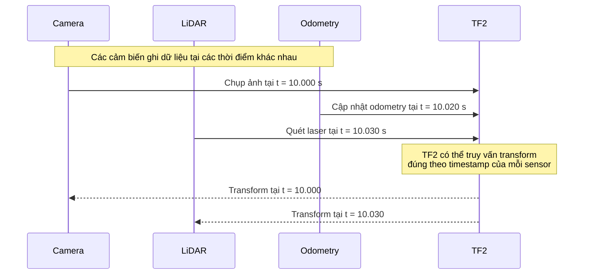

*Hình 13: TF2 lưu transform kèm timestamp, cho phép đồng bộ dữ liệu cảm biến thu tại các thời điểm khác nhau.*

Nếu Camera chụp ảnh tại `10.000 s` và LiDAR quét tại `10.030 s`, TF2 có thể truy vấn transform đúng theo từng thời điểm. Đây là một trong những chức năng quan trọng nhất của TF2 đối với hệ thống robot thời gian thực.

---

## References

1. [Nav2 Documentation — Transforms Introduction & Setup Guide](https://docs.nav2.org/setup_guides/transformation/setup_transforms.html)
2. [Nav2 Documentation — Overview](https://docs.nav2.org/)
3. [REP-103 — Standard Units of Measure and Coordinate Conventions](https://reps.openrobotics.org/rep-0103/)
4. [REP-105 — Coordinate Frames for Mobile Platforms](https://reps.openrobotics.org/rep-0105/)
5. [ROS 2 TF2 — Introduction to TF2](https://docs.ros.org/en/humble/Tutorials/Intermediate/Tf2/Introduction-To-Tf2.html)
6. [geometry_msgs/Pose — ROS 2 Foxy API](https://docs.ros2.org/foxy/api/geometry_msgs/msg/Pose.html)
7. [nav_msgs/Odometry — ROS 2 Foxy API](https://docs.ros2.org/foxy/api/nav_msgs/msg/Odometry.html)
