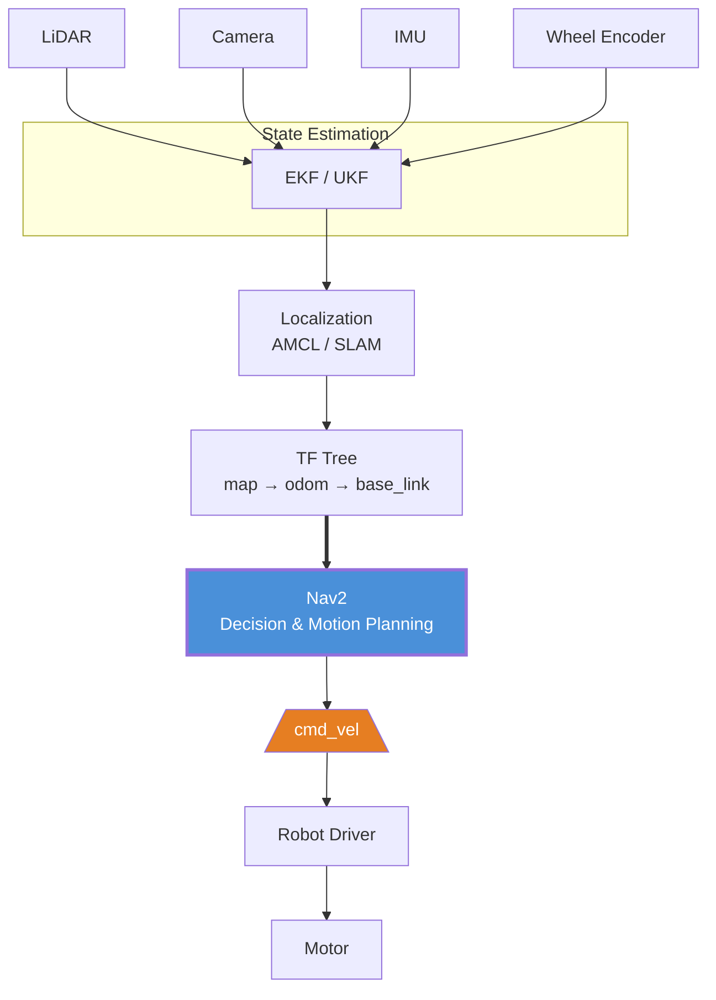
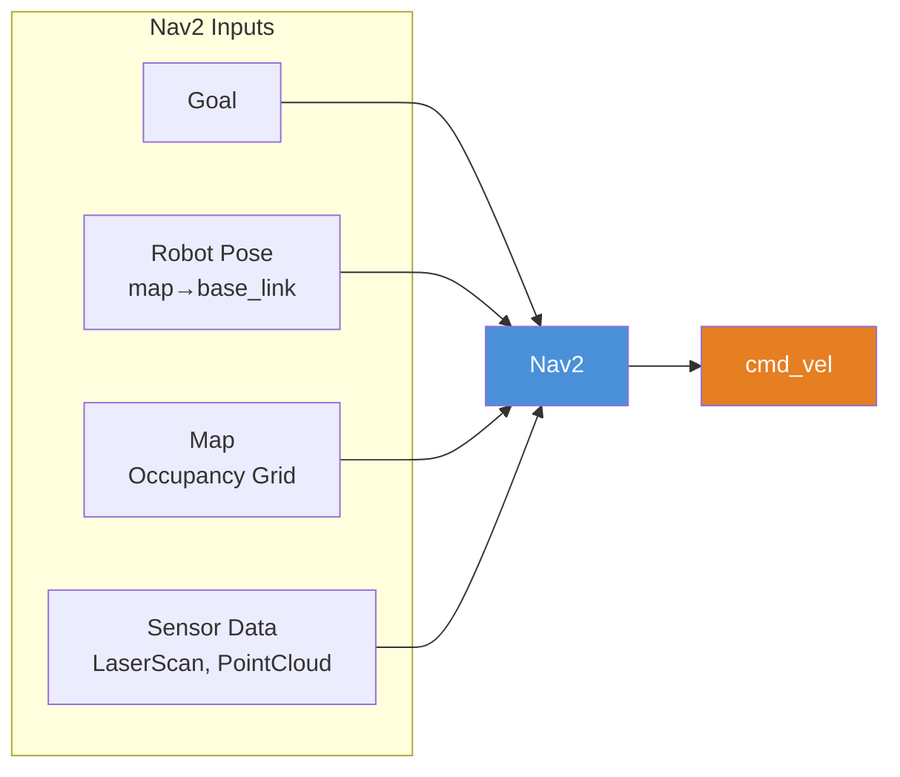
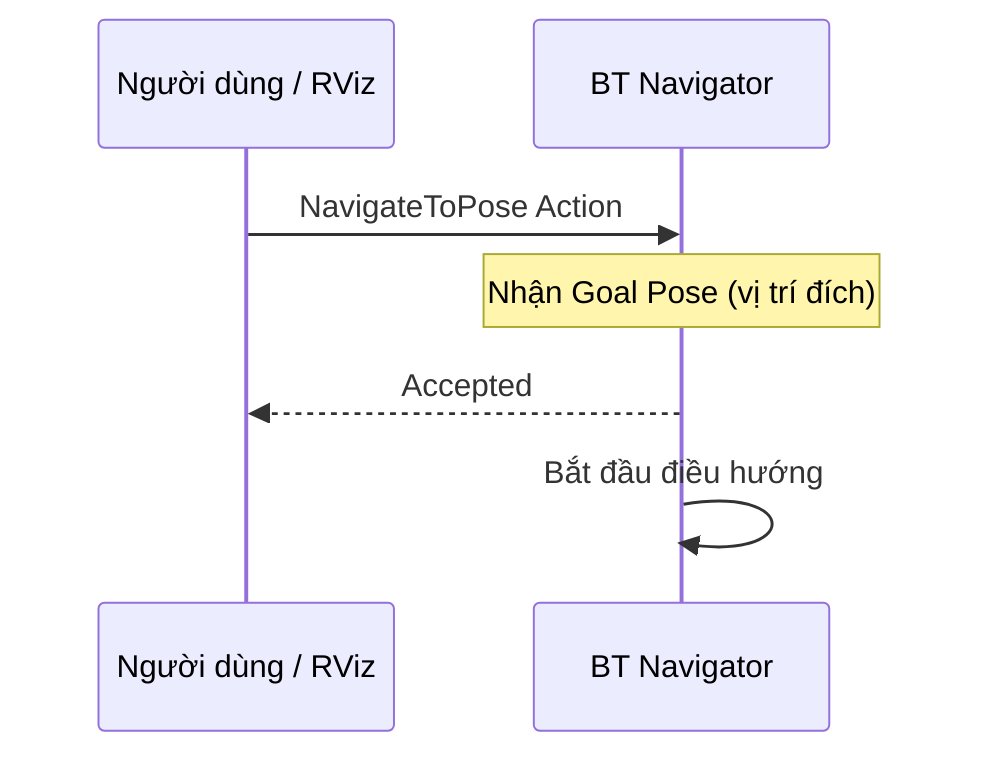
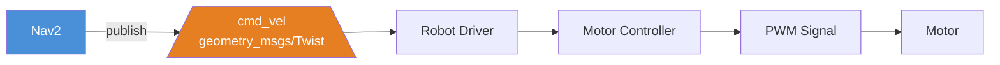
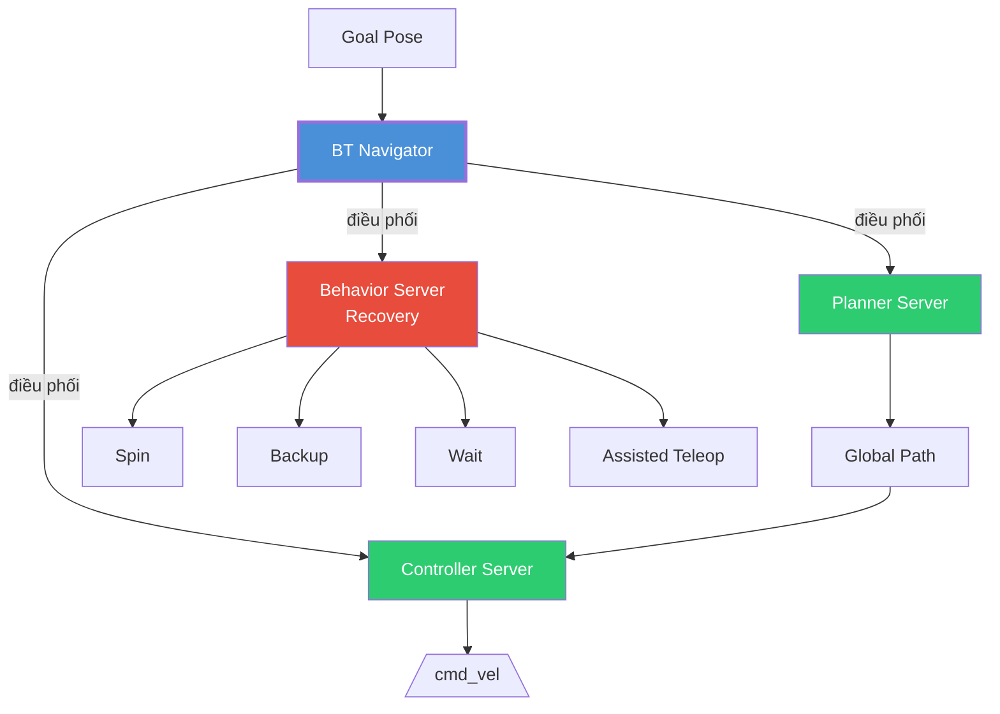
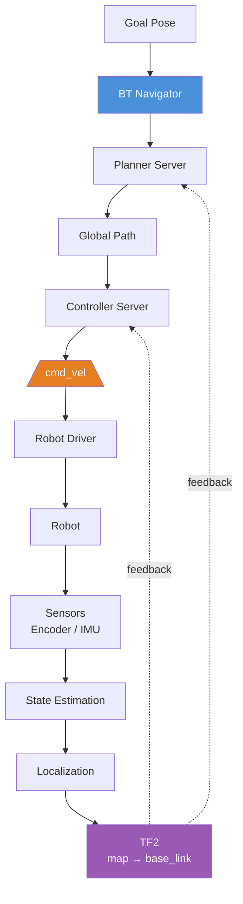
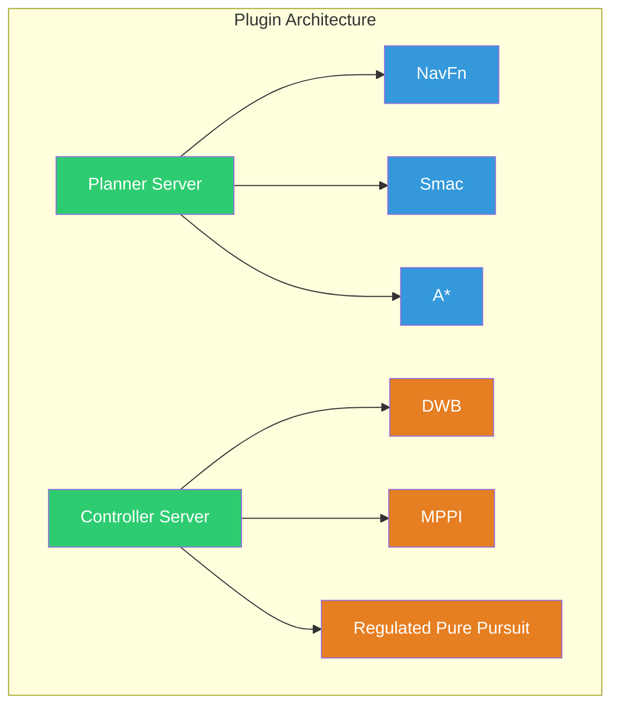
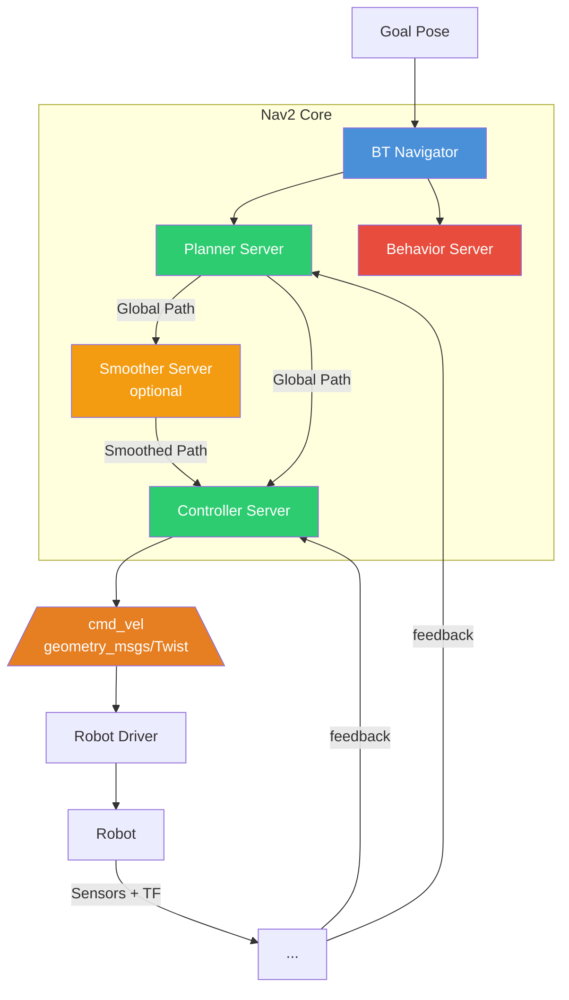
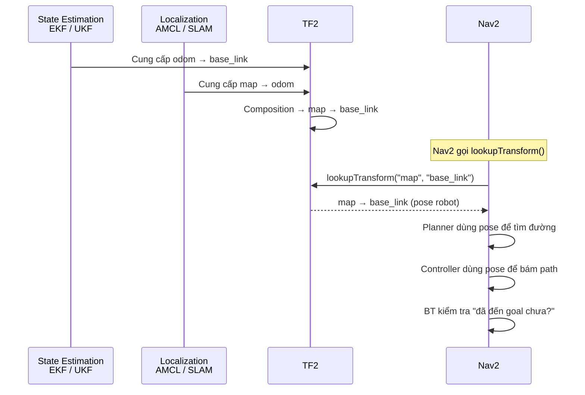
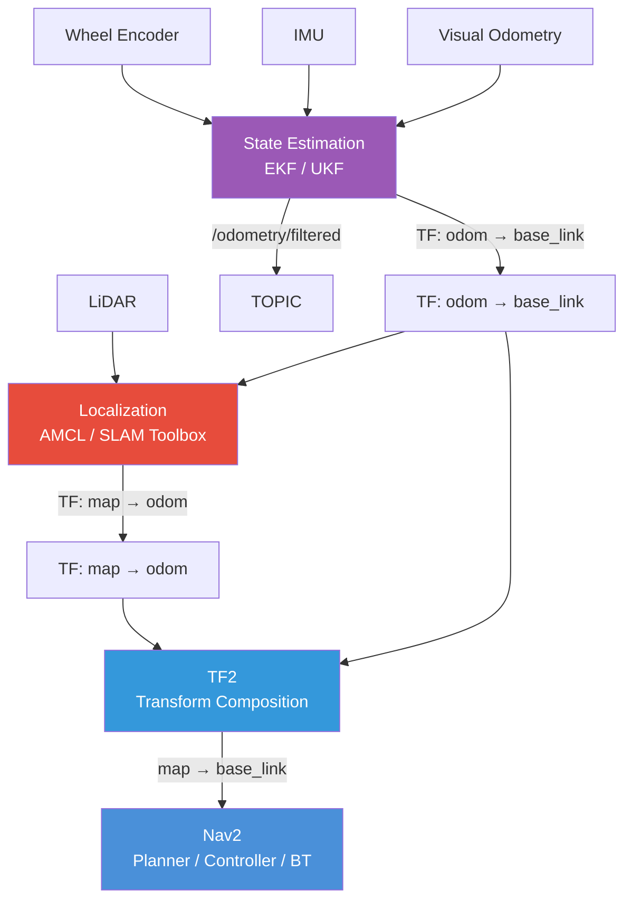

# Navigation2 (Nav2) — Navigation Framework cho ROS2

## Mục lục

- [Navigation2 (Nav2) — Navigation Framework cho ROS2](#navigation2-nav2--navigation-framework-cho-ros2)
  - [Mục lục](#mục-lục)
  - [1. Giới thiệu về Nav2](#1-giới-thiệu-về-nav2)
    - [1.1 Nav2 là gì?](#11-nav2-là-gì)
    - [1.2 Vị trí của Nav2 trong pipeline tổng thể](#12-vị-trí-của-nav2-trong-pipeline-tổng-thể)
  - [2. Input của Nav2](#2-input-của-nav2)
    - [2.1 Goal](#21-goal)
    - [2.2 Robot Pose](#22-robot-pose)
    - [2.3 Map](#23-map)
    - [2.4 Sensor Data](#24-sensor-data)
  - [3. Output của Nav2](#3-output-của-nav2)
  - [4. Kiến trúc tổng thể của Nav2](#4-kiến-trúc-tổng-thể-của-nav2)
    - [4.1 Action Servers và BT Navigator](#41-action-servers-và-bt-navigator)
    - [4.2 Luồng dữ liệu tổng thể — Closed-loop](#42-luồng-dữ-liệu-tổng-thể--closed-loop)
  - [5. Các thành phần chính](#5-các-thành-phần-chính)
    - [5.1 Bảng tổng hợp thành phần](#51-bảng-tổng-hợp-thành-phần)
    - [5.2 Plugin-based servers](#52-plugin-based-servers)
  - [6. Nav2 và TF](#6-nav2-và-tf)
    - [6.1 Nav2 consume TF, không tự tính pose](#61-nav2-consume-tf-không-tự-tính-pose)
    - [6.2 Điều kiện TF tree tối thiểu](#62-điều-kiện-tf-tree-tối-thiểu)
    - [6.3 Luồng dữ liệu hoàn chỉnh — State Estimation → Localization → TF2 → Nav2](#63-luồng-dữ-liệu-hoàn-chỉnh--state-estimation--localization--tf2--nav2)
  - [References](#references)

---

## 1. Giới thiệu về Nav2

### 1.1 Nav2 là gì?

Navigation2 (Nav2) là **navigation framework chính thức của ROS2**.

Mục tiêu của Nav2 là:

> Cho robot tự động đi từ vị trí hiện tại đến vị trí đích một cách an toàn.

Tuy nhiên, Nav2 **không** thực hiện:
- Đọc encoder
- Fusion sensor
- Localization
- SLAM

Nav2 **giả sử** tất cả các thông tin này đã được cung cấp bởi các node khác.

> 📌 **Navigation2 (Nav2)**: Tầng Decision & Motion Planning trong pipeline robot. Nó trả lời câu hỏi: "Robot nên đi đường nào và điều khiển bánh xe như thế nào để đến Goal?"
> *Nguồn: [Nav2 Documentation — Navigation Concepts](https://docs.nav2.org/concepts/index.html)*

```text
Nav2 trả lời:
  "Đường nào?"   → Planner (lập kế hoạch đường đi)
  "Đi thế nào?"  → Controller (sinh lệnh vận tốc)
```

Theo Nav2 Concepts, navigation stack được xây dựng dưới dạng tập hợp các **Lifecycle Nodes** và **Action Servers**, trong đó **BT Navigator** điều phối Planner, Controller, Recovery và các thành phần khác để hoàn thành nhiệm vụ điều hướng.

> 📌 **Lifecycle Node** (Managed Node): Node có vòng đời được quản lý (unconfigured → inactive → active → finalized), cho phép khởi động, tạm dừng, reset có kiểm soát toàn bộ stack.
> *Nguồn: [Nav2 Lifecycle Manager Documentation](https://api.nav2.org/nav2-jazzy/html/md_nav2_lifecycle_manager_README.html)*

> 📌 **Action Server**: Server xử lý các ROS 2 Action — giao tiếp bất đồng bộ cho phép gửi goal, nhận feedback và kết quả. Các thành phần Nav2 (Planner, Controller, Behavior...) đều là Action Server.
> *Nguồn: [Nav2 Documentation — Concepts](https://docs.nav2.org/concepts/index.html)*

---

### 1.2 Vị trí của Nav2 trong pipeline tổng thể

Nav2 chỉ xuất hiện **sau khi** robot đã biết vị trí của mình. Nó **không tham gia** vào quá trình tính pose.



*Hình 1: Vị trí của Nav2 trong toàn bộ pipeline của robot. Nav2 nằm sau State Estimation và Localization, trước Robot Driver.*

Có thể thấy Nav2 chỉ xuất hiện **sau khi** robot đã biết vị trí của mình thông qua TF Tree. Nav2 tiêu thụ TF (`map → base_link`), costmap và goal để sinh ra lệnh điều khiển, chứ không tự thực hiện localization hay state estimation.

---

## 2. Input của Nav2

Một hiểu lầm rất phổ biến là "Nav2 chỉ cần map". Điều này không đúng. Nav2 cần **bốn nguồn dữ liệu**:



*Hình 2: Bốn đầu vào của Nav2: Goal, Robot Pose, Map, Sensor Data.*

### 2.1 Goal

Nav2 cần biết robot muốn đi đâu.



Trong Nav2, giao diện điều hướng mức cao được thực hiện thông qua các ROS 2 Action như `NavigateToPose` hoặc `NavigateThroughPoses`, và BT Navigator chính là Action Server xử lý các yêu cầu này.

### 2.2 Robot Pose

Nav2 cần biết robot hiện đang ở đâu, nhưng **Nav2 không tự tính**. Nó gọi TF2:

```cpp
// Nav2 gọi TF2 để lấy vị trí robot
tf_buffer.lookupTransform(
    "map",
    "base_link",
    time);
```

TF2 trả về `map → base_link`. Planner và Controller đều sử dụng transform này.

Đây là lý do toàn bộ TF Tree phải hoạt động chính xác **trước khi** Nav2 có thể chạy.

### 2.3 Map

Planner cần biết môi trường để tìm đường.

```text
Map Server
    ↓
Occupancy Grid (bản đồ ô lưới)
    ↓
Planner tìm đường trên Occupancy Grid
```

> 📌 **Occupancy Grid**: Bản đồ dạng lưới 2D, mỗi ô (cell) mang giá trị xác suất có vật cản. Đây là biểu diễn môi trường chuẩn cho các thuật toán tìm đường.
> *Nguồn: [Nav2 Documentation — Concepts](https://docs.nav2.org/concepts/index.html)*

Trong chế độ Mapping (SLAM), map có thể liên tục cập nhật. Trong chế độ Localization, map thường là bản đồ tĩnh do Map Server cung cấp.

### 2.4 Sensor Data

Controller không chỉ nhìn map. Nó còn cần obstacle hiện tại từ cảm biến.

```text
LiDAR
    ↓
LaserScan / PointCloud
    ↓
Obstacle Layer (costmap layer)
    ↓
Local Costmap
    ↓
Controller
```

Điều này giúp robot tránh các vật cản mới xuất hiện mà static map chưa có. Theo Nav2, Planner và Controller đều làm việc trên costmap, trong đó costmap được cập nhật từ dữ liệu cảm biến.

> 📌 **Costmap**: Bản đồ chi phí được xây dựng từ static map và dữ liệu cảm biến. Mỗi ô có một "chi phí" (cost) — càng gần vật cản, cost càng cao. Nav2 có hai loại: Global Costmap (dùng cho Planner) và Local Costmap (dùng cho Controller).
> *Nguồn: [Nav2 Documentation — Costmaps and Layers](https://docs.nav2.org/concepts/index.html#costmaps-and-layers)*

---

## 3. Output của Nav2

Output cuối cùng của toàn bộ Nav2 không phải Path, không phải Pose — mà là:

```text
geometry_msgs/Twist
```

được publish lên topic `/cmd_vel`.

```cpp
// geometry_msgs/msg/Twist
geometry_msgs/msg/Vector3 linear    // linear.x (vận tốc tới)
geometry_msgs/msg/Vector3 angular   // angular.z (vận tốc quay)
```



*Hình 3: Output của Nav2 là lệnh vận tốc `/cmd_vel`. Robot Driver nhận và chuyển thành tín hiệu điều khiển motor.*

Điều này giải thích vì sao Isaac Sim chỉ cần subscribe `/cmd_vel` là robot có thể di chuyển. Nav2 kết thúc pipeline bằng việc phát lệnh vận tốc tuyến tính và góc thông qua Controller Server.

---

## 4. Kiến trúc tổng thể của Nav2

### 4.1 Action Servers và BT Navigator

Theo tài liệu chính thức, Nav2 được xây dựng từ nhiều **Action Servers** độc lập.



*Hình 4: Kiến trúc tổng thể của Nav2. BT Navigator là orchestration layer, điều phối Planner, Controller và Behavior Server.*

Điểm đặc biệt của Nav2 là **BT Navigator không trực tiếp lập kế hoạch, không điều khiển, không tránh vật cản**. Nó chỉ **điều phối** (orchestration).

Theo Nav2 Concepts, BT Navigator đóng vai trò orchestration layer, còn Planner Server, Controller Server, Behavior Server... là các Action Server thực hiện từng nhiệm vụ cụ thể.

> 📌 **BT Navigator** (Behavior Tree Navigator): Action Server trung tâm của Nav2, sử dụng Behavior Tree (cây hành vi) để điều phối thứ tự thực hiện giữa Planner, Controller và các hành động recovery.
> *Nguồn: [Nav2 Documentation — BT Navigator](https://docs.nav2.org/configuration/packages/configuring-bt-navigator.html)*

> 📌 **Recovery Behavior**: Các hành động khôi phục khi robot gặp sự cố (kẹt, lạc đường, không tìm được path...), bao gồm Spin (quay tại chỗ), Backup (lùi), Wait (chờ), Assisted Teleop (điều khiển tay).
> *Nguồn: [Nav2 Documentation — Behaviors](https://docs.nav2.org/concepts/index.html#behaviors)*

### 4.2 Luồng dữ liệu tổng thể — Closed-loop

Toàn bộ pipeline của Nav2 là một **vòng lặp kín (closed-loop)**:



*Hình 5: Luồng dữ liệu closed-loop của Nav2. Robot không lập kế hoạch một lần, mà liên tục đọc pose mới, cập nhật costmap, tính lại điều khiển.*

Robot liên tục:
1. Đọc pose mới từ TF (`map → base_link`)
2. Cập nhật costmap (từ sensor data)
3. Tính lại điều khiển (Controller)
4. Phát `/cmd_vel`
5. Nhận lại trạng thái mới từ TF

Đây là kiến trúc điều khiển phản hồi (feedback control) mà Nav2 sử dụng để đảm bảo robot luôn điều chỉnh theo trạng thái thực tế thay vì chỉ bám theo một kế hoạch cố định.

---

## 5. Các thành phần chính

### 5.1 Bảng tổng hợp thành phần

| Thành phần | Input | Output | Vai trò |
|---|---|---|---|
| **BT Navigator** | Goal, trạng thái các Action Server | Điều phối các tác vụ | Điều khiển logic điều hướng (orchestration) |
| **Planner Server** | Goal, `map→base_link`, Global Costmap | Global Path (`nav_msgs/Path`) | Tìm đường từ vị trí hiện tại đến goal |
| **Controller Server** | Global Path, `map→base_link`, Local Costmap | `/cmd_vel` (`geometry_msgs/Twist`) | Theo dõi đường đi và sinh lệnh điều khiển |
| **Behavior Server** | Yêu cầu recovery | Hành động recovery | Spin, Backup, Wait, Assisted Teleop... |
| **Smoother Server** (tùy chọn) | Global Path | Path đã làm mượt | Cải thiện chất lượng quỹ đạo |
| **Costmap2D** | Map, TF, Sensor | Global / Local Costmap | Mô hình môi trường để Planner và Controller sử dụng |
| **Lifecycle Manager** | Danh sách node | Lifecycle transitions | Khởi động, kích hoạt và quản lý trạng thái các node Nav2 |

### 5.2 Plugin-based servers

Các thành phần trên đều là các **Lifecycle Nodes** và phần lớn được triển khai dưới dạng **plugin-based servers**.

> 📌 **Plugin-based server**: Server cho phép thay đổi thuật toán mà không cần thay đổi kiến trúc tổng thể. Ví dụ Planner Server có thể dùng NavFn, Smac, A*... Controller Server có thể dùng DWB, MPPI, RPP... chỉ bằng cách thay đổi tham số cấu hình.
> *Nguồn: [Nav2 Documentation — Navigation Servers](https://docs.nav2.org/concepts/index.html#navigation-servers)*

```text
Ví dụ các Plugin có sẵn trong Nav2:
  Planner:     NavFn, Smac Planner 2D, Theta*
  Controller:  DWB, MPPI, Regulated Pure Pursuit, RPP
  Behavior:    Spin, Backup, DriveOnHeading, AssistedTeleop
  Smoother:    Simple smoother, Savitzky-Golay
```



*Hình 6: Plugin-based architecture cho phép thay đổi thuật toán Planner và Controller qua tham số cấu hình.*

Flow hoạt động của Nav2 (mở rộng):



*Hình 7: Sơ đồ tổng hợp kiến trúc Nav2 chuẩn, bao gồm toàn bộ flow từ Goal Pose đến `/cmd_vel`, với feedback loop từ sensor/TF.*

Đây cũng là flow chuẩn được Nav2 sử dụng trong cả mô phỏng (Gazebo, Isaac Sim) và robot thật; điểm khác biệt chủ yếu nằm ở nguồn dữ liệu đầu vào (sensor thật hay sensor mô phỏng), còn kiến trúc Navigation Stack vẫn giữ nguyên.

---

## 6. Nav2 và TF

### 6.1 Nav2 consume TF, không tự tính pose

Một hiểu lầm phổ biến là "Nav2 tự tính pose của robot". Điều này **không đúng**.

Nav2 **không thực hiện localization**. Nav2 **không thực hiện state estimation**.

Nav2 chỉ **tiêu thụ (consume)** kết quả từ các node khác.



*Hình 8: Nav2 không tự tính pose. Nó gọi TF2 để lấy `map → base_link` — kết quả đã được tổng hợp từ State Estimation và Localization.*

Giả sử Planner cần biết robot đang ở đâu:

```cpp
tf_buffer.lookupTransform(
    "map",
    "base_link",
    time);
```

TF2 trả về `map → base_link` cho **tất cả các thành phần** của Nav2:
- **Planner**: dùng để lập đường đi
- **Controller**: dùng để bám theo quỹ đạo
- **Behavior Tree**: dùng để kiểm tra điều kiện (ví dụ robot đã đến goal hay chưa)

Điểm quan trọng: **không có thành phần nào của Nav2 tính lại global pose**; tất cả đều dựa trên TF tree đã được xây dựng bởi hệ thống state estimation và localization.

### 6.2 Điều kiện TF tree tối thiểu

Theo Nav2 Concepts, robot tối thiểu phải có:

```text
map
  ↓
odom
  ↓
base_link
  ↓
các frame cảm biến (lidar, camera, imu...)
```

Nếu thiếu một transform, Nav2 sẽ không thể lập kế hoạch hoặc điều khiển robot.

### 6.3 Luồng dữ liệu hoàn chỉnh — State Estimation → Localization → TF2 → Nav2



*Hình 9: Luồng dữ liệu hoàn chỉnh từ sensor đến Nav2. Odometry system cung cấp `odom → base_link`, localization system cung cấp `map → odom`, TF2 hợp thành `map → base_link`, và Nav2 sử dụng transform cuối cùng này.*

Đây là kiến trúc chuẩn mà Nav2 khuyến nghị:
1. **Odometry system** (EKF/UKF) cung cấp `odom → base_link`
2. **Localization system** (AMCL, SLAM Toolbox) cung cấp `map → odom`
3. **TF2** hợp thành `map → base_link` từ hai transform trên
4. **Nav2** sử dụng `map → base_link` làm nguồn thông tin vị trí của robot

---

## References

1. [Nav2 Documentation — Navigation Concepts](https://docs.nav2.org/concepts/index.html)
2. [Nav2 Overview Documentation](https://docs.nav2.org/)
3. [Nav2 Lifecycle Manager — Background on lifecycle enabled nodes](https://api.nav2.org/nav2-jazzy/html/md_nav2_lifecycle_manager_README.html)
4. [Nav2 Configuration — BT Navigator](https://docs.nav2.org/configuration/packages/configuring-bt-navigator.html)
5. [Nav2 Configuration — Behavior Server](https://docs.nav2.org/configuration/packages/configuring-behavior-server.html)
6. [Nav2 Setup Transforms Guide](https://docs.nav2.org/setup_guides/transformation/setup_transforms.html)
7. [ROS 2 — Understanding Actions](https://docs.ros.org/en/humble/Tutorials/Intermediate/Understanding-ROS2-Actions.html)
