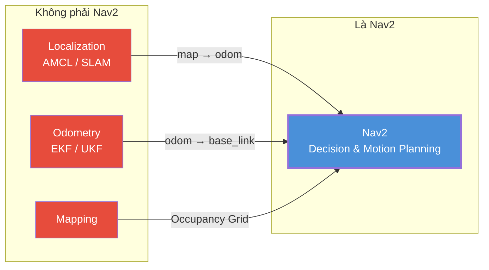
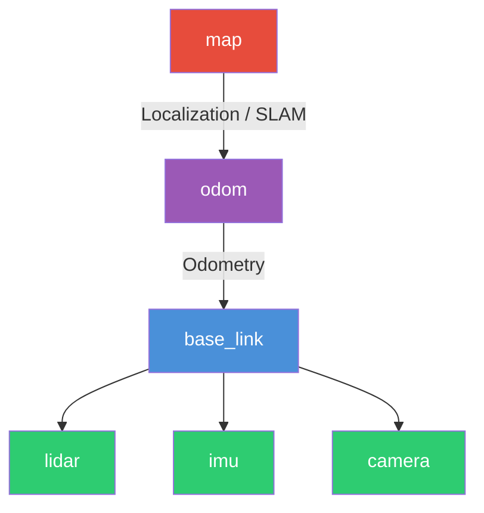
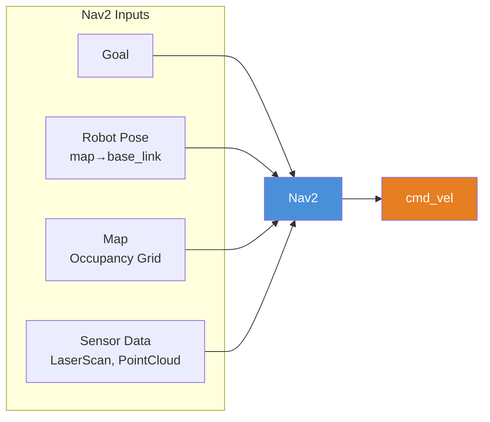
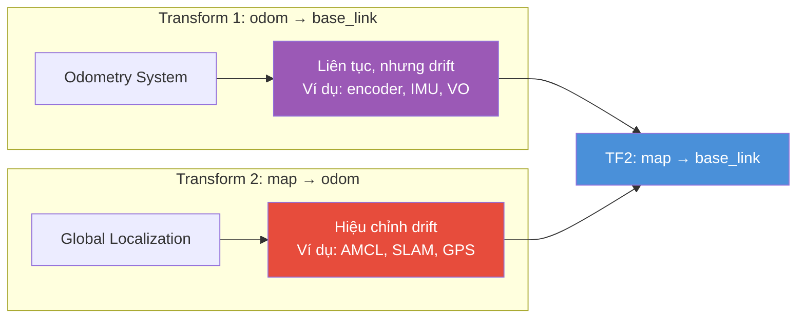
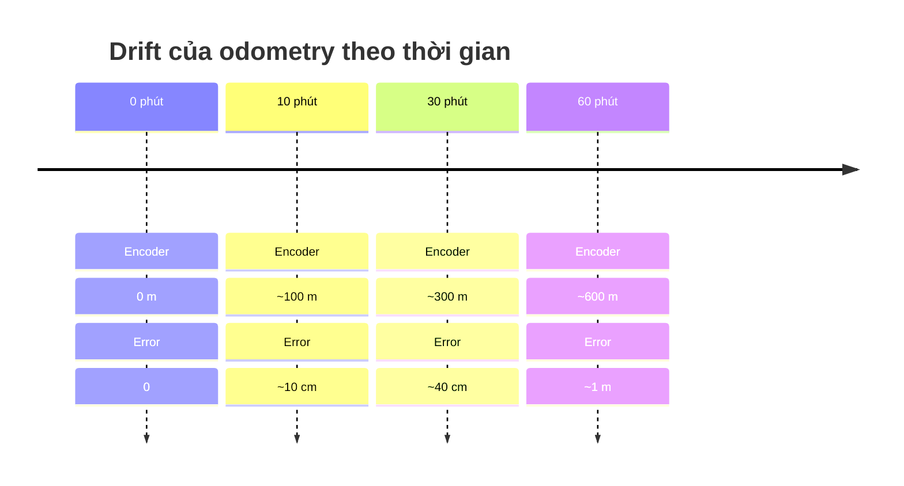
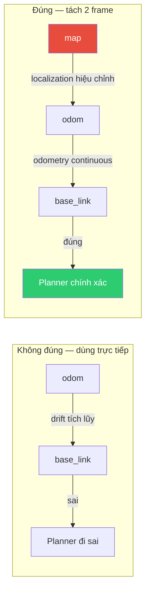
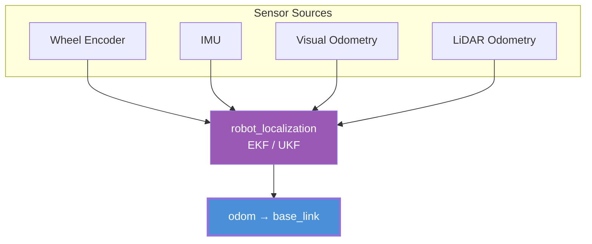
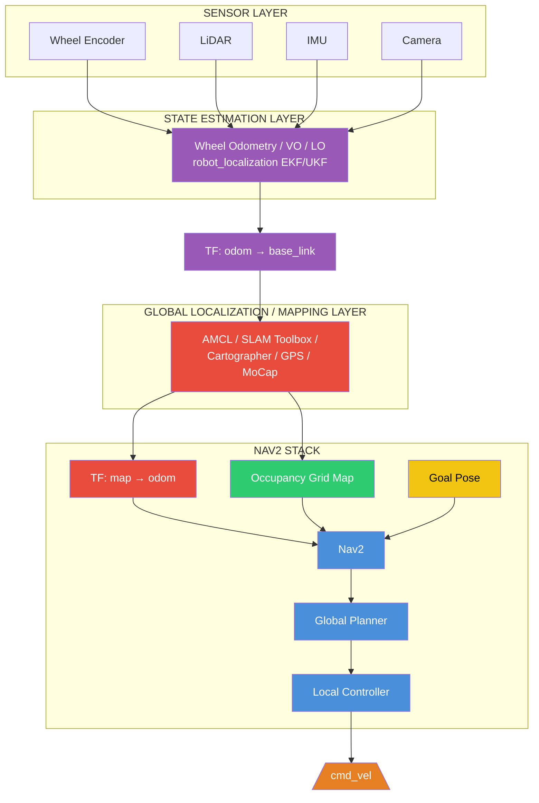

# Overall Architecture — Nav2 và Hệ thống Định vị Robot

## Mục lục

- [Overall Architecture — Nav2 và Hệ thống Định vị Robot](#overall-architecture--nav2-và-hệ-thống-định-vị-robot)
  - [Mục lục](#mục-lục)
  - [1. Góc nhìn đúng: Nav2 KHÔNG phải là hệ thống Localization hay Mapping](#1-góc-nhìn-đúng-nav2-không-phải-là-hệ-thống-localization-hay-mapping)
  - [2. Robot phải cung cấp TF tree tối thiểu](#2-robot-phải-cung-cấp-tf-tree-tối-thiểu)
  - [3. Input thực chất của Nav2 là gì?](#3-input-thực-chất-của-nav2-là-gì)
  - [4. Input bắt buộc của Nav2](#4-input-bắt-buộc-của-nav2)
  - [5. Hai transform quan trọng nhất](#5-hai-transform-quan-trọng-nhất)
    - [5.1 `odom → base_link` — Odometry System](#51-odom--base_link--odometry-system)
    - [5.2 `map → odom` — Global Localization](#52-map--odom--global-localization)
  - [6. Vì sao phải tách thành hai frame?](#6-vì-sao-phải-tách-thành-hai-frame)
  - [7. Các cách sinh `odom → base_link`](#7-các-cách-sinh-odom--base_link)
  - [8. Các cách sinh `map → odom`](#8-các-cách-sinh-map--odom)
  - [9. Pipeline tổng quát](#9-pipeline-tổng-quát)
  - [References](#references)

---

## 1. Góc nhìn đúng: Nav2 KHÔNG phải là hệ thống Localization hay Mapping

Một hiểu lầm rất phổ biến là "Nav2 nhận LiDAR rồi tự làm mọi thứ". Điều này **không đúng**.

Theo documentation của Nav2:

> Navigation Stack **không tạo localization**, **không tạo odometry**, và cũng **không bắt buộc sử dụng LiDAR**.

Nav2 chỉ giả định rằng robot **đã có một hệ thống định vị (positioning system)** và **đã có hệ thống odometry**.



*Hình 1: Ranh giới trách nhiệm. Localization, Odometry, Mapping là đầu vào, không phải chức năng của Nav2.*

Nav2 gọi hai hệ thống đầu vào này là:
- **Global Positioning System** — hệ thống định vị toàn cục
- **Odometry System** — hệ thống odometry (ước lượng vị trí tương đối)

> 📌 **Global Positioning System**: Hệ thống cung cấp vị trí robot trong khung tọa độ toàn cục (`map`), không bị drift theo thời gian nhưng có thể có bước nhảy (discrete jump). Ví dụ: AMCL, SLAM Toolbox, GPS, Motion Capture.
> *Nguồn: [Nav2 Documentation — Navigation Concepts](https://docs.nav2.org/concepts/index.html)*

> 📌 **Odometry System**: Hệ thống ước lượng vị trí robot dựa trên tích phân vận tốc (encoder, IMU, visual odometry...), cho kết quả liên tục nhưng bị drift (sai số tích lũy) theo thời gian.
> *Nguồn: [Nav2 Documentation — Navigation Concepts](https://docs.nav2.org/concepts/index.html)*

---

## 2. Robot phải cung cấp TF tree tối thiểu

Documentation của Nav2 chỉ rõ robot phải xây dựng TF tree sau:



*Hình 2: TF tree tối thiểu. `map → odom` do localization/SLAM sinh. `odom → base_link` do odometry sinh. Các sensor là child của `base_link`.*

Trong đó:

**`map → odom`** được sinh bởi:
- SLAM (SLAM Toolbox, Cartographer)
- AMCL
- GPS
- Motion Capture
- hoặc bất kỳ localization system nào

**`odom → base_link`** được sinh bởi:
- Wheel odometry
- Visual odometry
- LiDAR odometry
- EKF (robot_localization)
- ...

Đây là yêu cầu chuẩn theo **REP-105** mà Nav2 tuân theo.

---

## 3. Input thực chất của Nav2 là gì?

Nav2 cần **bốn nguồn dữ liệu**:



*Hình 3: Bốn đầu vào của Nav2: Goal, Robot Pose, Map, Sensor Data.*

---

## 4. Input bắt buộc của Nav2

Theo setup guide chính thức của Nav2, một hệ thống navigation đầy đủ cần có:

| Thành phần | Bắt buộc? | Vai trò |
|---|---|---|
| TF `map → odom` | ✔ | Global pose (localization) |
| TF `odom → base_link` | ✔ | Local pose (odometry) |
| URDF / `robot_state_publisher` | ✔ | TF các sensor (static transforms) |
| Map (`/map`) | ✔ (trên static map) | Global planning (Occupancy Grid) |
| LaserScan / sensor cho obstacle | gần như luôn cần | Costmap (tránh vật cản động) |
| Goal Pose | ✔ | Đích đến |
| `cmd_vel` | ✔ | Output (lệnh vận tốc) |

---

## 5. Hai transform quan trọng nhất

Documentation của Nav2 nhấn mạnh chỉ có hai transform "đặc biệt":

### 5.1 `odom → base_link` — Odometry System

```text
odom
  ↓
base_link
```

- Đây là kết quả của **Odometry System**
- Ví dụ: Wheel Encoder, IMU, Visual Odometry, LiDAR Odometry, robot_localization EKF
- Nó biểu diễn vị trí robot **liên tục theo thời gian**, nhưng sẽ bị drift

> 📌 **Drift**: Hiện tượng sai số tích lũy theo thời gian trong odometry. Ví dụ robot đi thẳng 100 m, odometry có thể báo 100.5 m (drift 0.5 m). Sai số này tăng dần và không có giới hạn trên.
> *Nguồn: [Nav2 Documentation — Concepts](https://docs.nav2.org/concepts/index.html)*

### 5.2 `map → odom` — Global Localization

```text
map
  ↓
odom
```

- Đây là kết quả của **Global Localization**
- Ví dụ: AMCL, SLAM Toolbox, Cartographer, GPS, Motion Capture
- Nó có nhiệm vụ **sửa drift** của odometry



*Hình 4: Hai transform quan trọng. `odom→base_link` cung cấp vị trí liên tục (bị drift). `map→odom` hiệu chỉnh drift. TF2 hợp thành `map→base_link`.*

---

## 6. Vì sao phải tách thành hai frame?

Đây là thiết kế chuẩn của **REP-105**.

Lý do: **Odometry luôn có drift**.



*Hình 5: Sai số odometry tích lũy theo thời gian (drift). Nếu planner dùng trực tiếp odometry, robot sẽ đi sai.*

Nếu Planner dùng trực tiếp `map → base_link` từ odometry, sai số drift sẽ làm robot đi sai vị trí. Do đó:

> **Localization liên tục hiệu chỉnh `map → odom` để giữ cho robot trong `map` luôn đúng.**



*Hình 6: Tách `map` và `odom` thành hai frame cho phép localization hiệu chỉnh drift mà không làm mất tính liên tục của odometry.*

Đó là lý do Nav2 không dùng `map → base_link` trực tiếp, mà luôn dùng:

```text
map → odom → base_link
```

> 📌 **REP-105**: ROS Enhancement Proposal quy định coordinate frames cho mobile platform. `map` là khung toàn cục có thể hiệu chỉnh (có bước nhảy), `odom` là khung cục bộ liên tục (không bước nhảy) nhưng bị drift.
> *Nguồn: [REP-105 — Coordinate Frames for Mobile Platforms](https://reps.openrobotics.org/rep-0105/)*

---

## 7. Các cách sinh `odom → base_link`

Theo documentation của `robot_localization`, nguồn odometry có thể đến từ nhiều loại cảm biến khác nhau. Bộ lọc EKF/UKF có thể hợp nhất (fuse) chúng thành một ước lượng odometry mượt hơn.

> 📌 **EKF** (Extended Kalman Filter) / **UKF** (Unscented Kalman Filter): Bộ lọc hợp nhất dữ liệu từ nhiều cảm biến để ước lượng trạng thái robot (pose, twist). `robot_localization` là package tiêu chuẩn trong ROS2 thực hiện việc này.
> *Nguồn: [Nav2 — Smoothing Odometry using Robot Localization](https://docs.nav2.org/setup_guides/odom/setup_robot_localization.html)*

Các kiểu dữ liệu đầu vào được hỗ trợ:
- `nav_msgs/Odometry`
- `sensor_msgs/Imu`
- `geometry_msgs/PoseWithCovarianceStamped`
- `geometry_msgs/TwistWithCovarianceStamped`

Một số cấu hình phổ biến:

| Sensor | Có thể tạo odometry? |
|---|---|
| Wheel Encoder | ✔ |
| IMU | ✔ (kết hợp) |
| Wheel + IMU | ✔ |
| Visual Odometry | ✔ |
| LiDAR Odometry | ✔ |
| Wheel + IMU + VO | ✔ |
| Wheel + IMU + LiDAR | ✔ |



*Hình 7: `robot_localization` dùng EKF/UKF để fuse nhiều nguồn cảm biến và xuất `odom → base_link`.*

---

## 8. Các cách sinh `map → odom`

Theo Nav2 documentation, các hệ thống sau đều có thể đảm nhận vai trò này:

- **SLAM Toolbox** — SLAM 2D, vừa tạo map vừa localization
- **AMCL** — Localization trên bản đồ có sẵn (không tạo map)
- **Cartographer** — SLAM 2D và 3D của Google
- **GPS** — Định vị toàn cầu (ngoài trời)
- **Motion Capture** — Hệ thống bắt chuyển động chính xác (trong phòng thí nghiệm)
- Hoặc bất kỳ **Global Positioning System** nào miễn tuân theo REP-105

Điều này có nghĩa:

> Nav2 **không quan tâm** bạn dùng thuật toán nào. Nó chỉ quan tâm: "Có ai publish `map → odom` hay chưa?"

---

## 9. Pipeline tổng quát

Từ các yêu cầu của Nav2, pipeline logic như sau:



*Hình 8: Pipeline tổng quát 5 layer: SENSOR → STATE ESTIMATION → TF odom→base → GLOBAL LOCALIZATION → TF map→odom → NAV2 → cmd_vel.*

Pipeline được tổ chức thành các layer:
1. **Sensor Layer** — Thu thập dữ liệu thô (encoder, LiDAR, IMU, camera)
2. **State Estimation Layer** — Tính odometry, fuse cảm biến, xuất `odom → base_link`
3. **Global Localization / Mapping Layer** — So khớp với bản đồ, hiệu chỉnh drift, xuất `map → odom` và Occupancy Grid
4. **Nav2 Stack** — Nhận TF (`map → base_link`), Map, Goal → lập kế hoạch và điều khiển
5. **Output** — `/cmd_vel` → Robot Driver → Motor

---

## References

1. [Nav2 Documentation — Navigation Concepts](https://docs.nav2.org/concepts/index.html)
2. [Nav2 — Mapping and Localization Setup Guide](https://docs.nav2.org/setup_guides/sensors/mapping_localization.html)
3. [Nav2 — Smoothing Odometry using Robot Localization](https://docs.nav2.org/setup_guides/odom/setup_robot_localization.html)
4. [REP-105 — Coordinate Frames for Mobile Platforms](https://reps.openrobotics.org/rep-0105/)
5. [Nav2 — Setup Transforms Guide](https://docs.nav2.org/setup_guides/transformation/setup_transforms.html)
