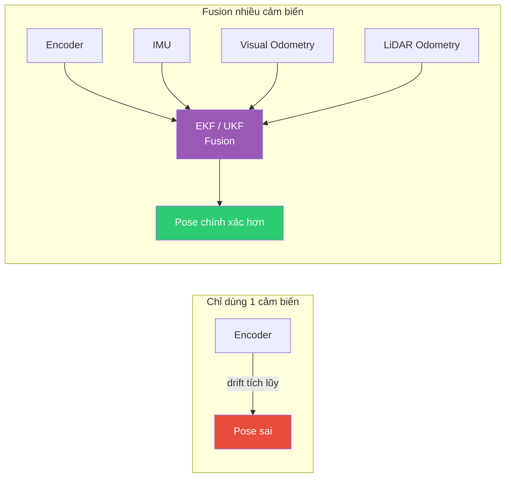
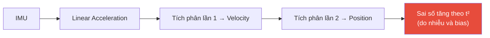
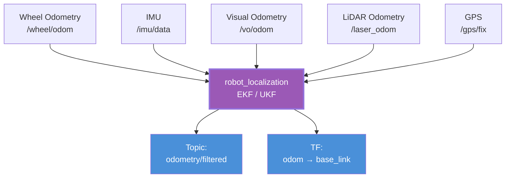
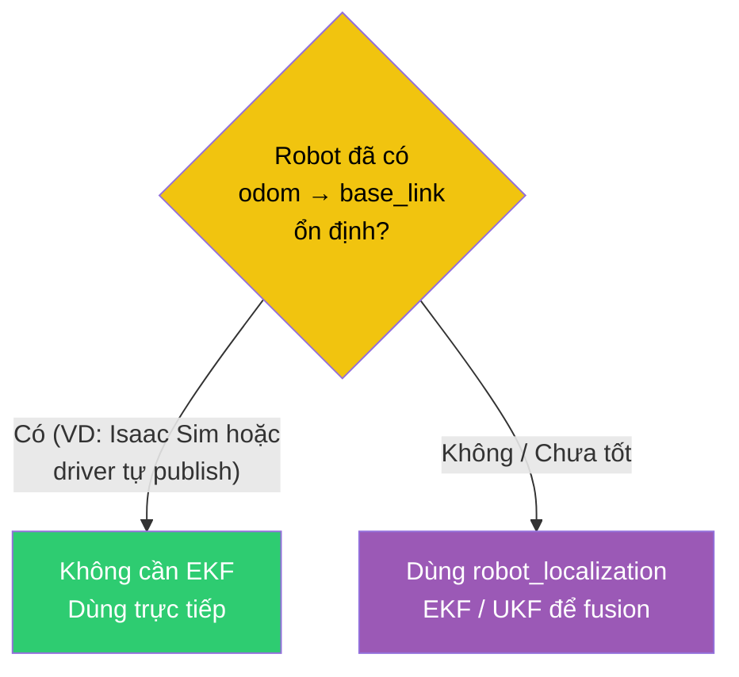
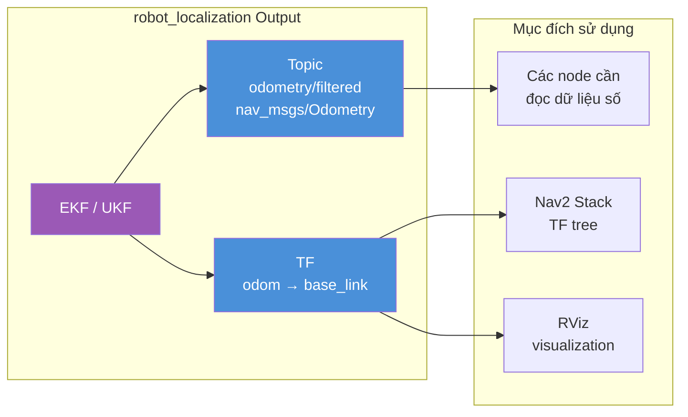
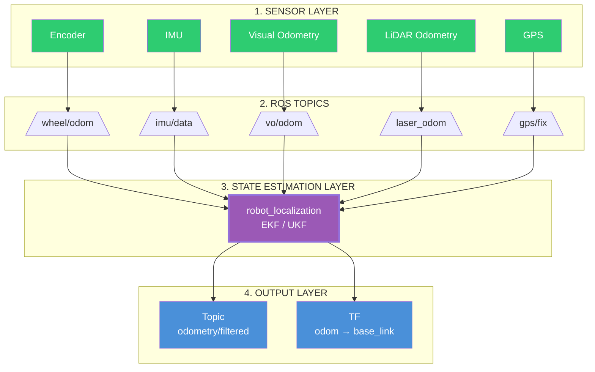

# State Estimation Layer — robot_localization và Fusion Cảm biến

## Mục lục

- [State Estimation Layer — robot\_localization và Fusion Cảm biến](#state-estimation-layer--robot_localization-và-fusion-cảm-biến)
  - [Mục lục](#mục-lục)
  - [1. State Estimation là gì?](#1-state-estimation-là-gì)
  - [2. Tại sao cần State Estimation?](#2-tại-sao-cần-state-estimation)
    - [Dead Reckoning Drift](#dead-reckoning-drift)
    - [Tại sao fusion là giải pháp?](#tại-sao-fusion-là-giải-pháp)
  - [3. Input của State Estimation](#3-input-của-state-estimation)
  - [4. Wheel Encoder tạo ra gì?](#4-wheel-encoder-tạo-ra-gì)
  - [5. IMU cung cấp gì?](#5-imu-cung-cấp-gì)
    - [Hạn chế của IMU](#hạn-chế-của-imu)
  - [6. robot\_localization làm gì?](#6-robot_localization-làm-gì)
    - [Pipeline chuẩn](#pipeline-chuẩn)
    - [Cấu hình EKF cơ bản (trích từ ekf.yaml)](#cấu-hình-ekf-cơ-bản-trích-từ-ekfyaml)
  - [7. EKF và UKF khác nhau như thế nào?](#7-ekf-và-ukf-khác-nhau-như-thế-nào)
  - [8. EKF có bắt buộc không?](#8-ekf-có-bắt-buộc-không)
  - [9. robot\_localization publish gì?](#9-robot_localization-publish-gì)
    - [(1) Topic — `odometry/filtered`](#1-topic--odometryfiltered)
    - [(2) TF — `odom → base_link`](#2-tf--odom--base_link)
  - [10. State Estimation Layer hoàn chỉnh](#10-state-estimation-layer-hoàn-chỉnh)
    - [Pipeline tổng quát 4 tầng](#pipeline-tổng-quát-4-tầng)
    - [Tổng kết](#tổng-kết)
  - [References](#references)

---

## 1. State Estimation là gì?

Trong bối cảnh navigation của robot, **State Estimation** là quá trình ước lượng trạng thái (state) của robot dựa trên dữ liệu từ nhiều cảm biến khác nhau.

Theo documentation của `robot_localization`:

> State Estimation là quá trình kết hợp (fusion) một hoặc nhiều nguồn đo lường để tạo ra một ước lượng trạng thái (state estimate) của robot.

State (trạng thái) ở đây bao gồm 15 đại lượng:

| Nhóm | Biến | Đơn vị (REP-103) |
|---|---|---|
| Position | x, y, z | m |
| Orientation | roll, pitch, yaw | rad |
| Linear velocity | vx, vy, vz | m/s |
| Angular velocity | vroll, vpitch, vyaw | rad/s |
| Linear acceleration | ax, ay, az | m/s² |

> 📌 **robot_localization**: Một collection các node state estimation cho robot di chuyển trong không gian 3D, bao gồm `ekf_localization_node` (EKF) và `ukf_localization_node` (UKF). Cả hai đều track state 15 chiều của robot: position, orientation, linear/angular velocity, linear acceleration.
> *Nguồn: [robot_localization documentation](https://docs.ros.org/en/api/robot_localization/html/index.html)*

> 📌 **State Estimation**: Quá trình hợp nhất (fusion) dữ liệu từ nhiều cảm biến để ước lượng trạng thái của robot, bao gồm vị trí, hướng, vận tốc và gia tốc.
> *Nguồn: [Nav2 Documentation — Smoothing Odometry using Robot Localization](https://docs.nav2.org/setup_guides/odom/setup_robot_localization.html)*

---

## 2. Tại sao cần State Estimation?

Lý do cốt lõi: **Không một cảm biến nào hoàn hảo một mình.**

### Dead Reckoning Drift

Giả sử robot chỉ dùng encoder:

```text
Encoder → Wheel rotation → Estimated distance → Robot pose
```

Nếu bánh xe:
- trượt trên sàn trơn
- quay tại chỗ (va chạm)
- đi trên thảm
- mất ma sát

thì encoder vẫn báo robot đang di chuyển dù thực tế không phải vậy.

Kết quả:

```text
Estimated pose  ≠  Real pose
```

Đây gọi là **dead reckoning drift** — sai số tích lũy của odometry.

> 📌 **Dead Reckoning**: Phương pháp ước lượng vị trí robot dựa trên vị trí trước đó và chuyển động đã thực hiện, sử dụng các cảm biến như wheel encoder. Ưu điểm: liên tục, luôn có sẵn. Nhược điểm: sai số tích lũy không giới hạn (unbounded drift).
> *Nguồn: [Robot Proving Grounds — Dead Reckoning](https://existentialrobotics.org/RobotProvingGrounds/algorithms/localization/content/dead-reckoning/)*

### Tại sao fusion là giải pháp?



*Hình 1: Single sensor vs Multi-sensor fusion. Một cảm biến đơn lẻ luôn có điểm yếu; fusion cho phép bù đắp điểm yếu của cảm biến này bằng ưu điểm của cảm biến khác.*

Mỗi loại cảm biến có ưu/nhược điểm riêng:

| Cảm biến | Ưu điểm | Nhược điểm |
|---|---|---|
| Wheel Encoder | Tốt ngắn hạn, ổn định | Drift dài hạn, trượt bánh |
| IMU | Tốc độ cao, góc ngắn hạn chính xác | Trôi (bias), tích phân sai số lớn |
| LiDAR Odometry | Chính xác trong môi trường có đặc trưng | Nặng tính toán, cần đặc trưng môi trường |
| Visual Odometry | Giàu thông tin, không cần LiDAR | Nhạy sáng, tính toán nặng |

---

## 3. Input của State Estimation

Một điểm rất quan trọng:

> **robot_localization không đọc trực tiếp sensor driver**. Nó chỉ nhận **ROS messages**.

Các kiểu message được hỗ trợ chính thức:

| Message | Kiểu dữ liệu cung cấp | Ý nghĩa |
|---|---|---|
| `nav_msgs/Odometry` | Pose + Twist + Covariance | Odometry đầy đủ |
| `sensor_msgs/Imu` | Orientation + Angular Velocity + Linear Acceleration | IMU |
| `geometry_msgs/PoseWithCovarianceStamped` | Pose + Covariance | Vị trí tuyệt đối/cục bộ |
| `geometry_msgs/TwistWithCovarianceStamped` | Twist + Covariance | Vận tốc |

> 📌 **nav_msgs/Odometry**: Message ROS biểu diễn ước lượng vị trí và vận tốc của robot. Gồm `header.frame_id` (frame của pose), `child_frame_id` (frame của twist), `geometry_msgs/PoseWithCovariance pose` và `geometry_msgs/TwistWithCovariance twist`.
> *Nguồn: [ROS 2 — nav_msgs/Odometry](https://docs.ros.org/en/latest/api/nav_msgs/html/msg/Odometry.html)*

> 📌 **sensor_msgs/Imu**: Message ROS chứa dữ liệu từ IMU, gồm orientation (Quaternion), angular velocity (rad/s), linear acceleration (m/s²), kèm covariance matrix 3×3 cho mỗi trường. Gia tốc tính bằng m/s² (không phải g).
> *Nguồn: [ROS 2 — sensor_msgs/Imu](https://docs.ros.org/en/humble/p/sensor_msgs/msg/Imu.html)*

---

## 4. Wheel Encoder tạo ra gì?

Encoder là cảm biến gắn trên động cơ, chỉ đo:

- Số xung quay của bánh xe
- Tốc độ quay của bánh

Từ đó, **một node khác** (ví dụ `diff_drive_controller` hoặc driver của robot) thực hiện:

```text
Số xung bánh xe
       ↓
Tính: x, y, yaw
       linear velocity
       angular velocity
       ↓
Publish: nav_msgs/Odometry
       ↓
Ví dụ: /wheel/odom
```

Điều quan trọng:

> **Encoder không trực tiếp tạo TF.**

Nó chỉ tạo dữ liệu odometry dưới dạng message `nav_msgs/Odometry`. TF `odom → base_link` có thể được publish bởi:
- chính controller (ví dụ `diff_drive_controller`), hoặc
- `robot_localization` (EKF/UKF)

tùy kiến trúc hệ thống.

---

## 5. IMU cung cấp gì?

IMU (Inertial Measurement Unit) thường gồm:

- **Accelerometer** — đo gia tốc tuyến tính
- **Gyroscope** — đo vận tốc góc
- (đôi khi) **Magnetometer** — đo từ trường (la bàn)

Trong ROS, dữ liệu IMU được đóng gói dưới dạng:

```text
sensor_msgs/Imu
```

IMU cung cấp:
- **Orientation** (nếu driver hoặc onboard filter tính sẵn) — dạng Quaternion
- **Angular velocity** (vận tốc góc) — rad/s
- **Linear acceleration** (gia tốc tuyến tính) — m/s²
- **covariance matrix** 3×3 cho mỗi trường

> 📌 **Covariance**: Ma trận 3×3 biểu diễn độ không chắc chắn của phép đo. Trong ROS, ma trận zero được hiểu là "chưa biết covariance". Giá trị -1 ở phần tử đầu tiên của covariance matrix báo hiệu "không có ước lượng cho trường dữ liệu này".
> *Nguồn: [ROS 2 — sensor_msgs/Imu](https://docs.ros.org/en/humble/p/sensor_msgs/msg/Imu.html)*

### Hạn chế của IMU

> **IMU không cung cấp vị trí tuyệt đối.**

Nếu chỉ tích phân gia tốc để tính vị trí, sai số sẽ tăng rất nhanh do nhiễu (noise) và bias (trôi) của cảm biến.



*Hình 3: Tích phân gia tốc IMU hai lần để có position. Sai số tích lũy theo cấp số nhân (t²), khiến vị trí từ IMU đơn thuần không dùng được trong thực tế nếu không có nguồn hiệu chỉnh khác.*

Vì vậy, IMU gần như luôn được dùng kết hợp với nguồn khác (encoder, visual odometry, LiDAR odometry...).

---

## 6. robot_localization làm gì?

`robot_localization` là package chính thực hiện State Estimation trong ROS2. Theo tài liệu Nav2:

> Nav2 Setup Guide mô tả `robot_localization` như thành phần hợp nhất nhiều nguồn odometry (wheel encoder, IMU, visual odometry, ...) bằng EKF hoặc UKF để tạo ra odometry mượt hơn.
> *Nguồn: [Nav2 — Smoothing Odometry using Robot Localization](https://docs.nav2.org/setup_guides/odom/setup_robot_localization.html)*

`robot_localization` có thể nhận **N nguồn odometry**, không giới hạn số lượng, miễn chúng được publish theo các message type được hỗ trợ.

### Pipeline chuẩn



*Hình 3: robot_localization nhận N nguồn dữ liệu từ nhiều cảm biến, fusion bằng EKF/UKF, xuất hai đầu ra: topic và TF.*

### Cấu hình EKF cơ bản (trích từ ekf.yaml)

```yaml
ekf_filter_node:
  ros__parameters:
    frequency: 30.0
    sensor_timeout: 0.1
    two_d_mode: false
    publish_tf: true

    map_frame: map
    odom_frame: odom
    base_link_frame: base_link
    world_frame: odom

    odom0: /wheel/odom
    odom0_config: [true, true, false,
                   false, false, false,
                   false, false, false,
                   false, false, true,
                   false, false, false]

    imu0: /imu/data
    imu0_config: [false, false, false,
                  true, true, true,
                  false, false, false,
                  true, true, true,
                  true, true, true]
    imu0_remove_gravitational_acceleration: true
```

> *Nguồn: [robot_localization/params/ekf.yaml](https://github.com/cra-ros-pkg/robot_localization/blob/rolling-devel/params/ekf.yaml)*

Giải thích `odom0_config` — vector 15 phần tử tương ứng với 15 state variable:

```
[x, y, z, roll, pitch, yaw, vx, vy, vz, vroll, vpitch, vyaw, ax, ay, az]
```

`true` ở vị trí nào nghĩa là "dùng giá trị đó từ sensor này để cập nhật EKF".

---

## 7. EKF và UKF khác nhau như thế nào?

`robot_localization` cung cấp hai bộ lọc:

> 📌 **EKF — Extended Kalman Filter**: Bộ lọc Kalman mở rộng dùng cho hệ phi tuyến. Nó tuyến tính hóa mô hình chuyển động và quan sát bằng Jacobian, sau đó áp dụng các công thức chuẩn của Kalman Filter. Phổ biến, nhanh, tài liệu và ví dụ nhiều.
> *Nguồn: [robot_localization documentation](https://docs.ros.org/en/api/robot_localization/html/index.html)*

> 📌 **UKF — Unscented Kalman Filter**: Bộ lọc Unscented Kalman dùng sigma points (2n+1 điểm được chọn tất định) để propagate mean và covariance qua hàm phi tuyến, không cần tính Jacobian. Xử lý phi tuyến tốt hơn EKF nhưng tính toán nặng hơn.
> *Nguồn: [Julier & Uhlmann — Unscented Filtering and Nonlinear Estimation](https://www.cs.ubc.ca/~murphyk/Papers/Julier_Uhlmann_mar04.pdf)*

| Tiêu chí | EKF | UKF |
|---|---|---|
| Cách xử lý phi tuyến | Tuyến tính hóa bằng Jacobian | Sigma points (2n+1) |
| Độ chính xác với hệ phi tuyến mạnh | Kém (có thể phân kỳ) | Tốt hơn (second-order) |
| Tốc độ tính toán | Nhanh | Chậm hơn ~2-3x |
| Jacobian cần thiết? | Có (code phức tạp, dễ sai) | Không (black-box model) |
| Tài liệu và cộng đồng | Nhiều | Ít hơn |
| Được Nav2 dùng mặc định? | Có (trong setup guide) | Không |

Cả hai node đều có cùng mục tiêu: tạo state estimate. Lựa chọn phụ thuộc yêu cầu của hệ thống.

---

## 8. EKF có bắt buộc không?

**Không.**

Đây là một hiểu lầm rất phổ biến.

Nav2 **không yêu cầu** robot phải có EKF hay `robot_localization`.

Nếu robot của bạn đã có:

```text
odom
  ↓
base_link
```

ổn định (ví dụ driver của robot hoặc Isaac Sim đã publish sẵn), Nav2 có thể sử dụng trực tiếp.

`robot_localization` chỉ là **một giải pháp được khuyến nghị** để làm mượt và hợp nhất nhiều nguồn odometry.



*Hình 4: Quyết định có cần EKF không. Nav2 không bắt buộc; EKF chỉ là giải pháp khuyến nghị khi robot có nhiều nguồn odometry cần fusion.*

---

## 9. robot_localization publish gì?

Khi cấu hình với `world_frame = odom`, EKF sẽ publish hai đầu ra:

### (1) Topic — `odometry/filtered`

Kiểu: `nav_msgs/Odometry`

Bao gồm:
- **Pose** — vị trí và hướng (trong frame `odom`)
- **Twist** — vận tốc (trong frame `base_link`)
- **Covariance** — độ không chắc chắn của estimate

### (2) TF — `odom → base_link`

```text
odom
  ↓
base_link
```

Đây chính là transform cục bộ mà Nav2 và các thành phần khác trong hệ thống sẽ sử dụng.

Việc publish TF này có thể bật/tắt bằng tham số `publish_tf` của `robot_localization` (mặc định: `true`).



*Hình 5: Hai đầu ra của robot_localization phục vụ hai mục đích khác nhau: topic cung cấp dữ liệu số (pose + twist + covariance) cho các node cần đọc message; TF cung cấp quan hệ không gian giữa `odom` và `base_link` cho toàn bộ hệ sinh thái ROS2.*

---

## 10. State Estimation Layer hoàn chỉnh

### Pipeline tổng quát 4 tầng



*Hình 6: Pipeline tổng quát 4 tầng. Sensor → ROS Topics → State Estimation (EKF/UKF) → Output. Output của State Estimation Layer (Topic + TF) là input cho Localization Layer (AMCL/SLAM).*

### Tổng kết

Điều quan trọng cần ghi nhớ:

| Đầu ra | Loại | Mục đích |
|---|---|---|
| `odometry/filtered` | ROS Topic (`nav_msgs/Odometry`) | Truyền message chứa pose + twist + covariance |
| `odom → base_link` | TF transform | Xây dựng TF tree cho toàn bộ hệ thống ROS2 |

Hai đầu ra này thường được tạo từ **cùng một state estimate**, nhưng phục vụ hai mục đích khác nhau: topic cung cấp dữ liệu cho các node cần đọc message, còn TF cung cấp quan hệ không gian giữa các frame cho toàn bộ hệ sinh thái ROS2.

> Tóm lại: State Estimation Layer là tầng đầu tiên trong Navigation Pipeline, chịu trách nhiệm biến dữ liệu cảm biến thô thành `odom → base_link` ổn định, sẵn sàng cho các tầng phía sau (Localization, Planning, Control).

---

## References

1. [robot_localization documentation — robot_localization 2.7.7](https://docs.ros.org/en/api/robot_localization/html/index.html)
2. [State Estimation Nodes — robot_localization 2.5.6](https://docs.ros.org/en/lunar/api/robot_localization/html/state_estimation_nodes.html)
3. [Nav2 — Smoothing Odometry using Robot Localization](https://docs.nav2.org/setup_guides/odom/setup_robot_localization.html)
4. [Preparing Your Data for use with robot_localization](https://docs.ros.org/indigo/api/robot_localization/html/preparing_sensor_data.html)
5. [robot_localization/params/ekf.yaml (rolling-devel)](https://github.com/cra-ros-pkg/robot_localization/blob/rolling-devel/params/ekf.yaml)
6. [ROS 2 — nav_msgs/Odometry Message](https://docs.ros.org/en/latest/api/nav_msgs/html/msg/Odometry.html)
7. [ROS 2 — sensor_msgs/Imu Message](https://docs.ros.org/en/humble/p/sensor_msgs/msg/Imu.html)
8. [Robot Proving Grounds — Dead Reckoning](https://existentialrobotics.org/RobotProvingGrounds/algorithms/localization/content/dead-reckoning/)
9. [Julier & Uhlmann — Unscented Filtering and Nonlinear Estimation](https://www.cs.ubc.ca/~murphyk/Papers/Julier_Uhlmann_mar04.pdf)
