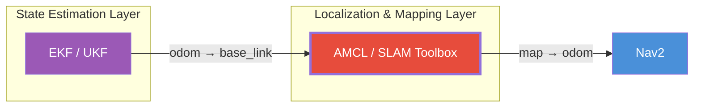
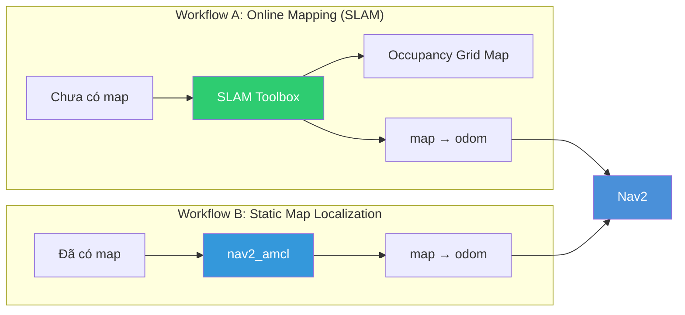
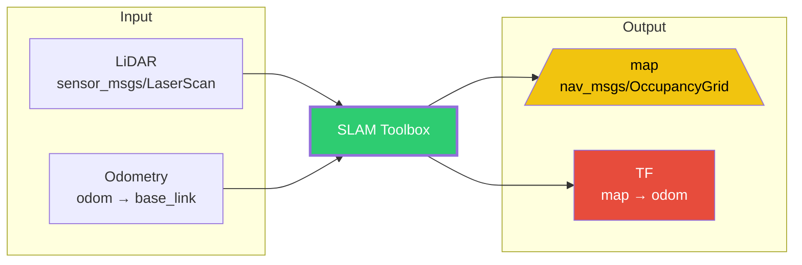
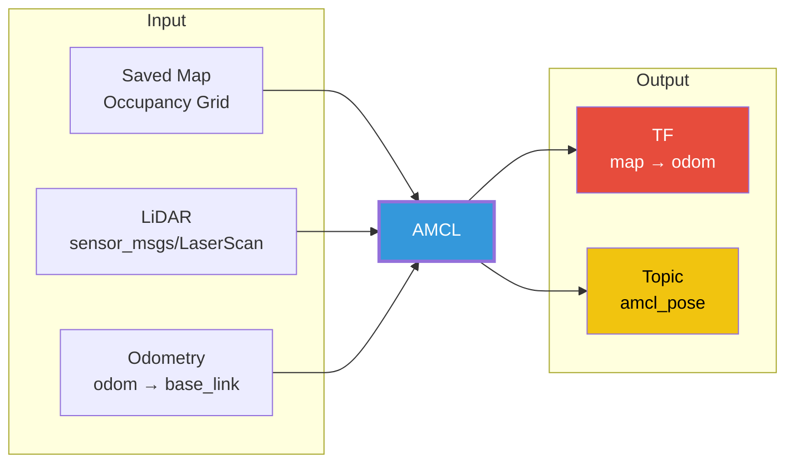
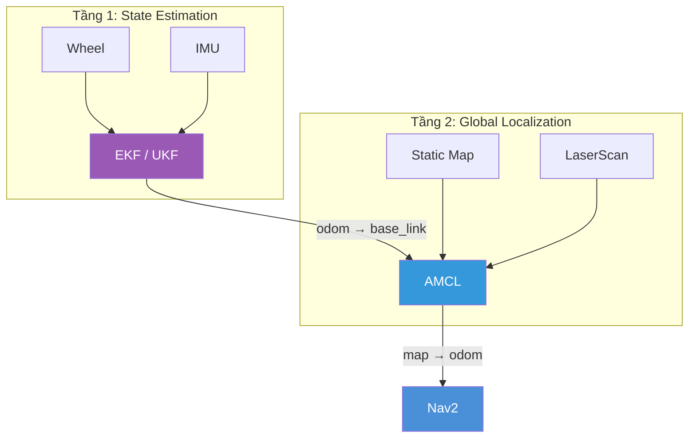
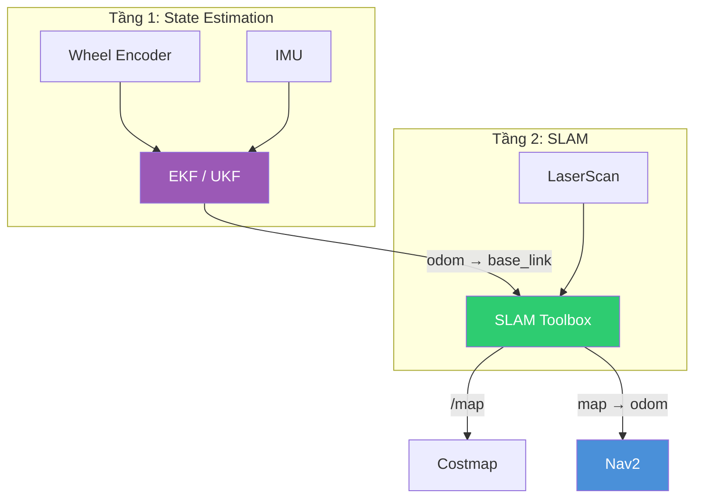
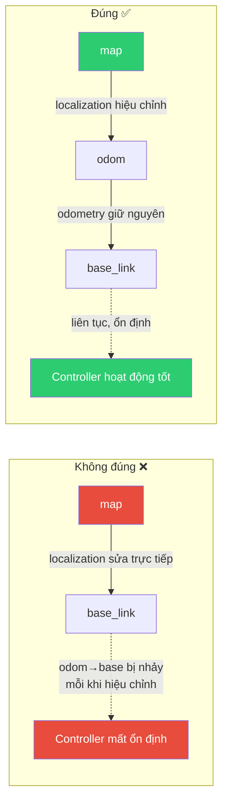
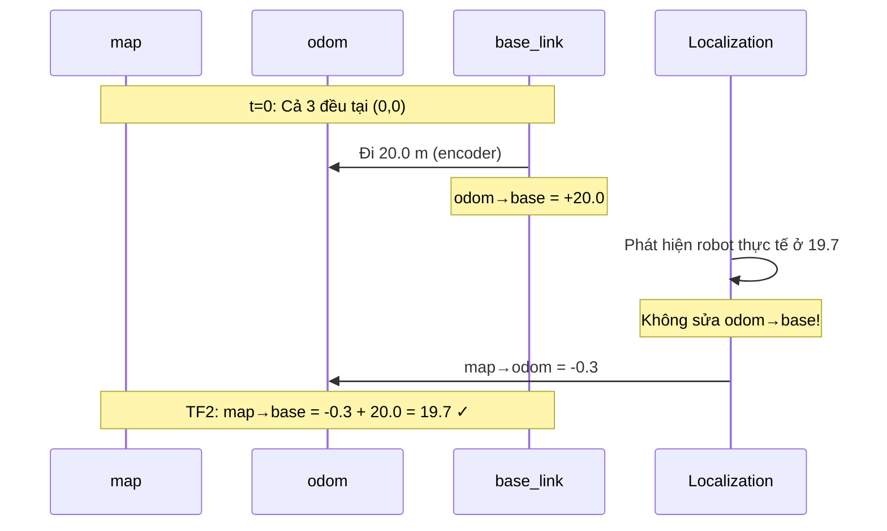
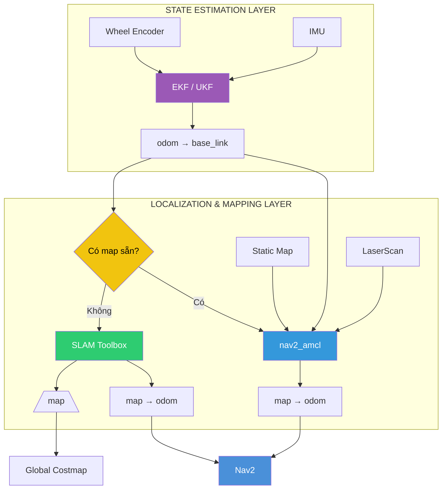

# Localization & Mapping Layer — SLAM Toolbox và nav2_amcl

## Mục lục

- [Localization \& Mapping Layer — SLAM Toolbox và nav2\_amcl](#localization--mapping-layer--slam-toolbox-và-nav2_amcl)
  - [Mục lục](#mục-lục)
  - [1. Vai trò của Localization \& Mapping Layer](#1-vai-trò-của-localization--mapping-layer)
  - [2. Hai workflow chính của Nav2](#2-hai-workflow-chính-của-nav2)
    - [Workflow A — Online Mapping (SLAM)](#workflow-a--online-mapping-slam)
    - [Workflow B — Static Map Localization](#workflow-b--static-map-localization)
  - [3. Mapping và Localization khác nhau như thế nào?](#3-mapping-và-localization-khác-nhau-như-thế-nào)
  - [4. Nav2 hỗ trợ những package nào?](#4-nav2-hỗ-trợ-những-package-nào)
    - [4.1 SLAM Toolbox](#41-slam-toolbox)
    - [4.2 nav2\_amcl](#42-nav2_amcl)
  - [5. Input và Output của SLAM Toolbox](#5-input-và-output-của-slam-toolbox)
    - [Input](#input)
    - [Output](#output)
  - [6. Input và Output của AMCL](#6-input-và-output-của-amcl)
    - [Input](#input-1)
    - [Output](#output-1)
  - [7. Tại sao cả SLAM và AMCL đều publish `map → odom`?](#7-tại-sao-cả-slam-và-amcl-đều-publish-map--odom)
  - [8. Quan hệ giữa EKF và AMCL](#8-quan-hệ-giữa-ekf-và-amcl)
  - [9. Quan hệ giữa EKF và SLAM](#9-quan-hệ-giữa-ekf-và-slam)
  - [10. State Estimation vs Localization — bảng so sánh](#10-state-estimation-vs-localization--bảng-so-sánh)
  - [11. Tại sao Localization publish `map → odom` thay vì `map → base_link`?](#11-tại-sao-localization-publish-map--odom-thay-vì-map--base_link)
    - [Về mặt trực giác](#về-mặt-trực-giác)
    - [Lý do](#lý-do)
  - [12. Ví dụ trực quan](#12-ví-dụ-trực-quan)
    - [t = 0](#t--0)
    - [Sau 5 phút](#sau-5-phút)
    - [Localization làm gì?](#localization-làm-gì)
    - [TF2 tự tính:](#tf2-tự-tính)
  - [13. Pipeline tổng quát của Localization Layer](#13-pipeline-tổng-quát-của-localization-layer)
  - [References](#references)

---

## 1. Vai trò của Localization & Mapping Layer

Sau khi robot đã có:
- Robot Description (URDF)
- Sensor (LiDAR, Camera, IMU...)
- Odometry (`odom → base_link`)

thì bước tiếp theo là **xây dựng bản đồ (mapping)** hoặc **xác định vị trí robot trên bản đồ (localization)**.

Đây là tầng thứ hai trong Navigation Pipeline, nằm ngay sau State Estimation Layer.



*Hình 1: Localization & Mapping Layer nằm giữa State Estimation và Nav2, chịu trách nhiệm cung cấp global pose (`map → odom`).*

> 📌 **Localization**: Bài toán ước lượng vị trí toàn cục (global pose) của robot trong một bản đồ đã biết. Không tạo bản đồ mới.
> *Nguồn: [Nav2 — Mapping and Localization](https://docs.nav2.org/setup_guides/sensors/mapping_localization.html)*

> 📌 **Mapping**: Bài toán xây dựng bản đồ từ dữ liệu cảm biến trong khi đồng thời ước lượng vị trí robot. Output là Occupancy Grid Map + global pose.
> *Nguồn: [Nav2 — Mapping and Localization](https://docs.nav2.org/setup_guides/sensors/mapping_localization.html)*

---

## 2. Hai workflow chính của Nav2

Nav2 phân chia thành hai workflow rõ ràng:



*Hình 2: Hai workflow — SLAM (khi chưa có map) và AMCL (khi đã có map). Cả hai đều cung cấp `map → odom` cho Nav2.*

### Workflow A — Online Mapping (SLAM)

Robot **chưa có map**. Robot vừa tạo map vừa định vị chính nó.

```text
Robot → SLAM → Occupancy Grid Map → Nav2
```

Nav2 khuyến nghị sử dụng **SLAM Toolbox** cho trường hợp này.

### Workflow B — Static Map Localization

Robot **đã có map**. Robot không tạo map nữa, chỉ trả lời câu hỏi: "Tôi đang ở đâu trong map?"

```text
Saved Map → Localization → Robot Pose → Nav2
```

Nav2 sử dụng **nav2_amcl** cho workflow này.

---

## 3. Mapping và Localization khác nhau như thế nào?

Đây là điểm rất quan trọng cần phân biệt:

| Mapping | Localization |
|---|---|
| Chưa có map | Đã có map |
| Xây dựng map | Sử dụng map |
| Đồng thời ước lượng pose | Chỉ ước lượng pose |
| Output: map + pose | Output: pose |

Hay nói cách khác:

```text
SLAM = Mapping + Localization
```

Điều này cũng đúng với định nghĩa của **SLAM** (Simultaneous Localization and Mapping).

> 📌 **SLAM** (Simultaneous Localization and Mapping): Bài toán đồng thời xây dựng bản đồ môi trường và xác định vị trí robot trong bản đồ đó. Hai quá trình phụ thuộc lẫn nhau: cần map để localize, cần pose để build map.
> *Nguồn: [Past, Present, and Future of SLAM — arXiv](https://arxiv.org/abs/1606.05830)*

---

## 4. Nav2 hỗ trợ những package nào?

### 4.1 SLAM Toolbox

> 📌 **SLAM Toolbox**: Bộ công cụ và khả năng cho 2D SLAM, được Nav2 chính thức hỗ trợ và khuyến nghị cho workflow Online Mapping. Có khả năng tạo map, localize robot, và publish `map → odom`.
> *Nguồn: [slam_toolbox — ROS 2 Humble](https://docs.ros.org/en/humble/p/slam_toolbox/)*

- **Khi nào dùng?** Khi chưa có map
- **Nhiệm vụ:**
  - Tạo Occupancy Grid Map (`/map`)
  - Localize robot
  - Publish `map → odom`

### 4.2 nav2_amcl

> 📌 **AMCL** (Adaptive Monte Carlo Localization): Hệ thống localization dạng probabilistic sử dụng particle filter để ước lượng pose của robot trong một bản đồ đã biết, dùng 2D laser scanner. Là bản port từ ROS 1 sang ROS 2.
> *Nguồn: [nav2_amcl — ROS 2 Jazzy](https://docs.ros.org/en/jazzy/p/nav2_amcl/__README.html)*

- **Khi nào dùng?** Khi đã có map
- **Nhiệm vụ:**
  - Đọc static map
  - Đọc LaserScan
  - Đọc odometry
  - Estimate robot pose
  - Publish `map → odom`

> 📌 **Particle Filter**: Phương pháp ước lượng trạng thái dùng tập hợp các "particle" (mẫu) để biểu diễn phân bố xác suất của robot pose. AMCL dùng KLD-sampling (adaptive) để tự động điều chỉnh số lượng particle.
> *Nguồn: [nav2_amcl — ROS 2 Humble](https://docs.ros.org/en/ros2_packages/humble/api/nav2_amcl/index.html)*

---

## 5. Input và Output của SLAM Toolbox

### Input

SLAM Toolbox cần tối thiểu:
- **LaserScan** (`sensor_msgs/LaserScan`) — topic mặc định `/scan`
- **Odometry** (`odom → base_link`) — transform đã có từ State Estimation Layer

### Output

SLAM Toolbox publish hai đầu ra:

**(1) Topic `/map`**

Kiểu: `nav_msgs/OccupancyGrid`

Đây là bản đồ mà Global Costmap của Nav2 sử dụng.

**(2) TF `map → odom`**

Transform mà Nav2 yêu cầu để planner có thể xác định vị trí robot trong hệ tọa độ toàn cục.



*Hình 3: Pipeline của SLAM Toolbox — nhận LaserScan và odometry, xuất /map và map→odom.*

---

## 6. Input và Output của AMCL

### Input

AMCL cần:
- **Static Map** — bản đồ đã được lưu từ trước
- **LaserScan** — dữ liệu laser để so khớp với map
- **Odometry** (`odom → base_link`) — để ước lượng chuyển động

### Output

AMCL publish:

**(1) TF `map → odom`**

Transform quan trọng nhất mà Nav2 cần từ AMCL.

**(2) Topic `amcl_pose`**

Pose estimate của robot, dùng cho các thành phần khác trong hệ thống.



*Hình 4: Pipeline của AMCL — nhận map + LaserScan + odometry, xuất map→odom và amcl_pose.*

---

## 7. Tại sao cả SLAM và AMCL đều publish `map → odom`?

Nhìn bề ngoài:

```text
SLAM → map → odom
AMCL → map → odom
```

đều giống nhau. Nhưng:

| SLAM | AMCL |
|---|---|
| Tạo map | Không tạo map |
| + Localization | Chỉ localization |

> **Không chạy đồng thời SLAM Toolbox và AMCL** trong cùng một hệ thống navigation thông thường, vì cả hai đều muốn trở thành nguồn publish transform `map → odom`.

Nav2 tách hai workflow này thành hai hướng triển khai khác nhau.

---

## 8. Quan hệ giữa EKF và AMCL

Đây là điểm rất dễ nhầm.

```text
EKF  →  odom → base_link

AMCL →  map → odom
```

Hai node này **không thay thế nhau**. Ngược lại, chúng hoạt động **ở hai tầng khác nhau**.



*Hình 5: EKF và AMCL hoạt động ở hai tầng khác nhau. EKF cung cấp `odom → base_link` cho AMCL, AMCL cung cấp `map → odom` cho Nav2.*

Pipeline chuẩn:

```text
Wheel + IMU → EKF → odom → base_link → AMCL → map → odom → Nav2
```

---

## 9. Quan hệ giữa EKF và SLAM

Tương tự:



*Hình 6: EKF và SLAM hoạt động ở hai tầng khác nhau. SLAM sử dụng odometry từ EKF như một trong các đầu vào để ước lượng đồng thời bản đồ và vị trí toàn cục.*

SLAM **không thay thế EKF**. SLAM sử dụng odometry như một trong các đầu vào.

---

## 10. State Estimation vs Localization — bảng so sánh

| State Estimation | Localization |
|---|---|
| Local pose (odom frame) | Global pose (map frame) |
| Có drift (sai số tích lũy) | Không drift (hoặc được hiệu chỉnh) |
| Liên tục (continuous) | Có thể nhảy (discrete jump) |
| EKF, UKF, Wheel Odometry | AMCL, SLAM, GPS, Motion Capture |

Đây cũng chính là phân chia trách nhiệm mà Nav2 quy định:

> **Odometry System** chịu trách nhiệm `odom → base_link`
> **Global Positioning System** (AMCL, SLAM, GPS...) chịu trách nhiệm `map → odom`

---

## 11. Tại sao Localization publish `map → odom` thay vì `map → base_link`?

### Về mặt trực giác

Giả sử Localization tính được: "Robot đang ở (10.5, 2.0)" trong bản đồ.

Nhiều người nghĩ node localization sẽ publish:

```text
map → base_link
```

Nhưng theo **REP-105**, điều này **không được làm**.

### Lý do

`odom → base_link` **không được nhảy**.

Nếu AMCL hoặc SLAM sửa trực tiếp `odom → base_link`, thì mỗi lần localization cập nhật, robot sẽ "dịch chuyển" vài centimet hoặc vài chục centimet trong TF. Điều này sẽ làm:

- Controller mất ổn định
- Local planner tính sai quỹ đạo
- PID hoặc MPC sinh lệnh điều khiển đột ngột

Thay vào đó, ROS giữ nguyên `odom → base_link` và chỉ điều chỉnh:

```text
map → odom
```



*Hình 7: Vì sao localization không publish map→base_link trực tiếp. Nếu làm vậy, mỗi lần hiệu chỉnh pose sẽ gây jump trong odometry, làm mất ổn định controller.*

Nhờ vậy:
- **Odometry** vẫn liên tục (không nhảy)
- **Vị trí toàn cục** vẫn được hiệu chỉnh

Đây là triết lý thiết kế cốt lõi của **REP-105**.

> 📌 **REP-105**: Coordinate Frames for Mobile Platforms. Quy định `odom` frame là continuous (không nhảy), `map` frame có thể nhảy (khi hiệu chỉnh). Localization chỉ publish `map → odom`, để TF2 tự suy ra `map → base_link` qua phép nhân transform.
> *Nguồn: [REP-105 — Coordinate Frames](https://reps.openrobotics.org/rep-0105/)*

---

## 12. Ví dụ trực quan

### t = 0

Robot bắt đầu tại (0, 0):

```text
map → odom → base_link
Tất cả đều tại (0, 0)
```

### Sau 5 phút

Wheel Encoder nói: robot đi **20.0 m**
LiDAR Localization phát hiện: robot thực tế **19.7 m**

Sai số: **0.3 m** (drift)

### Localization làm gì?

Không sửa `odom → base_link`.

Localization publish:

```text
map → odom = (-0.3 m)
```

### TF2 tự tính:

```text
map → base_link = map → odom + odom → base_link
                = (-0.3) + 20.0
                = 19.7 m  ← ĐÚNG
```



*Hình 8: Sequence diagram ví dụ số — localization publish map→odom = -0.3 m để hiệu chỉnh drift +0.3 m, giữ nguyên odom→base_link không đổi.*

---

## 13. Pipeline tổng quát của Localization Layer



*Hình 9: Pipeline tổng quát. State Estimation Layer → Localization Layer (Option A: SLAM / Option B: AMCL) → Nav2.*

Tóm tắt:

| Layer | Thành phần | Output | Mục đích |
|---|---|---|---|
| State Estimation | EKF / UKF | `odom → base_link` | Local pose, liên tục, có drift |
| Localization & Mapping | SLAM Toolbox / AMCL | `map → odom` (+ `/map` nếu SLAM) | Global pose, không drift |
| Navigation | Nav2 | `cmd_vel` | Planning & Control |

---

## References

1. [Nav2 — Mapping and Localization Setup Guide](https://docs.nav2.org/setup_guides/sensors/mapping_localization.html)
2. [Nav2 — Navigating while Mapping (SLAM) Tutorial](https://docs.nav2.org/tutorials/docs/navigation2_with_slam.html)
3. [Nav2 — AMCL Configuration](https://docs.nav2.org/configuration/packages/configuring-amcl.html)
4. [arXiv — Past, Present, and Future of SLAM](https://arxiv.org/abs/1606.05830)
5. [Nav2 — Navigating using GPS Localization](https://docs.nav2.org/tutorials/docs/navigation2_with_gps.html)
6. [slam_toolbox — ROS 2 Humble Documentation](https://docs.ros.org/en/humble/p/slam_toolbox/)
7. [nav2_amcl — ROS 2 Jazzy Documentation](https://docs.ros.org/en/jazzy/p/nav2_amcl/__README.html)
8. [nav2_amcl — ROS 2 Humble API](https://docs.ros.org/en/ros2_packages/humble/api/nav2_amcl/index.html)
9. [REP-105 — Coordinate Frames for Mobile Platforms](https://reps.openrobotics.org/rep-0105/)
