# Navigation 2 (Nav2) và Tích Hợp với NVIDIA Isaac Sim

> **Mục tiêu:** Hiểu toàn bộ luồng hoạt động của Navigation 2 từ đầu vào đến đầu ra, cách Nav2 hoạt động nội bộ, và cách nó giao tiếp với Isaac Sim.

---

## 1. Giới thiệu Navigation 2

### 1.1. Nav2 là gì?

Navigation 2 (Nav2) là bộ công cụ (stack) điều hướng thế hệ thứ hai dành cho robot di động trong hệ sinh thái ROS 2. Nav2 cung cấp khả năng tự động điều khiển robot di chuyển từ điểm A đến điểm B một cách an toàn trong môi trường đã biết hoặc chưa biết.

Nguồn: https://docs.nav2.org/concepts/index.html

### 1.2. Vai trò

Nav2 đảm nhiệm các vai trò sau:

- **Lập kế hoạch đường đi (Path Planning):** Tính toán đường đi từ vị trí hiện tại đến đích
- **Điều khiển bám đường (Path Tracking):** Điều khiển robot di chuyển theo đường đi đã lập
- **Tránh vật cản (Obstacle Avoidance):** Phát hiện và tránh vật cản tĩnh và động
- **Phục hồi (Recovery):** Xử lý các tình huống robot bị kẹt hoặc không thể đi tiếp
- **Biểu diễn môi trường (Environmental Representation):** Duy trì bản đồ chi phí (costmap) để đánh giá khả năng đi qua của từng khu vực

Nguồn: https://docs.nav2.org/concepts/index.html

### 1.3. Khi nào sử dụng Nav2?

- Robot có bánh xe di động cần tự động điều hướng
- Robot có gắn cảm biến LiDAR, camera depth, hoặc IMU
- Cần tích hợp với hệ thống mô phỏng như Gazebo hoặc Isaac Sim
- Cần khả năng tránh vật cản động theo thời gian thực

Nguồn: https://docs.nav2.org/concepts/index.html

### 1.4. Thành phần chính của Nav2

Nav2 bao gồm các thành phần cốt lõi sau:

| Thành phần | Chức năng |
|-----------|-----------|
| **Planner Server** | Lập kế hoạch đường đi toàn cục |
| **Controller Server** | Điều khiển robot bám theo đường đi |
| **Behavior Server** | Xử lý các hành vi phục hồi (spin, backup, drive on heading) |
| **Behavior Tree Navigator** | Điều phối toàn bộ luồng navigation bằng Behavior Tree |
| **Costmap 2D** | Biểu diễn môi trường dưới dạng lưới chi phí (2 lớp: global và local) |
| **Map Server** | Cung cấp bản đồ tĩnh (occupancy grid) |
| **Lifecycle Manager** | Quản lý vòng đời các node Nav2 |

Nguồn: https://docs.nav2.org/concepts/index.html

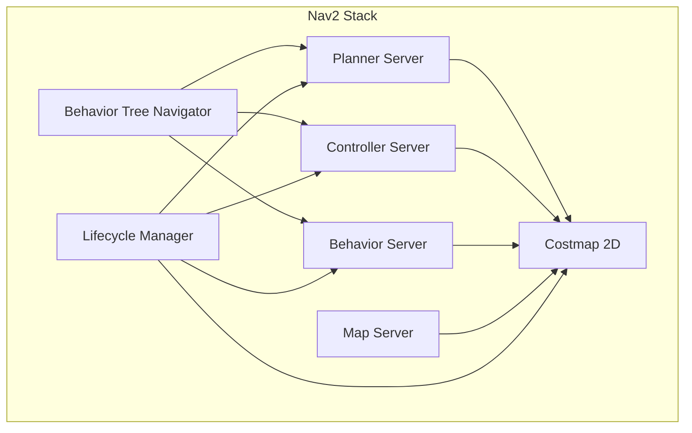

Nguồn sơ đồ: https://docs.nav2.org/concepts/index.html (dựa trên mô tả kiến trúc)

---

## 2. Kiến thức nền tảng trước khi học Nav2

### 2.1. Coordinate Frames (Hệ tọa độ) trong ROS

Trong ROS, tất cả các hệ tọa độ đều tuân theo **REP 103** (Standard Units of Measure and Coordinate Conventions) và **REP 105** (Coordinate Frames for Mobile Platforms).

#### REP 103 - Chuẩn đơn vị đo và quy ước hệ tọa độ

Theo REP 103:

- **Đơn vị:** Sử dụng SI units. Đơn vị góc là **radian** (không phải độ).

| Đại lượng | Đơn vị |
|-----------|--------|
| Chiều dài | meter (m) |
| Góc | radian (rad) |
| Tần số | hertz (Hz) |
| Lực | newton (N) |
| Công suất | watt (W) |

- **Chiều (Chirality):** Tất cả hệ tọa độ đều thuận tay phải (right-handed), tuân theo **right-hand rule**.
- **Hướng trục (Axis Orientation) - Đối với vật thể:**
  - X: hướng về phía trước (forward)
  - Y: hướng sang trái (left)
  - Z: hướng lên trên (up)
- **Biểu diễn xoay (Rotation Representation):** Thứ tự ưu tiên:
  1. Quaternion (không có điểm kỳ dị): Biểu diễn xoay bằng 4 số thực
  2. Rotation matrix: Ma trận 3×3 trực giao
  3. Fixed axis roll, pitch, yaw (dùng cho vận tốc góc): Xoay quanh 3 trục cố định X (roll), Y (pitch), Z (yaw) theo thứ tự đó
  4. Euler angles (không khuyến khích): Xoay quanh các trục Z (yaw), Y (pitch), X (roll)

Nguồn:
- https://www.ros.org/reps/rep-0103.html
- https://reps.openrobotics.org/rep-0103/

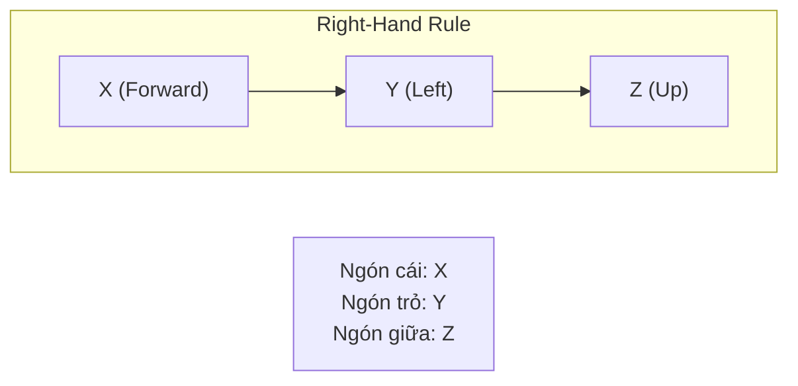

#### REP 105 - Hệ tọa độ cho robot di động

REP 105 định nghĩa các hệ tọa độ chuẩn:

| Frame | Ý nghĩa | Loại |
|-------|---------|------|
| `map` | Frame cố định tuyệt đối trong thế giới thực. Dùng cho biểu diễn toàn cục (globally consistent). Có thể nhảy (jump) khi localization cập nhật. | World-fixed |
| `odom` | Frame cố định tương đối, gắn với vị trí bắt đầu của robot. Dùng cho biểu diễn cục bộ (locally consistent). Liên tục, không nhảy. | World-fixed |
| `base_link` | Frame gắn chặt vào thân robot, thường ở tâm quay (rotation center). | Robot-attached |
| `base_laser` / `sensor_link` | Frame gắn tại vị trí cảm biến (LiDAR, camera, v.v.) | Sensor-attached |

**Chuỗi transform mà Nav2 yêu cầu:**

```
map  →  odom  →  base_link  →  sensor_link
```

- `map` → `odom`: Do hệ thống localization (ví dụ AMCL, SLAM) cung cấp
- `odom` → `base_link`: Do hệ thống odometry (wheel encoders, IMU fusion) cung cấp
- `base_link` → `sensor_link`: Do robot_state_publisher hoặc static_transform_publisher cung cấp

Nguồn:
- https://www.ros.org/reps/rep-0105.html
- https://docs.nav2.org/setup_guides/transformation/setup_transforms.html

> **Lưu ý:** `odom` frame dùng cho tham chiếu cục bộ ngắn hạn (local short-term), `map` frame dùng cho tham chiếu toàn cục dài hạn (global long-term). `odom` liên tục nhưng drift, `map` không drift nhưng có thể nhảy.

Nguồn: https://robotics.stackexchange.com/questions/117503/no-map-→-odom-tf-when-using-custom-odometry-in-ros-2-humble

---

## 3. Kiến trúc tổng thể của Nav2

Nav2 được xây dựng dựa trên kiến trúc plugin, sử dụng các **Action Server** và **Lifecycle Node** của ROS 2.

### 3.1. Kiến trúc tổng quan

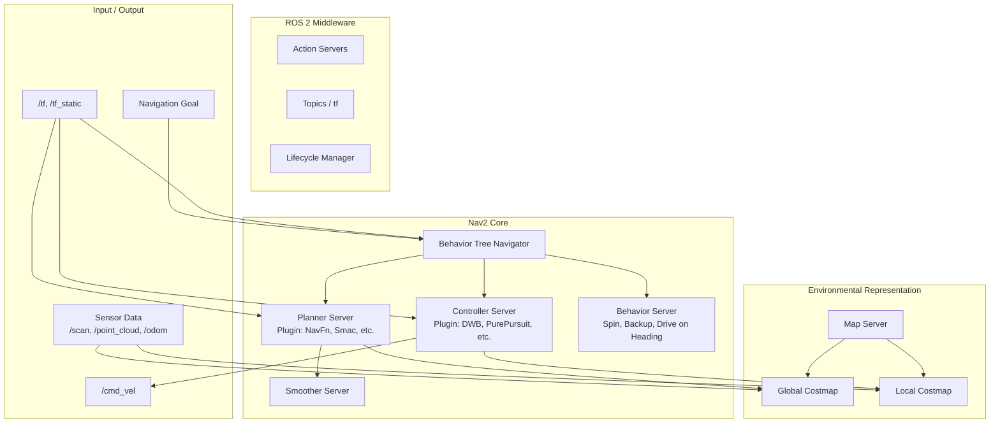

Nguồn: https://docs.nav2.org/concepts/index.html

### 3.2. Giải thích các thành phần

#### ROS 2 Action Server

Nav2 sử dụng Action Server (ROS 2 Actions) để nhận goal từ người dùng. Action cho phép:

- Gửi goal (ví dụ: navigate to pose)
- Theo dõi feedback (ví dụ: distance remaining)
- Nhận kết quả (thành công hay thất bại)
- Hủy bỏ goal giữa chừng

Nguồn: https://docs.nav2.org/concepts/index.html

#### Lifecycle Nodes

Nav2 sử dụng Lifecycle Nodes để quản lý trạng thái các thành phần:

1. **Unconfigured** → 2. **Inactive** → 3. **Active** → 4. **Finalized**

Điều này cho phép khởi tạo các node theo đúng thứ tự phụ thuộc.

Nguồn: https://docs.nav2.org/concepts/index.html

#### Behavior Trees

Nav2 sử dụng Behavior Trees (cây hành vi) để điều khiển luồng navigation. Behavior Tree cho phép:

- Kết hợp các hành động (action) và điều kiện (condition)
- Dễ dàng tùy chỉnh luồng hoạt động
- Hỗ trợ các control node: Sequence, Fallback, Parallel, Decorator

Nguồn: https://docs.nav2.org/concepts/index.html

### 3.3. Navigation Servers

| Server | Chức năng | Plugin ví dụ |
|--------|-----------|-------------|
| **Planner Server** | Tính toán đường đi toàn cục từ start đến goal | NavFn, Smac Planner 2D/ Hybrid |
| **Controller Server** | Điều khiển robot bám theo đường đi đã lập | DWB Controller, Pure Pursuit, Regulated Pure Pursuit |
| **Behavior Server** | Xử lý các hành vi phục hồi khi gặp sự cố | Spin, Backup, Drive on Heading, Assisted Teleop |
| **Smoother Server** | Làm mịn đường đi sau khi planner tạo ra | 

Nguồn: https://docs.nav2.org/concepts/index.html

---

## 4. Các thuật toán cốt lõi của Nav2

### 4.1. Planner (Global Planner)

**Vai trò:** Tính toán đường đi từ vị trí hiện tại đến vị trí đích trên costmap toàn cục.

**Đầu vào:**
- Global costmap
- Vị trí hiện tại (từ TF)
- Vị trí đích (từ action goal)

**Đầu ra:**
- `nav_msgs/msg/Path` - Đường đi dưới dạng chuỗi các pose

Các plugin Planner có sẵn:

| Plugin | Mô tả |
|--------|-------|
| **NavFn** | Thuật toán Navigation Function, tính toán đường đi dựa trên wavefront |
| **Smac Planner 2D** | Thuật toán Hybrid-A* cải tiến, hỗ trợ tìm đường trong không gian 2D |
| **Smac Planner Hybrid** | Mở rộng của Smac, hỗ trợ ràng buộc động học của robot |

Nguồn:
- https://docs.nav2.org/concepts/index.html
- https://docs.nav2.org/setup_guides/algorithm/select_algorithm.html

### 4.2. Controller (Local Planner / Controller)

**Vai trò:** Điều khiển robot bám theo đường đi đã lập, đồng thời tránh vật cản động sử dụng local costmap.

**Đầu vào:**
- Path (từ planner)
- Local costmap
- Vị trí hiện tại (từ TF / odometry)

**Đầu ra:**
- `geometry_msgs/msg/Twist` - Vận tốc tuyến tính và góc (cmd_vel)

Các plugin Controller có sẵn:

| Plugin | Mô tả |
|--------|-------|
| **DWB Controller** | Dynamic Window Approach, tính toán vận tốc tối ưu dựa trên cửa sổ động (dynamic window) |
| **Pure Pursuit** | Thuật toán pure pursuit, bám theo một điểm phía trước trên đường đi |
| **Regulated Pure Pursuit** | Mở rộng của Pure Pursuit, thêm ràng buộc về chi phí để tránh vật cản |

Nguồn:
- https://docs.nav2.org/concepts/index.html
- https://docs.nav2.org/setup_guides/algorithm/select_algorithm.html

### 4.3. Behavior Server (Recovery Behaviors)

**Vai trò:** Xử lý các tình huống robot bị kẹt, không thể đi tiếp.

Các hành vi phục hồi:

| Hành vi | Mô tả |
|---------|-------|
| **Spin** | Quay tại chỗ 360 độ để dò tìm không gian trống |
| **Backup** | Lùi lại một đoạn ngắn |
| **Drive on Heading** | Đi thẳng về phía trước một đoạn |
| **Assisted Teleop** | Cho phép người dùng điều khiển bằng tay |

Nguồn: https://docs.nav2.org/concepts/index.html

### 4.4. Costmap 2D

**Vai trò:** Biểu diễn môi trường dưới dạng lưới 2D, mỗi ô có một giá trị chi phí (cost).

Nav2 duy trì **2 costmap**:

| Costmap | Vùng bao phủ | Cập nhật | Mục đích |
|---------|-------------|----------|----------|
| **Global Costmap** | Toàn bộ bản đồ | Tần suất thấp | Dùng cho global planner |
| **Local Costmap** | Xung quanh robot | Tần suất cao | Dùng cho controller và tránh vật cản động |

**Giá trị cost:**
- 0: Free space (không gian trống)
- 0-100: Mức độ chi phí (càng cao càng nguy hiểm)
- 100: Lethal obstacle (vật cản tuyệt đối)

**Costmap Layers:**

| Layer | Mô tả |
|-------|-------|
| **Static Layer** | Dữ liệu từ bản đồ tĩnh (occupancy grid), vật cản cố định |
| **Obstacle Layer** | Dữ liệu từ cảm biến thời gian thực (/scan, /point_cloud), vật cản động |
| **Inflation Layer** | Mở rộng vùng chi phí xung quanh vật cản (dựa trên footprint và radius) |

Nguồn: https://docs.nav2.org/concepts/index.html

---

## 5. Input của Nav2

### 5.1. Tổng quan

Nav2 nhận các đầu vào sau từ hệ thống:

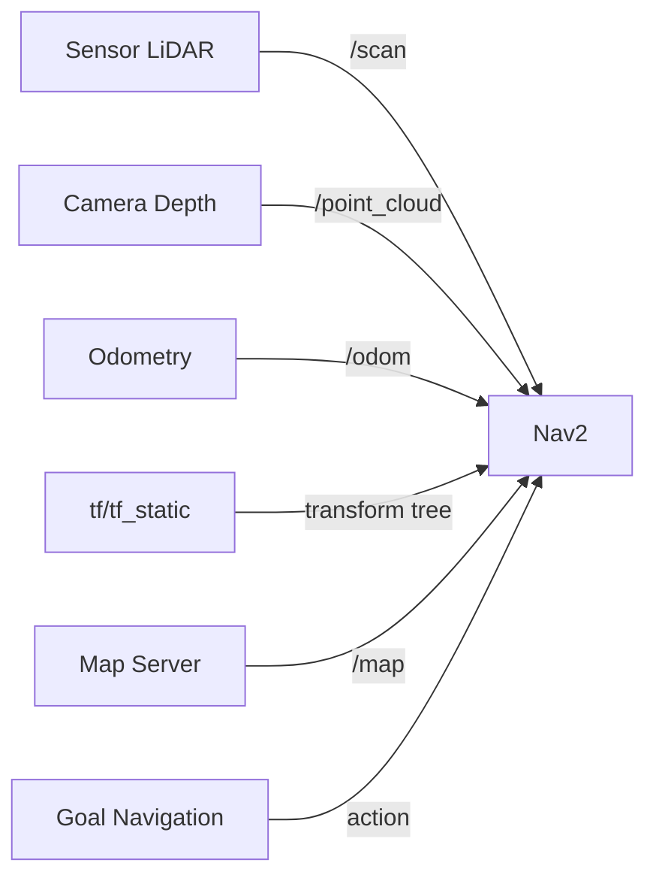

### 5.2. Bảng tổng hợp Input

| Topic / Interface | Message Type | Publisher | Ý nghĩa |
|------------------|--------------|-----------|---------|
| `/map` | `nav_msgs/msg/OccupancyGrid` | Map Server / SLAM | Bản đồ lưới nhị phân thể hiện không gian trống và vật cản tĩnh |
| `/scan` | `sensor_msgs/msg/LaserScan` | LiDAR 2D | Dữ liệu cảm biến khoảng cách thời gian thực (2D) |
| `/point_cloud` | `sensor_msgs/msg/PointCloud2` | Camera độ sâu | Dữ liệu cảm biến thời gian thực (3D -> projected thành 2D) |
| `/odom` | `nav_msgs/msg/Odometry` | Hệ thống odometry | Vị trí ước lượng và vận tốc hiện tại của robot |
| `/tf` | `tf2_msgs/msg/TFMessage` | Hệ thống TF | Transform tree: `map → odom → base_link` |
| `/tf_static` | `tf2_msgs/msg/TFMessage` | robot_state_publisher | Transform tĩnh: `base_link → sensor_link` |

Nguồn:
- https://docs.isaacsim.omniverse.nvidia.com/6.0.1/ros2_tutorials/tutorial_ros2_navigation.html

### 5.3. Giải thích chi tiết từng Input

#### /map

- **Publisher:** Map Server (từ file YAML/PGM) hoặc SLAM node
- **Nav2 sử dụng:** Làm lớp nền cho **global costmap** (Static Layer). Các ô có giá trị 100 (occupied) được đánh dấu là vật cản tuyệt đối.
- **Định dạng:** Occupancy Grid, giá trị 0-100 (-1 là unknown)

#### /scan

- **Publisher:** 2D LiDAR
- **Nav2 sử dụng:** Làm nguồn dữ liệu cho **Obstacle Layer** của local và global costmap. Phát hiện vật cản động và cập nhật costmap.

#### /point_cloud

- **Publisher:** 3D Camera / Depth camera
- **Nav2 sử dụng:** Có thể thay thế hoặc bổ sung cho /scan. Các điểm 3D được chiếu (project) xuống mặt phẳng 2D để tạo thành obstacle layer. Trong Isaac Sim, Nova Carter sử dụng RTX Lidar và /point_cloud được chuyển đổi thành /scan bởi node `pointcloud_to_laserscan`.

Nguồn: https://docs.isaacsim.omniverse.nvidia.com/6.0.1/ros2_tutorials/tutorial_ros2_navigation.html

#### /odom

- **Publisher:** Hệ thống odometry (wheel encoders, IMU fusion)
- **Nav2 sử dụng:** Cung cấp vận tốc hiện tại (twist) cho controller để tính toán bám đường. Cũng dùng để cập nhật transform `odom → base_link`.

#### /tf và /tf_static

- **Publisher:** Các node TF khác nhau:
  - `map → odom`: Do AMCL hoặc SLAM node publish
  - `odom → base_link`: Do robot_localization hoặc odometry node publish
  - `base_link → sensor_link`: Do robot_state_publisher (từ URDF) publish
- **Nav2 sử dụng:** Rất quan trọng. Nav2 cần TF để biết:
  - Robot đang ở đâu trong map
  - Cảm biến đang ở đâu so với robot
  - Dữ liệu cảm biến thuộc frame nào

Nguồn: https://docs.nav2.org/setup_guides/transformation/setup_transforms.html

> **Lưu ý:** Trong Isaac Sim với Nova Carter, các transform (TF) có thể được publish trực tiếp từ Isaac Sim thông qua Action Graph thay vì từ robot_state_publisher. Tuy nhiên, cũng có tùy chọn dùng robot_state_publisher bên ngoài để publish static TFs, trong khi Isaac Sim chỉ publish joint states cho các khớp động.

Nguồn: https://docs.isaacsim.omniverse.nvidia.com/6.0.1/ros2_tutorials/tutorial_ros2_navigation.html

---

## 6. Output của Nav2

### 6.1. Bảng tổng hợp Output

| Topic | Message Type | Subscriber | Ý nghĩa |
|-------|-------------|------------|---------|
| `/cmd_vel` | `geometry_msgs/msg/Twist` | Motor Driver / Isaac Sim | Lệnh vận tốc tuyến tính và góc |
| `/plan` | `nav_msgs/msg/Path` | RViz (visualization) | Đường đi tổng thể để hiển thị |

Nguồn:
- https://docs.isaacsim.omniverse.nvidia.com/6.0.1/ros2_tutorials/tutorial_ros2_navigation.html

### 6.2. Giải thích chi tiết Output

#### /cmd_vel

Đây là đầu ra quan trọng nhất của Nav2.

- **Message type:** `geometry_msgs/msg/Twist`
- **Nội dung:**
  - `linear.x`: Vận tốc tịnh tiến theo trục X (m/s) - tiến/lùi
  - `linear.y`: Vận tốc tịnh tiến theo trục Y (m/s) - thường = 0 với differential drive
  - `linear.z`: Vận tốc tịnh tiến theo trục Z (m/s) - thường = 0
  - `angular.x`: Vận tốc góc quanh trục X (rad/s) - thường = 0
  - `angular.y`: Vận tốc góc quanh trục Y (rad/s) - thường = 0
  - `angular.z`: Vận tốc góc quanh trục Z (rad/s) - quay trái/phải

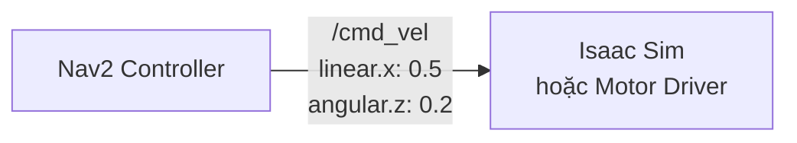

Nguồn: https://docs.isaacsim.omniverse.nvidia.com/6.0.1/ros2_tutorials/tutorial_ros2_navigation.html

#### /plan

- **Message type:** `nav_msgs/msg/Path`
- **Mục đích:** Visualization trên RViz để lập trình viên quan sát đường đi
- **Nội dung:** Chuỗi các `geometry_msgs/PoseStamped` đại diện cho đường đi

---

## 7. Luồng hoạt động của Nav2

### 7.1. Tổng quan luồng

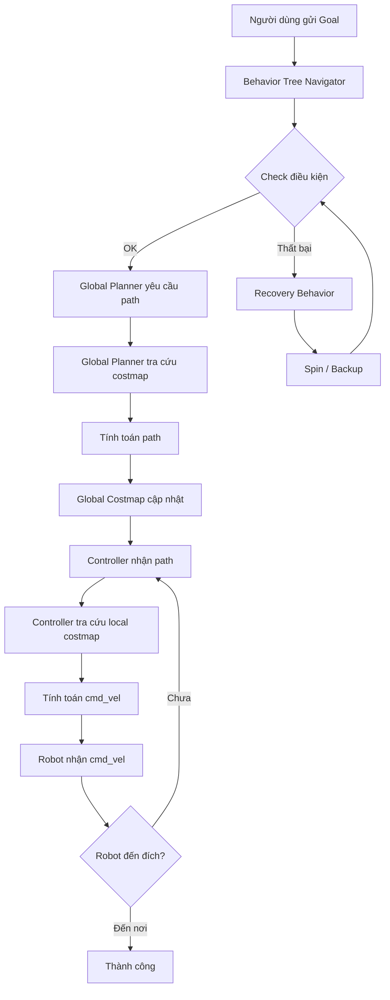

Nguồn: https://docs.nav2.org/concepts/index.html

### 7.2. Mô tả chi tiết từng bước

#### Bước 1: Robot nhận dữ liệu cảm biến

Các cảm biến (LiDAR, camera, encoder) publish dữ liệu lên các topic:
- `/scan` hoặc `/point_cloud`: Dữ liệu môi trường xung quanh
- `/odom`: Vị trí và vận tốc ước lượng
- `/tf`: Transform tree

#### Bước 2: Localization

Hệ thống localization (AMCL, SLAM, hoặc robot_localization) xác định vị trí của robot trên bản đồ và publish transform `map → odom`.

#### Bước 3: Cập nhật TF

Nav2 liên tục lắng nghe `/tf` và `/tf_static` để biết vị trí hiện tại của robot trong các hệ tọa độ khác nhau.

#### Bước 4: Cập nhật Costmap

Costmap được cập nhật từ:
- Static Layer: `/map`
- Obstacle Layer: `/scan` / `/point_cloud` (vật cản động thời gian thực)
- Inflation Layer: Mở rộng vùng cấm xung quanh vật cản

#### Bước 5: Planner tính toán Path

Khi nhận được goal, Global Planner sử dụng global costmap để tính toán đường đi từ vị trí hiện tại đến đích.

#### Bước 6: Controller nhận Path và bám đường

Controller nhận path từ planner, kết hợp local costmap để tính toán vận tốc (cmd_vel) phù hợp, đồng thời tránh vật cản động.

#### Bước 7: Gửi cmd_vel đến robot

Controller publish `/cmd_vel` với vận tốc tuyến tính và góc phù hợp.

#### Bước 8: Robot di chuyển

Robot nhận cmd_vel và di chuyển. Quá trình lặp lại từ bước 1 đến khi đến đích.

---

## 8. Giao tiếp giữa Nav2 và Isaac Sim

### 8.1. Tổng quan

Khi Nav2 được tích hợp với NVIDIA Isaac Sim, luồng dữ liệu diễn ra như sau:

1. Nav2 chạy trong môi trường ROS 2
2. Nav2 nhận dữ liệu cảm biến từ Isaac Sim (qua ROS 2 bridge)
3. Nav2 tính toán và publish `/cmd_vel`
4. Isaac Sim nhận `/cmd_vel` qua ROS 2 Subscribe node trong OmniGraph
5. Differential Controller trong OmniGraph chuyển đổi cmd_vel thành vận tốc bánh xe
6. Articulation Controller áp dụng vận tốc lên các joint của robot

Nguồn:
- https://docs.isaacsim.omniverse.nvidia.com/6.0.1/ros2_tutorials/tutorial_ros2_navigation.html
- https://docs.nvidia.com/learning/physical-ai/getting-started-with-isaac-sim/latest/developing-robots-with-sil-in-isaac-sim/03-using-omnigraph-to-drive-a-robot-in-isaac-sim.html

### 8.2. Sơ đồ Sequence

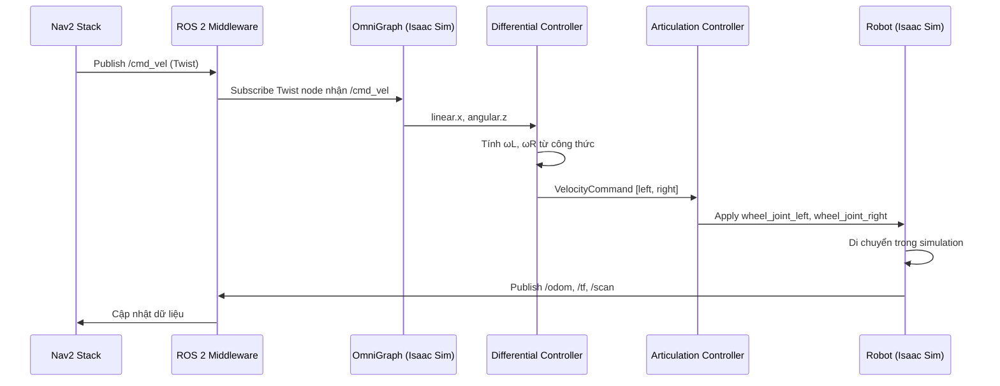

Nguồn:
- https://docs.nvidia.com/learning/physical-ai/getting-started-with-isaac-sim/latest/developing-robots-with-sil-in-isaac-sim/03-using-omnigraph-to-drive-a-robot-in-isaac-sim.html
- https://docs.isaacsim.omniverse.nvidia.com/6.0.1/robot_simulation/mobile_robot_controllers.html

### 8.3. Block Diagram từ tài liệu Isaac Sim

Theo tài liệu Isaac Sim, các ROS 2 topics và message types được publish đến Nav2:

| ROS2 Topic | ROS2 Message Type |
|------------|-------------------|
| `/tf` | `tf2_msgs/TFMessage` |
| `/odom` | `nav_msgs/Odometry` |
| `/map` | `nav_msgs/OccupancyGrid` |
| `/point_cloud` | `sensor_msgs/PointCloud2` |
| `/scan` | `sensor_msgs/LaserScan` (từ node pointcloud_to_laserscan) |

Nguồn: https://docs.isaacsim.omniverse.nvidia.com/6.0.1/ros2_tutorials/tutorial_ros2_navigation.html

---

## 9. Differential Controller trong Isaac Sim

### 9.1. Vai trò

Theo tài liệu Isaac Sim, **Differential Controller** sử dụng sự chênh lệch tốc độ giữa bánh trái và bánh phải để điều khiển vận tốc tuyến tính và vận tốc góc của robot. Nó phù hợp với robot dạng differential drive như NVIDIA Nova Carter.

Nguồn: https://docs.isaacsim.omniverse.nvidia.com/6.0.1/robot_simulation/mobile_robot_controllers.html

### 9.2. Đầu vào (Inputs)

| Input | Kiểu | Mô tả |
|-------|------|-------|
| `execIn` | Execution | Tín hiệu kích hoạt từ đồng hồ |
| `wheelRadius` | float | Bán kính bánh xe (meters) |
| `wheelDistance` | float | Khoảng cách giữa hai bánh xe (meters) |
| `dt` | float | Delta time (seconds) |
| `maxAcceleration` | float | Gia tốc tuyến tính tối đa (m/s²) |
| `maxDeceleration` | float | Giảm tốc tuyến tính tối đa (m/s²) |
| `maxAngularAcceleration` | float | Gia tốc góc tối đa (rad/s²) |
| `maxLinearSpeed` | float | Vận tốc tuyến tính tối đa (m/s) |
| `maxAngularSpeed` | float | Vận tốc góc tối đa (rad/s) |
| `maxWheelSpeed` | float | Vận tốc bánh xe tối đa (rad/s) |
| `Desired Linear Velocity` | float | Vận tốc tuyến tính mong muốn (m/s) |
| `Desired Angular Velocity` | float | Vận tốc góc mong muốn (rad/s) |

### 9.3. Đầu ra (Outputs)

| Output | Kiểu | Mô tả |
|--------|------|-------|
| `VelocityCommand` | float[2] | Lệnh vận tốc cho bánh trái và phải: `[left_wheel_velocity, right_wheel_velocity]` (m/s, rad/s) |

> **Lưu ý:** `VelocityCommand` được sắp xếp là `[vận tốc bánh trái, vận tốc bánh phải]`. Khi kết nối output này đến Articulation Controller, cần liệt kê tên các joint theo đúng thứ tự bánh trái trước, bánh phải sau.

Nguồn: https://docs.isaacsim.omniverse.nvidia.com/6.0.1/robot_simulation/mobile_robot_controllers.html

### 9.4. Cấu hình ví dụ (Nova Carter)

| Tham số | Giá trị |
|---------|---------|
| `Max Linear Speed` | 2.0 m/s |
| `Max Angular Speed` | 3.0 rad/s |
| `Wheel Distance` | 0.413 m |
| `Wheel Radius` | 0.14 m |

Nguồn: https://docs.nvidia.com/learning/physical-ai/getting-started-with-isaac-sim/latest/developing-robots-with-sil-in-isaac-sim/03-using-omnigraph-to-drive-a-robot-in-isaac-sim.html

### 9.5. OmniGraph Node Connections

Trong OmniGraph, Differential Controller được kết nối với các node sau:

```
ROS2 Context → On Playback Tick → ROS2 Subscribe Twist → Scale To/From Stage Units 
→ Break 3-Vector (x2) → Make Array → Differential Controller → Articulation Controller
```

Các Constant Token node chỉ định tên joint:
- `joint_wheel_left`
- `joint_wheel_right`

Nguồn: https://docs.nvidia.com/learning/physical-ai/getting-started-with-isaac-sim/latest/developing-robots-with-sil-in-isaac-sim/03-using-omnigraph-to-drive-a-robot-in-isaac-sim.html

---

## 10. Nguyên lý Differential Drive

### 10.1. Khái niệm

Differential drive là cơ cấu di chuyển sử dụng hai bánh xe độc lập (trái và phải). Bằng cách điều khiển tốc độ và chiều quay của từng bánh, robot có thể:

- **Đi thẳng:** Cả hai bánh quay cùng tốc độ, cùng chiều
- **Quay trái:** Bánh phải quay nhanh hơn bánh trái, hoặc bánh trái quay ngược chiều
- **Quay phải:** Bánh trái quay nhanh hơn bánh phải, hoặc bánh phải quay ngược chiều
- **Quay tại chỗ:** Hai bánh quay ngược chiều nhau, cùng tốc độ
- **Đi lùi:** Cả hai bánh quay cùng tốc độ, ngược chiều

Nguồn: https://docs.isaacsim.omniverse.nvidia.com/6.0.1/robot_simulation/mobile_robot_controllers.html

### 10.2. Sơ đồ các chế độ di chuyển

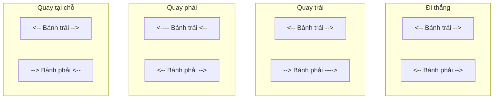

> **Công thức:** Differential controller sử dụng sự chênh lệch tốc độ giữa bánh trái và bánh phải để tạo ra vận tốc tuyến tính và vận tốc góc cho toàn bộ robot.

Nguồn: https://docs.isaacsim.omniverse.nvidia.com/6.0.1/robot_simulation/mobile_robot_controllers.html

---

## 11. Công thức chuyển đổi cmd_vel thành tốc độ bánh xe

### 11.1. Ký hiệu và ý nghĩa

| Ký hiệu | Ý nghĩa | Đơn vị |
|---------|---------|--------|
| $V$ | Vận tốc tuyến tính của robot (linear.x) | m/s |
| $\omega$ | Vận tốc góc của robot (angular.z) | rad/s |
| $r$ | Bán kính bánh xe (wheel radius) | m |
| $l_{tw}$ | Khoảng cách giữa hai bánh xe (wheel distance / wheel base) | m |
| $\omega_R$ | Vận tốc góc mong muốn của bánh phải | rad/s |
| $\omega_L$ | Vận tốc góc mong muốn của bánh trái | rad/s |
| $V_R$ | Vận tốc tuyến tính của bánh phải | m/s |
| $V_L$ | Vận tốc tuyến tính của bánh trái | m/s |

Nguồn: https://docs.isaacsim.omniverse.nvidia.com/6.0.1/robot_simulation/mobile_robot_controllers.html

### 11.2. Công thức

Theo tài liệu Isaac Sim Mobile Robot Controllers, công thức chính xác được sử dụng là:

```
ω_R = (1 / 2r) * (2V + ω * l_tw)
ω_L = (1 / 2r) * (2V - ω * l_tw)
```

Hay viết dưới dạng vận tốc tuyến tính của bánh xe:

```
V_R = V + (ω * l_tw) / 2
V_L = V - (ω * l_tw) / 2
```

Trong đó:
$$V_R = \omega_R \times r$$
$$V_L = \omega_L \times r$$

Nguồn:
- https://docs.isaacsim.omniverse.nvidia.com/6.0.1/robot_simulation/mobile_robot_controllers.html
- https://robotics.stackexchange.com/questions/93410/how-to-split-cmd-vel-into-left-and-right-wheel-of-2wd-robot

### 11.3. Giải thích trực quan

- **Khi robot đi thẳng** ($\omega = 0$):
  $$V_R = V$$
  $$V_L = V$$
  - Cả hai bánh quay cùng tốc độ

- **Khi robot quay phải** ($\omega > 0$):
  - $V_R = V + (\omega \times l_{tw}) / 2$ → Bánh phải nhanh hơn
  - $V_L = V - (\omega \times l_{tw}) / 2$ → Bánh trái chậm hơn

- **Khi robot quay trái** ($$\omega < 0$$):
  - $V_R = V + (\omega \times l_{tw}) / 2$ → (với ω âm, VR giảm)
  - $V_L = V - (\omega \times l_{tw}) / 2$ → (với ω âm, VL tăng)

- **Khi quay tại chỗ** ($$V = 0$$):
  $$V_R = (\omega \times l_{tw}) / 2$$
  $$V_L = -(\omega \times l_{tw}) / 2$$
  - Hai bánh quay ngược chiều, cùng tốc độ

### 11.4. Ví dụ tính toán

**Ví dụ 1:** Robot Nova Carter muốn đi thẳng với V = 0.5 m/s
- `Wheel Radius (r) = 0.14 m`, `Wheel Distance (l_tw) = 0.413 m`
- ω = 0 (không quay)

```
V_R = 0.5 + (0 * 0.413) / 2 = 0.5 m/s
V_L = 0.5 - (0 * 0.413) / 2 = 0.5 m/s

ω_R = 0.5 / 0.14 = 3.57 rad/s
ω_L = 0.5 / 0.14 = 3.57 rad/s
```

**Ví dụ 2:** Robot quay tại chỗ với ω = 1.0 rad/s

```
V_R = 0 + (1.0 * 0.413) / 2 = 0.2065 m/s
V_L = 0 - (1.0 * 0.413) / 2 = -0.2065 m/s

ω_R = 0.2065 / 0.14 = 1.475 rad/s
ω_L = -0.2065 / 0.14 = -1.475 rad/s
```

**Ví dụ 3:** Robot vừa tiến vừa quay phải, V = 0.3 m/s, ω = 0.5 rad/s

```
V_R = 0.3 + (0.5 * 0.413) / 2 = 0.3 + 0.10325 = 0.40325 m/s
V_L = 0.3 - (0.5 * 0.413) / 2 = 0.3 - 0.10325 = 0.19675 m/s
```

### 11.5. Bảng tổng hợp các chế độ

| Chế độ | V | ω | V_L | V_R | Kết quả |
|--------|---|---|-----|-----|---------|
| Đi thẳng | > 0 | 0 | V | V | Robot tiến thẳng |
| Lùi | < 0 | 0 | V | V | Robot lùi thẳng |
| Quay trái | 0 | > 0 | -V_ω | V_ω | Robot quay trái tại chỗ |
| Quay phải | 0 | < 0 | V_ω | -V_ω | Robot quay phải tại chỗ |
| Rẽ trái | > 0 | > 0 | V - V_ω | V + V_ω | Robot rẽ trái |
| Rẽ phải | > 0 | < 0 | V + V_ω | V - V_ω | Robot rẽ phải |

> **Ghi chú:** $$V_ω = (\omega \times l_{tw}) / 2$$

Nguồn: https://docs.isaacsim.omniverse.nvidia.com/6.0.1/robot_simulation/mobile_robot_controllers.html

---

## 12. Toàn bộ Pipeline từ Nav2 đến Isaac Sim

### 12.1. Sơ đồ tổng thể

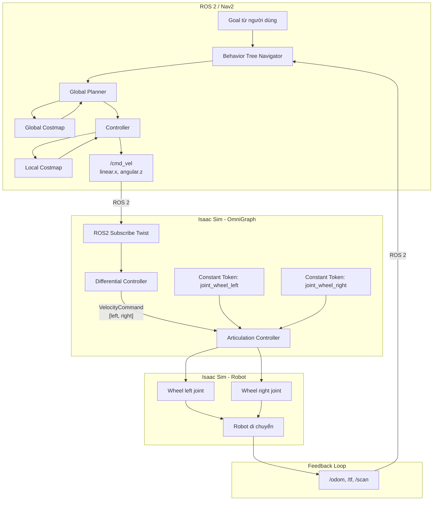

Nguồn:
- https://docs.nav2.org/concepts/index.html
- https://docs.isaacsim.omniverse.nvidia.com/6.0.1/ros2_tutorials/tutorial_ros2_navigation.html
- https://docs.nvidia.com/learning/physical-ai/getting-started-with-isaac-sim/latest/developing-robots-with-sil-in-isaac-sim/03-using-omnigraph-to-drive-a-robot-in-isaac-sim.html

### 12.2. Mô tả từng bước

| Bước | Thành phần | Mô tả |
|------|-----------|-------|
| 1 | User | Gửi navigation goal (pose đích) |
| 2 | Behavior Tree Navigator | Tiếp nhận goal, điều phối toàn bộ quy trình |
| 3 | Global Planner | Yêu cầu global costmap, tính toán đường đi tối ưu |
| 4 | Global Costmap | Cung cấp thông tin vật cản toàn cục |
| 5 | Controller | Nhận path từ planner, kết hợp local costmap |
| 6 | Local Costmap | Cập nhật vật cản động xung quanh robot |
| 7 | `/cmd_vel` | Controller publish vận tốc (linear.x, angular.z) |
| 8 | ROS 2 Bridge | Chuyển tiếp /cmd_vel qua ROS 2 bridge đến Isaac Sim |
| 9 | ROS2 Subscribe Twist | Nhận /cmd_vel trong OmniGraph |
| 10 | Differential Controller | Chuyển đổi cmd_vel thành vận tốc từng bánh xe |
| 11 | Articulation Controller | Gửi lệnh vận tốc đến các joint của robot |
| 12 | Wheel Joints | Bánh trái/phải quay với vận tốc tương ứng |
| 13 | Robot | Di chuyển trong môi trường mô phỏng |
| 14 | Sensors | Isaac Sim publish /odom, /tf, /scan, /point_cloud |
| 15 | Nav2 | Nhận feedback, tiếp tục vòng lặp điều khiển |

Nguồn:
- https://docs.nav2.org/concepts/index.html
- https://docs.isaacsim.omniverse.nvidia.com/6.0.1/ros2_tutorials/tutorial_ros2_navigation.html
- https://docs.nvidia.com/learning/physical-ai/getting-started-with-isaac-sim/latest/developing-robots-with-sil-in-isaac-sim/03-using-omnigraph-to-drive-a-robot-in-isaac-sim.html
- https://docs.isaacsim.omniverse.nvidia.com/6.0.1/robot_simulation/mobile_robot_controllers.html

### 12.3. Sequence Diagram chi tiết

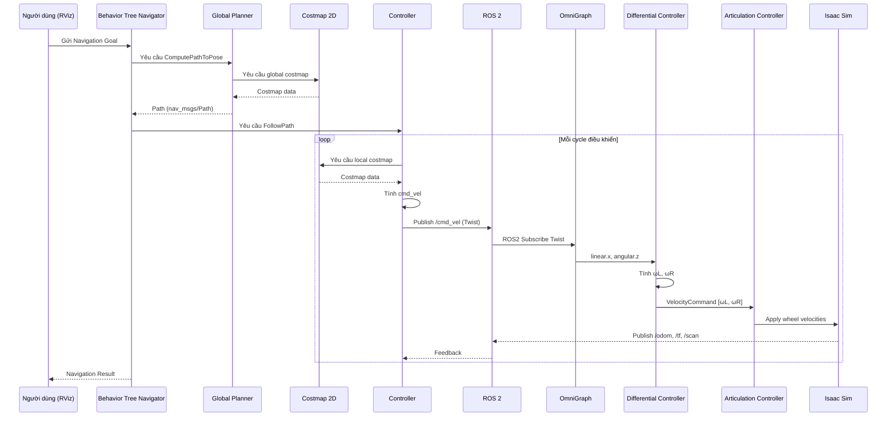

Nguồn:
- https://docs.nav2.org/concepts/index.html
- https://docs.isaacsim.omniverse.nvidia.com/6.0.1/ros2_tutorials/tutorial_ros2_navigation.html
- https://docs.nvidia.com/learning/physical-ai/getting-started-with-isaac-sim/latest/developing-robots-with-sil-in-isaac-sim/03-using-omnigraph-to-drive-a-robot-in-isaac-sim.html

---

## 13. Cấu hình Nav2 qua file YAML

### 13.1. Tổng quan

Nav2 sử dụng file cấu hình YAML để cấu hình tất cả các server và plugin. File YAML này được nạp khi khởi động thông qua tham số ROS 2 (parameter).

Nguồn: https://docs.nav2.org/configuration/index.html#core-servers

### 13.2. Các server cần cấu hình

| Server | File cấu hình | Mô tả |
|--------|--------------|-------|
| **Controller Server** | `configuring-controller-server.html` | Cấu hình local planner plugin (DWB, Pure Pursuit, Regulated Pure Pursuit) |
| **Planner Server** | `configuring-planner-server.html` | Cấu hình global planner plugin (NavFn, Smac Planner 2D/Hybrid) |
| **Costmap 2D** | `configuring-costmaps.html` | Cấu hình global và local costmap, layers, footprint |

Nguồn:
- https://docs.nav2.org/configuration/packages/configuring-controller-server.html
- https://docs.nav2.org/configuration/packages/configuring-planner-server.html
- https://docs.nav2.org/configuration/packages/configuring-costmaps.html

### 13.3. File mẫu chính thức

File cấu hình YAML mẫu đầy đủ được duy trì tại kho mã nguồn Nav2:

```
https://github.com/ros-navigation/navigation2/blob/main/nav2_bringup/params/nav2_params.yaml
```

File này chứa cấu hình mẫu cho tất cả các tham số của Nav2, bao gồm:
- `amcl`: Tham số localization
- `bt_navigator`: Tham số Behavior Tree Navigator
- `controller_server`: Tham số Controller Server và plugin
- `planner_server`: Tham số Planner Server và plugin
- `global_costmap` / `local_costmap`: Tham số costmap
- `map_server`: Tham số Map Server
- `behavior_server`: Tham số Behavior Server

Nguồn: https://github.com/ros-navigation/navigation2/blob/main/nav2_bringup/params/nav2_params.yaml

### 13.4. Lưu ý khi cấu hình cho Isaac Sim

Khi tích hợp với Isaac Sim, cần đặc biệt chú ý các tham số sau trong file YAML:

- **`controller_server`**: Cấu hình `RegulatedPurePursuitController` hoặc `DWBController` phù hợp với động học của robot mô phỏng
- **`local_costmap`**: Điều chỉnh kích thước và tần suất cập nhật phù hợp với tốc độ mô phỏng
- **`global_costmap`**: Sử dụng static map nếu có bản đồ môi trường Isaac Sim

> **Mẹo:** Bắt đầu với file `nav2_params.yaml` mẫu, sau đó tinh chỉnh các tham số dựa trên cấu hình robot cụ thể (ví dụ: wheel radius, max speed, footprint).

---

## 14. Tổng kết

### 14.1. Luồng tổng quát

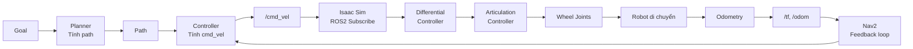

### 14.2. Checklist kiến thức cần nhớ

| STT | Kiến thức | Đã nắm? |
|-----|-----------|---------|
| ☐ | `map` frame: global, absolute, có thể nhảy | |
| ☐ | `odom` frame: local, continuous, bị drift | |
| ☐ | `base_link` frame: gắn chặt vào robot | |
| ☐ | TF tree: `map → odom → base_link → sensor_link` | |
| ☐ | REP 103: right-hand rule, X-forward, Y-left, Z-up | |
| ☐ | REP 105: coordinate frames cho mobile platforms | |
| ☐ | Nav2 gồm: Planner, Controller, Behavior, Costmap, BT | |
| ☐ | Global Planner nhận costmap, trả path | |
| ☐ | Controller nhận path, trả cmd_vel | |
| ☐ | Costmap 2 lớp: global (toàn bộ) và local (quanh robot) | |
| ☐ | 3 layer: Static, Obstacle, Inflation | |
| ☐ | Input Nav2: /map, /scan, /point_cloud, /odom, /tf | |
| ☐ | Output Nav2: /cmd_vel (Twist: linear.x, angular.z) | |
| ☐ | Isaac Sim nhận /cmd_vel qua ROS2 Subscribe Twist | |
| ☐ | Differential Controller chuyển cmd_vel → tốc độ bánh | |
| ☐ | Articulation Controller gửi lệnh đến wheel joints | |
| ☐ | Wheel Radius và Wheel Distance là 2 tham số quan trọng | |
| ☐ | Công thức: ω_R = (2V + ω×l_tw)/(2r), ω_L = (2V - ω×l_tw)/(2r) | |
| ☐ | Đi thẳng: ωL = ωR, Quay tại chỗ: ωL = -ωR | |
| ☐ | Cấu hình Nav2 qua file YAML (Controller, Planner, Costmap) | |
| ☐ | File mẫu nav2_params.yaml trên GitHub | |
| ☐ | Tinh chỉnh YAML khi tích hợp Isaac Sim | |

Nguồn tổng hợp từ toàn bộ tài liệu tham khảo.

### 14.3. Thông điệp chính

1. **Nav2 là bộ điều hướng** - nó nhận goal, tính path, và tạo cmd_vel
2. **Isaac Sim là môi trường mô phỏng** - nó nhận cmd_vel, mô phỏng vật lý, và gửi lại sensor data
3. **Differential Controller là cầu nối** - nó chuyển cmd_vel (vận tốc robot) thành vận tốc từng bánh xe
4. **Công thức là nền tảng** - hiểu công thức để hiểu tại sao robot di chuyển như vậy
5. **TF là huyết mạch** - không có TF đúng, Nav2 không hoạt động
6. **YAML là bảng điều khiển** - file cấu hình quyết định toàn bộ hành vi Nav2

---

## Phụ lục: Danh sách nguồn tham khảo

| # | Nguồn | URL |
|---|-------|-----|
| 1 | REP 103 - Standard Units and Coordinate Conventions | https://www.ros.org/reps/rep-0103.html |
| 2 | REP 105 - Coordinate Frames for Mobile Platforms | https://www.ros.org/reps/rep-0105.html |
| 3 | Nav2 Concepts | https://docs.nav2.org/concepts/index.html |
| 4 | Nav2 Algorithm Selection | https://docs.nav2.org/setup_guides/algorithm/select_algorithm.html |
| 5 | Nav2 Setup Transforms | https://docs.nav2.org/setup_guides/transformation/setup_transforms.html |
| 6 | Isaac Sim - ROS 2 Navigation Tutorial | https://docs.isaacsim.omniverse.nvidia.com/6.0.1/ros2_tutorials/tutorial_ros2_navigation.html |
| 7 | Isaac Sim - Mobile Robot Controllers | https://docs.isaacsim.omniverse.nvidia.com/6.0.1/robot_simulation/mobile_robot_controllers.html |
| 8 | Isaac Sim - Motion Generation Controllers | https://docs.isaacsim.omniverse.nvidia.com/6.0.1/motion_generation/mobile_robot_control_example.html |
| 9 | Using OmniGraph to Drive a Robot (NVIDIA Learning) | https://docs.nvidia.com/learning/physical-ai/getting-started-with-isaac-sim/latest/developing-robots-with-sil-in-isaac-sim/03-using-omnigraph-to-drive-a-robot-in-isaac-sim.html |
| 10 | ROS 2 Control - Diff Drive Controller | https://control.ros.org/rolling/doc/ros2_controllers/diff_drive_controller/doc/userdoc.html |
| 11 | Robotics StackExchange - Split cmd_vel | https://robotics.stackexchange.com/questions/93410/how-to-split-cmd-vel-into-left-and-right-wheel-of-2wd-robot |
| 12 | HiWonder JetRover - Chassis Motion Control | https://wiki.hiwonder.com/projects/JetRover/en/jetrover-jetson-nano/docs/3_ROS1-Chassis_Motion_Control_Lesson.html |
| 13 | ROS Answers - Coordinate Frames (REP 105) | https://robotics.stackexchange.com/questions/84816/how-does-robot_localization-finds-tf-between-odom-and-base-link |
| 14 | ROS Answers - No map→odom TF | https://robotics.stackexchange.com/questions/117503/no-map-→-odom-tf-when-using-custom-odometry-in-ros-2-humble |
| 15 | Nav2 Core Configuration Overview | https://docs.nav2.org/configuration/index.html#core-servers |
| 16 | Nav2 Controller Server Configuration | https://docs.nav2.org/configuration/packages/configuring-controller-server.html |
| 17 | Nav2 Planner Server Configuration | https://docs.nav2.org/configuration/packages/configuring-planner-server.html |
| 18 | Nav2 Costmap 2D Configuration | https://docs.nav2.org/configuration/packages/configuring-costmaps.html |
| 19 | Nav2 Official Params YAML (GitHub) | https://github.com/ros-navigation/navigation2/blob/main/nav2_bringup/params/nav2_params.yaml |