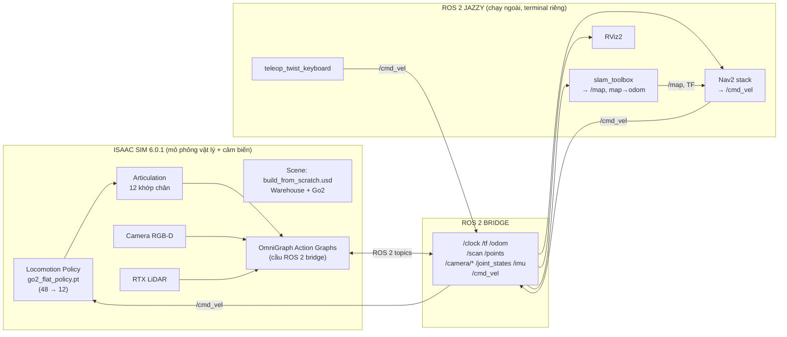
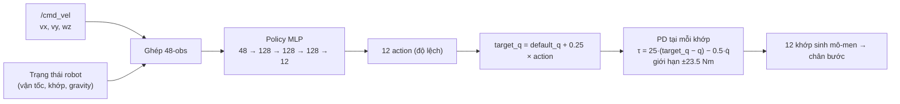
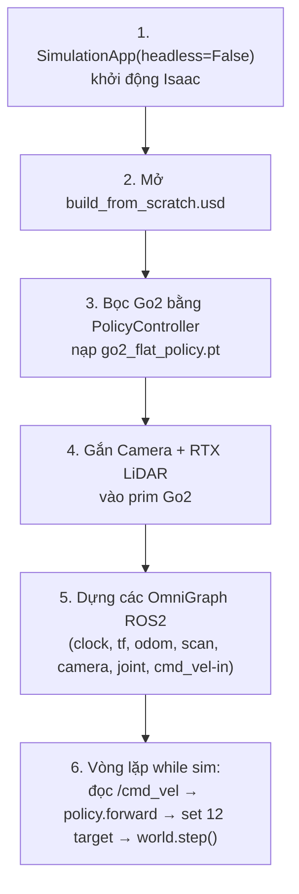
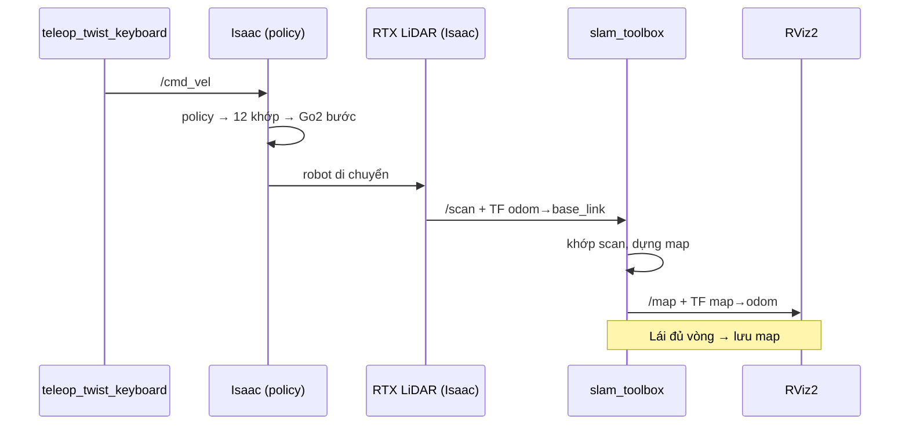
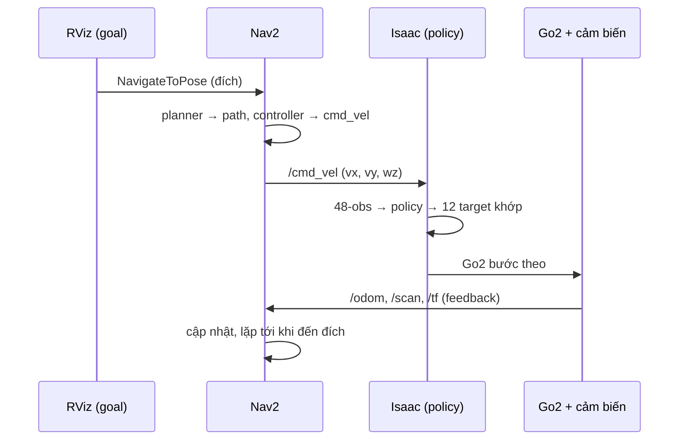

# STEP 1 — Dựng con Go2 chạy được: Isaac Sim ↔ ROS 2 ↔ SLAM ↔ Nav2

> **Mục tiêu Step 1:** Từ scene `build_from_scratch.usd` (warehouse + Go2 đã kéo thả), biến con Go2 thành một robot **điều khiển được**: nhận lệnh (bàn phím hoặc Nav2), tự bước đi bằng policy đã train, mang camera + LiDAR quét bản đồ, đẩy đầy đủ topic sang ROS 2, dựng map bằng SLAM, và để Nav2 tự lái đến đích.
>
> Tài liệu này **liệt kê từng thành phần**, nó **được cụ thể hóa bằng cái gì** (file `.usd`, `.pt`, node OmniGraph, node ROS 2, file `.yaml`), **tác dụng** của nó, và **giao tiếp với nhau qua đâu** (ROS 2 topic / action / TF / OmniGraph).

---

## 0. Điểm mấu chốt phải hiểu trước: Go2 KHÁC robot bánh xe

Tài liệu `nav2_isaac_sim.md` bạn đã viết mô tả robot **bánh xe** (Nova Carter). Ở đó `/cmd_vel` → **Differential Controller** → 2 bánh. Đơn giản, không cần train gì.

Con **Go2 không có bánh**. Nó có **12 khớp động cơ ở 4 chân**. Không có công thức nào biến "đi 0.5 m/s" thành 12 góc khớp. Vì vậy giữa `/cmd_vel` và cái chân **bắt buộc phải chèn một lớp policy** (mạng neural đã train ở `setup-isaac-lab.md`).

| | Robot bánh xe (Nova Carter) | Robot 4 chân (Go2) |
|---|---|---|
| Lớp giữa `/cmd_vel` và cơ cấu | Differential Controller (công thức) | **Locomotion Policy** (`policy.pt`, mạng neural 48→12) |
| Đầu ra lớp giữa | 2 vận tốc bánh | **12 góc khớp mục tiêu** |
| Tần số chạy | — | **50 Hz** (chạy inference liên tục) |
| Có sẵn free? | Có | **Không** — phải train (bạn đã train xong) |

> Đây là lý do toàn bộ Step 1 phải xây một pipeline riêng cho robot chân, không dùng lại được Differential Controller.

Nguồn: https://docs.isaacsim.omniverse.nvidia.com/6.0.0/ros2_tutorials/tutorial_ros2_rl_controller.html · https://docs.isaacsim.omniverse.nvidia.com/6.0.0/robot_simulation/ext_isaacsim_robot_policy_example.html

---

## 1. Bản đồ toàn cảnh Step 1

Ba khối lớn, giao tiếp với nhau qua **ROS 2 (DDS)**:



**Vòng khép kín (closed loop):**
`/cmd_vel` (từ Nav2 hoặc bàn phím) → **Policy** biến thành 12 góc khớp → Go2 **bước đi** → cảm biến (LiDAR/camera/odom) đẩy dữ liệu ra ROS 2 → SLAM dựng map, Nav2 tính đường → ra `/cmd_vel` mới. Quay lại đầu.

---

## 2. Bảng tổng hợp: mọi thành phần cần có ở Step 1

| # | Thành phần | Được cụ thể hóa bằng | Tác dụng | Giao tiếp qua |
|---|-----------|----------------------|----------|---------------|
| A | **Scene mô phỏng** | `build_from_scratch.usd` | Chứa warehouse + prim Go2 `/World/Go2` | USD stage (trong Isaac) |
| B | **Locomotion Policy** | **NVIDIA pre-trained `policy.pt` + `env.yaml`** (khuyến nghị) *hoặc* `go2_flat_policy.pt` tự train | "Bộ não biết đi": 48 số → 12 góc khớp | Nạp qua `PolicyController` trong script Python |
| C | **Script điều khiển** | `go2_ros2.py` (Python standalone) | Nạp scene, chạy policy 50 Hz, dựng OmniGraph, chạy vòng lặp sim | `SimulationApp` API |
| D | **OmniGraph Action Graphs** | Các node trong `/World/.../ActionGraph` | Cầu nối Isaac ↔ ROS 2 (publish/subscribe) | ROS 2 topics |
| E | **Cảm biến** | Prim `Camera` + `RtxLidar` gắn lên Go2 | Camera RGB-D + LiDAR để quét map | Render product → OmniGraph |
| F | **TF tree** | Node publish transform | Cho biết robot & cảm biến ở đâu | `/tf`, `/tf_static` |
| G | **SLAM** | `slam_toolbox` + `mapper_params_online_async.yaml` | Dựng `/map`, phát TF `map→odom` | ROS 2 topic + TF |
| H | **Navigation** | `nav2_bringup` + `nav2_go2.yaml` | Tính đường, sinh `/cmd_vel` | ROS 2 action + topic |
| I | **Teleop / lệnh tay** | `teleop_twist_keyboard` hoặc `ros2 topic pub` | Lái tay để test & để SLAM quét map | `/cmd_vel` |
| J | **Trực quan hóa** | `rviz2` + `nav2_default_view.rviz` | Xem map, laser, TF, path | ROS 2 topics |

Dưới đây mô tả **chi tiết cụ thể từng thành phần**.

---

## 3. Thành phần A — Scene `.usd`

- **Cụ thể hóa:** file `build_from_scratch.usd`.
- **Bên trong có gì:**
  - `/World/Warehouse` — môi trường kho (tường, kệ → vật cản cho SLAM/Nav2 quét).
  - `/World/Go2` (hoặc tên bạn đặt) — prim robot Go2, là một **Articulation** gồm 13 rigid body (1 thân `base` + 4 chân × 3 link) và **12 khớp revolute**.
  - `PhysicsScene` — cấu hình vật lý (gravity, solver). Thường chạy **200 Hz** (dt = 0.005 s).
- **Nguồn robot:** asset gốc NVIDIA (`Isaac/Robots/Unitree/Go2/go2.usd`) + các file config trong thư mục `configuration/` (định nghĩa articulation, drive PD, sensor mount).
- **Giao tiếp:** không trực tiếp ra ROS 2. Nó là "sân khấu" mà script (C) mở ra và OmniGraph (D) đọc/ghi lên.

Nguồn: https://docs.isaacsim.omniverse.nvidia.com/6.0.0/robot_simulation/ext_isaacsim_robot_policy_example.html

---

## 4. Thành phần B — Locomotion Policy (chi tiết "lệnh điều khiển động tới khớp nào")

Đây là phần bạn yêu cầu "cụ thể vào": **một lệnh `/cmd_vel` thực sự làm khớp nào của con chó chuyển động?**

### 4.1. 12 khớp của Go2 là gì

Go2 có 4 chân: **FL** (trước-trái), **FR** (trước-phải), **RL** (sau-trái), **RR** (sau-phải). Mỗi chân **3 khớp**:

| Khớp | Tên trong USD/Isaac Lab | Trục quay | Vai trò cơ học | Góc mặc định (rad) |
|------|-------------------------|-----------|----------------|--------------------|
| Hip (háng, dạng ngang) | `FL_hip_joint`, `FR_hip_joint`, `RL_hip_joint`, `RR_hip_joint` | quanh trục X (dọc thân) | Dạng chân ra/vào 2 bên | trái `+0.1`, phải `-0.1` |
| Thigh (đùi) | `FL_thigh_joint`, `FR_thigh_joint`, `RL_thigh_joint`, `RR_thigh_joint` | quanh trục Y (ngang thân) | Nhấc/hạ đùi (đưa chân tới-lui) | trước `0.8`, sau `1.0` |
| Calf (cẳng/đầu gối) | `FL_calf_joint`, `FR_calf_joint`, `RL_calf_joint`, `RR_calf_joint` | quanh trục Y | Co/duỗi đầu gối | `-1.5` |

> **Tư thế đứng mặc định** (`default_joint_pos`) chính là 12 số ở cột cuối. Policy luôn xuất ra **độ lệch** so với tư thế này.

Nguồn (config Go2 trong Isaac Lab): `isaaclab_assets` — `UNITREE_GO2_CFG` (stiffness 25, damping 0.5, effort limit 23.5 Nm).

### 4.2. Policy nhận gì (48 số observation)

Mỗi 1/50 giây, môi trường gom **48 số** đưa cho policy (bạn đã ghi ở `setup-isaac-lab.md`):

| Nhóm | Số phần tử | Ý nghĩa |
|------|-----------|---------|
| Base linear velocity | 3 | Vận tốc tịnh tiến thân (từ odom/IMU sim) |
| Base angular velocity | 3 | Vận tốc xoay thân |
| Projected gravity | 3 | Vector trọng lực chiếu theo thân → biết đang nghiêng/thẳng |
| **Velocity command** | **3** | **Chính là `/cmd_vel`: `[vx, vy, wz]`** |
| Joint positions (rel) | 12 | Góc 12 khớp hiện tại − góc mặc định |
| Joint velocities | 12 | Tốc độ 12 khớp |
| Last action | 12 | Hành động ở bước trước |
| **Tổng** | **48** | = `in_features=48` bạn thấy khi chạy `play.py` |

> **Điểm cốt lõi:** `/cmd_vel` nằm ngay trong observation (3 số ở giữa). Policy được train để **đọc con số này và bước theo**. Đó là lý do sau này Nav2 gửi `/cmd_vel` thì Go2 phản ứng đúng.

### 4.3. Policy xuất ra gì (12 số action) và biến thành chuyển động khớp thế nào



- **Action = 12 số**, mỗi số là **độ lệch góc** cho 1 khớp (không phải góc tuyệt đối).
- **Tính góc mục tiêu:** `target_q[i] = default_q[i] + action_scale × action[i]`, với `action_scale = 0.25`.
- **Áp vào khớp:** bộ **PD controller** trong PhysX tính mô-men: `τ = stiffness·(target_q − q) − damping·q̇`, với `stiffness=25`, `damping=0.5`, cắt ở `±23.5 Nm`.
- **Tần số:** policy chạy **50 Hz** (`decimation = 4`, sim `200 Hz`). Nghĩa là **1 lần inference → giữ nguyên target trong 4 bước vật lý**.

### 4.4. "Đi tới 0.5 m/s" thì khớp nào chạy? — Không có mapping trực tiếp, mà là dáng bước (gait)

Khác với bánh xe (1 lệnh → 1 bánh), với Go2 **một lệnh tiến tác động cả 12 khớp cùng lúc** theo một dáng đi **trot** (chạy nước kiệu) mà policy tự học:

- 2 chân chéo nhau **FL + RR** chống đất, đồng thời **FR + RL** nhấc lên đưa tới → rồi đổi vai. Đây là chu kỳ trot.
- `vx > 0` (tiến): policy tăng biên độ đưa chân **thigh** tới trước + duỗi **calf** đúng nhịp để đẩy thân tới.
- `wz ≠ 0` (xoay): policy tạo lệch pha/độ dài bước giữa 2 bên trái–phải → thân xoay.
- `vy ≠ 0` (đi ngang): policy điều khiển **hip** dạng chân ra 2 bên để trượt ngang (Go2 làm được vì command có 3 chiều).

> Tóm lại: **không** có bảng "cmd_vel → khớp X". Quan hệ đó nằm ẩn trong trọng số mạng neural `policy.pt`. Bạn ra lệnh vận tốc **cho cả thân**, policy lo phối hợp 12 khớp để đạt vận tốc đó mà không ngã.

- **Cụ thể hóa:** `~/go2_deploy/go2_flat_policy.pt` (bản export).

### 4.5. KHUYẾN NGHỊ: dùng policy có sẵn của NVIDIA thay cho policy tự train

Nếu policy bạn tự train bị **ngã ngay khi import** (xem `step1a-train-go2-policy.md`), hãy **thay thẳng bằng policy pre-trained của NVIDIA** cho Step 1. Lý do không chỉ là "policy tốt hơn":

> Policy có sẵn đi kèm lớp **`PolicyController`** (extension `isaacsim.robot.policy.examples`). Lớp này **đã tự xử lý đúng 3 thứ hay khiến policy tự train ngã**: (1) lấy **thứ tự 12 khớp** từ chính articulation, (2) áp **đúng observation scale** ghi trong `env.yaml`, (3) áp **`target = default_q + action_scale × action`**. Nghĩa là bạn bỏ được toàn bộ rủi ro ghép nối tay.

**Hai cách lấy policy có sẵn:**

| Cách | Thao tác | Khi nào dùng |
|------|----------|--------------|
| **A. Menu example** | Empty stage → `Robotics Examples > POLICY > Go2`. Tự nạp policy + robot, điều khiển bằng bàn phím ngay | Test nhanh policy chạy được |
| **B. Trỏ file trong script** | `self.load_policy("policy.pt", "env.yaml")` trong `PolicyController` | Ghép vào pipeline ROS 2 của Step 1 |

**Điểm mấu chốt khi thay:** policy đi **cặp** `policy.pt` **+** `env.yaml`. File `env.yaml` chứa **observation scale, action_scale, decimation, default joint pos** — `PolicyController` đọc từ đây nên không cần bạn hard-code. Chỉ cần đảm bảo `policy.pt` và `env.yaml` là **cùng một cặp** (cùng lần train).

> Có thể dùng policy pre-trained của NVIDIA **hoặc** chính `policy.pt` + `env.yaml` bạn train — miễn nạp qua `PolicyController` thì cơ chế ghép nối là như nhau. Đây là lý do "thay policy như thay pin": đổi 2 file, giữ nguyên mọi thứ khác.

**Tìm file policy có sẵn trên máy bạn:**
```bash
# policy Go2 pre-trained + env.yaml (đi kèm extension / asset)
find ~/isaacsim -iname "*.pt"   -path "*olicy*" 2>/dev/null
find ~/isaacsim -iname "env.yaml" -path "*olicy*" 2>/dev/null
find ~/isaacsim -type d -iname "*policy*example*" 2>/dev/null
# hoặc chính policy bạn train:
ls ~/IsaacLab/logs/rsl_rl/unitree_go2_flat/*/exported/   # policy.pt
ls ~/IsaacLab/logs/rsl_rl/unitree_go2_flat/*/params/     # env.yaml
```

Nguồn: https://docs.isaacsim.omniverse.nvidia.com/6.0.0/robot_simulation/ext_isaacsim_robot_policy_example.html · https://docs.isaacsim.omniverse.nvidia.com/latest/isaac_lab_tutorials/tutorial_policy_deployment.html · https://docs.isaacsim.omniverse.nvidia.com/6.0.0/ros2_tutorials/tutorial_ros2_rl_controller.html

---

## 5. Thành phần C — Script Python điều khiển (`go2_ros2.py`)

Đây là "file python tạo graph" bạn muốn viết. Nó là **standalone Isaac Sim app** (chạy bằng `~/isaacsim/python.sh go2_ros2.py`), không phải node ROS 2.

### 5.1. Nhiệm vụ của script



### 5.2. Bộ khung vòng lặp — dùng `PolicyController` (an toàn, khỏi ghép nối tay)

Cách chắc ăn nhất là **kế thừa `PolicyController`** của extension `isaacsim.robot.policy.examples`. Nó tự đọc `env.yaml` để lấy obs scale / action_scale / decimation / default_q, nên bạn **không phải hard-code** những thứ hay gây ngã.

```python
# giả mã minh họa luồng — dựa trên PolicyController (isaacsim.robot.policy.examples)
class Go2Runner(PolicyController):
    def __init__(self, prim_path, ...):
        super().__init__(...)
        # nạp CẶP file: trọng số + cấu hình môi trường
        self.load_policy("policy.pt", "env.yaml")     # NVIDIA pretrained hoặc bản tự train
        self._decimation = ...     # đọc từ env.yaml (thường 4 → 50 Hz)
        self._action_scale = ...   # đọc từ env.yaml (Go2 flat = 0.25)

    def _compute_observation(self, command):          # command = [vx, vy, wz] từ /cmd_vel
        obs = torch.zeros(48, device=self.robot._device)
        obs[0:3]   = base_lin_vel_b                    # (không tự scale — dùng scale trong env.yaml)
        obs[3:6]   = base_ang_vel_b
        obs[6:9]   = projected_gravity_b
        obs[9:12]  = command                           # <-- /cmd_vel nằm ở đây
        obs[12:24] = joint_pos - self.default_pos      # TƯƠNG ĐỐI (quan trọng)
        obs[24:36] = joint_vel
        obs[36:48] = self._previous_action
        return obs

    def advance(self, dt, command):                    # gọi mỗi physics step
        if self._policy_counter % self._decimation == 0:   # chỉ inference mỗi 4 bước → 50 Hz
            obs = self._compute_observation(command)
            self.action = self._compute_action(obs)        # 12 action thô
            self._previous_action = self.action.clone()
        # target = default + action_scale × action  (PolicyController lo phần này)
        self.robot.set_joint_position_targets(self.default_pos + self.action * self._action_scale)
        self._policy_counter += 1

# vòng lặp chính
cmd = [0.0, 0.0, 0.0]                    # cập nhật từ OmniGraph ROS2 Subscribe Twist (mục 6.6)
while simulation_app.is_running():
    go2.advance(dt, cmd)
    world.step(render=True)              # PhysX chạy PD; OmniGraph publish /odom /scan /tf... ra ROS2
```

- **Thứ tự 12 khớp**: `PolicyController` lấy từ `robot.data.joint_names` của chính articulation → đúng thứ tự train, không đoán tay (xem `step1a-train-go2-policy.md` mục 5).
- Node ROS 2 subscribe `/cmd_vel` nhúng trong OmniGraph (mục 6.6), ghi vào biến `cmd`.
- **Cụ thể hóa:** 1 file `.py` trong `~/go2_deploy/`. Tham khảo lớp Go2 dựng sẵn trong `isaacsim.robot.policy.examples` và các repo cộng đồng bên dưới.

Nguồn tham khảo triển khai: https://github.com/Zhefan-Xu/isaac-go2-ros2 · https://github.com/abizovnuralem/go2_omniverse

---

## 6. Thành phần D — OmniGraph Action Graphs (cầu ROS 2 bridge)

Đây là nơi Isaac **nói chuyện với ROS 2**. Mỗi graph là một cụm node visual scripting đặt trong stage. Bật extension `isaacsim.ros2.bridge` trước.

Chia thành **6 graph** (tách ra cho gọn, có thể gộp):

### 6.1. Clock graph → `/clock`
| Node | Vai trò |
|------|---------|
| `On Playback Tick` | Kích hoạt mỗi tick |
| `Isaac Read Simulation Time` | Lấy thời gian sim |
| `ROS2 Publish Clock` | Đẩy `/clock` (`rosgraph_msgs/Clock`) |

→ Bắt buộc để mọi node ROS 2 chạy với `use_sim_time:=True`.

### 6.2. TF + Odometry graph → `/tf`, `/odom`
| Node | Vai trò |
|------|---------|
| `Isaac Compute Odometry Node` | Tính vị trí/vận tốc thân Go2 trong `odom` frame |
| `ROS2 Publish Odometry` | Đẩy `/odom` (`nav_msgs/Odometry`) |
| `ROS2 Publish Raw Transform Tree` | Đẩy cạnh `odom → base_link` vào `/tf` |
| `ROS2 Publish Transform Tree` | Đẩy `base_link → camera`, `base_link → lidar` (tĩnh) |

→ Cung cấp mắt xích `odom → base_link → sensor` mà Nav2 & SLAM cần.

### 6.3. LiDAR graph → `/scan` (và `/points`)
| Node | Vai trò |
|------|---------|
| `On Playback Tick` | trigger |
| `Isaac Run One Simulation Frame` | đồng bộ frame |
| `Isaac Create Render Product` (LiDAR) | lấy dữ liệu RTX LiDAR |
| `ROS2 RTX Lidar Helper` (type = `laser_scan`) | xuất `/scan` (`sensor_msgs/LaserScan`) |
| (tùy chọn) `ROS2 RTX Lidar Helper` (type = `point_cloud`) | xuất `/points` (`PointCloud2`) |

→ **`/scan` là đầu vào chính cho slam_toolbox** (SLAM 2D).

### 6.4. Camera graph → `/camera/rgb`, `/camera/depth`, `/camera/camera_info`
| Node | Vai trò |
|------|---------|
| `Isaac Create Render Product` (Camera) | lấy ảnh từ camera |
| `ROS2 Camera Helper` (type = `rgb`) | `/go2/front_cam/rgb` (`sensor_msgs/Image`) |
| `ROS2 Camera Helper` (type = `depth`) | `/go2/front_cam/depth` (`Image`, 32FC1) |
| `ROS2 Camera Helper` (type = `camera_info`) | `/go2/front_cam/camera_info` (`CameraInfo`) |

→ RGB-D + intrinsics. **Dùng chính ở Step 2** (nhận diện & định vị vật thể). Ở Step 1 chỉ cần để hiển thị/optional cho map.

### 6.5. Joint State + IMU graph (tùy chọn nhưng nên có)
| Node | Vai trò |
|------|---------|
| `ROS2 Publish Joint State` | `/joint_states` (`sensor_msgs/JointState`) — 12 khớp |
| `Isaac Read IMU Node` + `ROS2 Publish Imu` | `/imu` (`sensor_msgs/Imu`) từ thân |

→ `/imu` giúp odom mượt hơn; `/joint_states` để RViz vẽ robot & debug dáng đi.

### 6.6. cmd_vel subscribe (đường vào policy)
| Node | Vai trò |
|------|---------|
| `ROS2 Subscribe Twist` | nhận `/cmd_vel` (`geometry_msgs/Twist`) |
| → ghi `linear.x, linear.y, angular.z` vào biến `cmd` của script |

> Lưu ý: với Go2, `/cmd_vel` **KHÔNG** đi vào Differential Controller (như robot bánh xe) mà đi vào **48-obs của policy**.

Nguồn: https://docs.isaacsim.omniverse.nvidia.com/6.0.0/ros2_tutorials/tutorial_ros2_rl_controller.html · https://docs.isaacsim.omniverse.nvidia.com/latest/ros2_tutorials/tutorial_ros2_navigation.html

---

## 7. Thành phần E — Cảm biến gắn lên Go2

| Cảm biến | Cụ thể hóa | Gắn vào prim | Xuất topic | Dùng cho |
|----------|-----------|--------------|-----------|----------|
| **RTX LiDAR** | prim `RtxLidar` (chọn profile, ví dụ giống Livox/Velodyne) | `base_link` (trên lưng Go2) | `/scan`, `/points` | **SLAM + Nav2 obstacle** |
| **Camera RGB-D** | prim `Camera` | đầu Go2 (`base_link` + offset về trước) | `/…/rgb`, `/…/depth`, `/…/camera_info` | Step 2 (nhìn người/hộp); optional map |
| **IMU** | `Isaac IMU Sensor` | `base_link` | `/imu` | Ổn định odom |

> **Làm rõ về "camera quét map":** slam_toolbox là SLAM **2D**, nó ăn `/scan` (LaserScan). "Quét map" chuẩn nhất là dùng **RTX LiDAR**. Nếu chỉ có camera thì phải thêm node `depth_image_proc`/`pointcloud_to_laserscan` để biến depth → `/scan`. Khuyến nghị Step 1: **dùng RTX LiDAR cho map**, để camera RGB-D dành cho Step 2.

Nguồn: https://docs.isaacsim.omniverse.nvidia.com/latest/ros2_tutorials/tutorial_ros2_navigation.html

---

## 8. Thành phần F — TF tree (huyết mạch, không có là Nav2 chết)

```
map ──(slam_toolbox)──► odom ──(Isaac Compute Odometry)──► base_link ──(static)──► front_cam
                                                                      └──(static)──► lidar_link
                                                                      └──(static)──► imu_link
```

| Cạnh TF | Ai publish | Qua đâu |
|---------|-----------|---------|
| `map → odom` | **slam_toolbox** | `/tf` |
| `odom → base_link` | **Isaac** (Compute Odometry + Publish Raw TF) | `/tf` |
| `base_link → sensor_*` | **Isaac** (Publish Transform Tree) hoặc `static_transform_publisher` | `/tf_static` |

**Kiểm tra bằng lệnh của bạn:** `ros2 run tf2_tools view_frames` → phải ra đúng chuỗi trên, không đứt đoạn.

Nguồn: https://docs.nav2.org/setup_guides/transformation/setup_transforms.html

---

## 9. Thành phần G — Danh sách topic ROS 2 đầy đủ (kỳ vọng khi chạy `ros2 topic list`)

| Topic | Message type | Publisher | Subscriber | Vai trò |
|-------|--------------|-----------|-----------|---------|
| `/clock` | `rosgraph_msgs/Clock` | Isaac | tất cả | Đồng bộ sim time |
| `/cmd_vel` | `geometry_msgs/Twist` | Nav2 / teleop | **Isaac (policy)** | Lệnh vận tốc thân |
| `/odom` | `nav_msgs/Odometry` | Isaac | Nav2 | Vị trí+vận tốc |
| `/tf`, `/tf_static` | `tf2_msgs/TFMessage` | Isaac + slam | Nav2, RViz | Cây tọa độ |
| `/scan` | `sensor_msgs/LaserScan` | Isaac (RTX LiDAR) | slam, Nav2 | Quét map + vật cản |
| `/points` | `sensor_msgs/PointCloud2` | Isaac | (tùy) | Point cloud 3D |
| `/go2/front_cam/rgb` | `sensor_msgs/Image` | Isaac | Step 2 | Ảnh màu |
| `/go2/front_cam/depth` | `sensor_msgs/Image` | Isaac | Step 2 | Ảnh độ sâu |
| `/go2/front_cam/camera_info` | `sensor_msgs/CameraInfo` | Isaac | Step 2 | Nội tham số camera |
| `/joint_states` | `sensor_msgs/JointState` | Isaac | RViz | 12 khớp |
| `/imu` | `sensor_msgs/Imu` | Isaac | (fusion) | Quán tính thân |
| `/map` | `nav_msgs/OccupancyGrid` | slam_toolbox | Nav2, RViz | Bản đồ lưới |
| `/plan` | `nav_msgs/Path` | Nav2 | RViz | Đường đi |

Nguồn: https://docs.isaacsim.omniverse.nvidia.com/latest/ros2_tutorials/tutorial_ros2_navigation.html

---

## 10. Thành phần H — SLAM (slam_toolbox)

- **Cụ thể hóa:** package `slam_toolbox`, chế độ `online_async`, file config `mapper_params_online_async.yaml`.
- **Đầu vào:** `/scan` + TF `odom→base_link` + `/clock`.
- **Đầu ra:** `/map` (`OccupancyGrid`) + TF `map→odom`.
- **Vai trò:** vừa dựng bản đồ vừa định vị (SLAM) trong lúc bạn lái Go2 đi vòng quanh warehouse.
- **Tham số cần chỉnh cho Go2:**
  - `base_frame: base_link`, `odom_frame: odom`, `map_frame: map`
  - `scan_topic: /scan`
  - `mode: mapping` (khi quét), đổi sang `localization` khi đã có map.
  - `use_sim_time: true` (bắt buộc vì dùng `/clock`).

Lệnh bạn đã có:
```bash
ros2 launch slam_toolbox online_async_launch.py use_sim_time:=True
```

Nguồn: https://github.com/andy-zhuo-02/go2_ros2_toolbox · https://github.com/h-naderi/unitree-go2-slam-nav2

---

## 11. Thành phần I — Nav2 (điều hướng), cấu hình riêng cho Go2

- **Cụ thể hóa:** `nav2_bringup` + file `nav2_go2.yaml` (sửa từ `nav2_params.yaml` mẫu).
- **Đầu vào:** `/map`, `/scan`, `/odom`, `/tf`, goal (action `NavigateToPose`).
- **Đầu ra:** `/cmd_vel` → đi vào **policy** (không phải bánh xe).
- **Khác biệt quan trọng khi cấu hình cho Go2 (so với robot bánh xe):**

| Tham số | Robot bánh xe | Go2 (4 chân) | Vì sao |
|---------|---------------|--------------|--------|
| `footprint` | theo khung xe | ~ hình chữ nhật `0.60 × 0.35 m` | Kích thước thân Go2 |
| Kiểu chuyển động | differential | **có thể holonomic** (đi ngang được) | Policy Go2 nhận `vy` |
| Controller plugin | DWB / RPP | **MPPI** hoặc **RPP** (đặt `vy` limit) | Bám đường mượt cho robot chân |
| `min/max_vel_x` | — | `0.0 … 0.8 m/s` | Policy flat train ổn định ≲ 0.8 m/s |
| `max_vel_theta` | — | `~1.0 rad/s` | Tránh lệnh xoay quá gắt làm ngã |

> **Bẫy hay gặp:** đặt tốc độ Nav2 quá cao → policy chưa được train ở dải đó → Go2 loạng choạng/ngã. Giữ trần tốc độ khớp với lúc train (flat, ≲ 0.8 m/s).

Lệnh bạn đã có (ví dụ chạy dạng rolling window, chưa cần map tĩnh):
```bash
ros2 launch nav2_bringup navigation_launch.py use_sim_time:=True rolling_window:=True width:=10 height:=10
```

Nguồn: https://docs.nav2.org/configuration/index.html · https://github.com/h-naderi/unitree-go2-slam-nav2

---

## 12. Thành phần I' — Teleop / lệnh tay

Hai cách sinh `/cmd_vel` bằng tay (để test policy và để lái Go2 đi quét map trước khi Nav2 vào cuộc):

- **Bàn phím:** `ros2 run teleop_twist_keyboard teleop_twist_keyboard`
- **Lệnh command:** bắn 1 lệnh vận tốc trực tiếp:
  ```bash
  ros2 topic pub /cmd_vel geometry_msgs/msg/Twist "{linear: {x: 0.4}, angular: {z: 0.2}}"
  ```

Cả hai đều publish `/cmd_vel` → policy → Go2 bước. Đây cũng là bài test đầu tiên để xác nhận pipeline sống.

---

## 13. Luồng end-to-end (2 kịch bản)

### 13.1. Kịch bản A — Lái tay để quét map



### 13.2. Kịch bản B — Nav2 tự lái tới đích



---

## 14. Thứ tự khởi động (bring-up) — chạy trên các terminal riêng

```bash
# T1 — Isaac Sim + policy + ROS2 bridge (mở scene, chạy graph)
cd ~/isaacsim && ./python.sh ~/go2_deploy/go2_ros2.py
#   (bấm Play trong UI nếu chạy có màn hình / DCV)

# T2 — kiểm tra topic đã ra chưa
ros2 topic list
ros2 topic echo /scan --once
ros2 run tf2_tools view_frames        # xem TF tree

# T3 — SLAM
ros2 launch slam_toolbox online_async_launch.py use_sim_time:=True

# T4 — Nav2
ros2 launch nav2_bringup navigation_launch.py use_sim_time:=True rolling_window:=True width:=10 height:=10

# T5 — RViz
ros2 run rviz2 rviz2 -d /opt/ros/jazzy/share/nav2_bringup/rviz/nav2_default_view.rviz --ros-args -p use_sim_time:=True

# T6 — Lái tay để test / quét map
ros2 run teleop_twist_keyboard teleop_twist_keyboard
```

> Ghi chú DCV/headless: khi chạy qua SSH `azureuser@20.55.80.91`, muốn thấy cửa sổ Go2 phải bật display (DCV). Lúc `play.py` "chạy nhưng không hiện gì" là do headless / chưa có display; RViz vẫn là nơi quan sát chính khi làm ROS 2.

---

## 15. Checklist nghiệm thu Step 1

| ☐ | Tiêu chí | Kiểm tra bằng |
|---|----------|---------------|
| ☐ | Policy sống: bắn `/cmd_vel` → Go2 bước, không ngã | `ros2 topic pub /cmd_vel …` |
| ☐ | Có đủ topic bắt buộc | `ros2 topic list` (mục 9) |
| ☐ | `/scan` có dữ liệu | `ros2 topic echo /scan --once` |
| ☐ | TF liền mạch `map→odom→base_link→sensor` | `ros2 run tf2_tools view_frames` |
| ☐ | slam_toolbox dựng được `/map` | RViz thấy map lớn dần khi lái |
| ☐ | Nav2 nhận goal → Go2 tự tới đích | RViz "Nav2 Goal" |
| ☐ | Tốc độ Nav2 khớp dải train (≲ 0.8 m/s) → không loạng choạng | quan sát dáng đi |

---

## 16. Nguồn tham khảo

| # | Nguồn | URL |
|---|-------|-----|
| 1 | Isaac Sim — Running an RL Policy through ROS 2 | https://docs.isaacsim.omniverse.nvidia.com/6.0.0/ros2_tutorials/tutorial_ros2_rl_controller.html |
| 2 | Isaac Sim — RL Policy Examples (Go2/Spot) | https://docs.isaacsim.omniverse.nvidia.com/6.0.0/robot_simulation/ext_isaacsim_robot_policy_example.html |
| 3 | Isaac Sim — ROS 2 Navigation Tutorial | https://docs.isaacsim.omniverse.nvidia.com/latest/ros2_tutorials/tutorial_ros2_navigation.html |
| 4 | Nav2 — Configuration | https://docs.nav2.org/configuration/index.html |
| 5 | Nav2 — Setup Transforms | https://docs.nav2.org/setup_guides/transformation/setup_transforms.html |
| 6 | isaac-go2-ros2 (Zhefan-Xu) | https://github.com/Zhefan-Xu/isaac-go2-ros2 |
| 7 | go2_omniverse (abizovnuralem) | https://github.com/abizovnuralem/go2_omniverse |
| 8 | go2_ros2_toolbox (SLAM+Nav2) | https://github.com/andy-zhuo-02/go2_ros2_toolbox |
| 9 | unitree-go2-slam-nav2 (h-naderi) | https://github.com/h-naderi/unitree-go2-slam-nav2 |
| 10 | (Tham chiếu nội bộ) `nav2_isaac_sim.md`, `setup-isaac-lab.md` | — |
