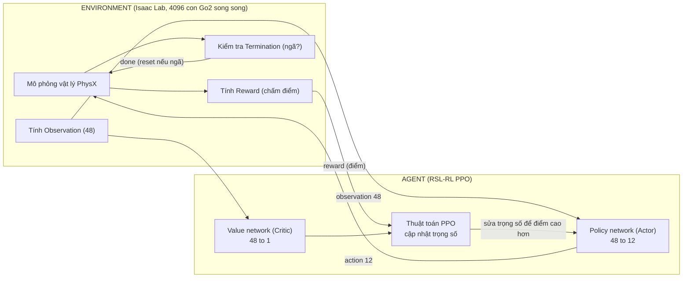
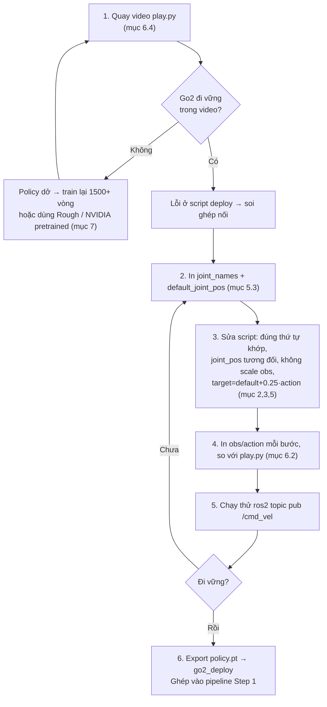

# STEP 1A — Train & Debug policy locomotion cho Go2 (vì sao ngã, cách sửa)

> **Bối cảnh:** Bạn đã train policy Go2 (300 vòng), nhưng khi **import vào Isaac Sim chạy thử thì Go2 ngã ngay lập tức**. Tài liệu này mổ xẻ **toàn bộ quá trình train RL** (input/output/reward/punish là gì), **nguyên nhân ngã**, **cách ghép nối 12 khớp cho đúng**, cách **xem input/output** để debug, và **các bước train ra 1 policy hoàn chỉnh** + **checklist kiểm tra**.

---

## 0. Chẩn đoán nhanh: "ngã NGAY khi import" nói lên điều gì

Thời điểm ngã tiết lộ nguyên nhân:

| Triệu chứng | Nguyên nhân nhiều khả năng |
|-------------|----------------------------|
| **Ngã ngay lập tức** (0.1–0.5 s đầu), giật đùng đùng | **Ghép nối sai**: thứ tự 12 khớp sai, hoặc thứ tự/scale 48-obs sai, hoặc thiếu default-offset. Policy nhận đầu vào "rác" → xuất lệnh loạn |
| Đứng được vài giây rồi từ từ đổ | Sai nhỏ: PD gain, tần số điều khiển (decimation), action_scale |
| Đi được nhưng run rẩy, dễ ngã khi có lệnh | **Policy chưa đủ tốt** (train quá ít vòng — 300 là quá ít) |
| Đi tốt trong `play.py` nhưng ngã trong script ROS2 của bạn | Chắc chắn là **ghép nối trong script deploy**, không phải policy |

> Của bạn là **ngã ngay** → 90% là **thứ tự khớp** hoặc **observation không khớp lúc train**. Đây là lỗi phổ biến nhất khi mang policy từ Isaac Lab ra deploy. Phần 5 & 6 là chỗ cần soi kỹ nhất.

---

## 1. Toàn cảnh: các thành phần trong MỘT lần train RL

Train RL = một vòng lặp **Agent ↔ Environment** theo mô hình MDP (Markov Decision Process).



| Thành phần | Được cụ thể hóa bằng | Vai trò |
|-----------|----------------------|---------|
| **Environment** | `UnitreeGo2FlatEnvCfg` (Python cfg) | Định nghĩa robot, obs, reward, termination, command |
| **Robot** | `go2.usd` + `UNITREE_GO2_CFG` | 12 khớp, PD gain, tư thế mặc định |
| **Observation** | `ObservationsCfg` | 48 số mô tả trạng thái (input policy) |
| **Action** | `ActionsCfg` (JointPositionAction, scale 0.25) | 12 số → góc khớp mục tiêu (output policy) |
| **Reward** | `RewardsCfg` | Hàm chấm điểm (thưởng/phạt) |
| **Termination** | `TerminationsCfg` | Khi nào cắt episode (ngã → reset) |
| **Command** | `CommandsCfg` | Sinh `/cmd_vel` ngẫu nhiên lúc train |
| **Agent (PPO)** | RSL-RL `train.py` + `PPORunnerCfg` | Học từ kinh nghiệm, cập nhật policy |
| **Policy (Actor)** | MLP 48→128→128→128→12 | "Bộ não biết đi" — thứ được export ra `.pt` |
| **Critic** | MLP 48→128→128→128→1 | Ước lượng "trạng thái này tốt cỡ nào" (chỉ dùng lúc train, không export) |

Nguồn: https://github.com/isaac-sim/IsaacLab (locomotion/velocity)

---

## 2. INPUT của policy — Observation = 48 số (chính xác từng term)

Isaac Lab gom obs theo thứ tự **cố định** dưới đây. **Cực kỳ quan trọng:** Isaac Lab **KHÔNG nhân hệ số scale** lên từng term (khác với `legged_gym` cũ hay nhân lin_vel×2.0, dof_vel×0.05). Lúc train chỉ **thêm nhiễu (noise)** để robust. → **Khi deploy phải đưa giá trị THÔ, không được tự nhân scale.**

| Thứ tự | Term | Số | Noise lúc train | Ghi chú deploy |
|--------|------|-----|-----------------|----------------|
| 1 | `base_lin_vel` | 3 | ±0.1 | Vận tốc tịnh tiến thân (frame thân) |
| 2 | `base_ang_vel` | 3 | ±0.2 | Vận tốc góc thân |
| 3 | `projected_gravity` | 3 | ±0.05 | Vector trọng lực chiếu theo thân (biết nghiêng/thẳng) |
| 4 | `velocity_commands` | 3 | 0 | **Chính là `/cmd_vel`: [vx, vy, wz]** |
| 5 | `joint_pos` | 12 | ±0.01 | **q − default_q** (tương đối!), đúng thứ tự khớp (phần 5) |
| 6 | `joint_vel` | 12 | ±1.5 | Tốc độ 12 khớp, đúng thứ tự |
| 7 | `actions` | 12 | 0 | Action ở bước TRƯỚC (raw, chưa scale) |
| | **Tổng** | **48** | | = `in_features=48` bạn thấy |

> **3 bẫy deploy hay khiến ngã ngay:**
> 1. Nhân scale kiểu legged_gym → sai (Isaac Lab không scale).
> 2. Dùng `joint_pos` tuyệt đối thay vì `q − default_q` → policy tưởng robot đang ở tư thế lạ.
> 3. Sắp sai thứ tự 12 khớp ở term 5, 6, 7 (phần 5).

> **Lưu ý:** `base_lin_vel` là term khó lấy trên robot THẬT (cần state estimator). Trong Isaac Sim thì có sẵn từ physics → không sao. Nếu sau này lên robot thật thì cần đổi sang policy không dùng lin_vel hoặc thêm estimator.

Nguồn: `velocity_env_cfg.py` (ObservationsCfg) — https://github.com/isaac-sim/IsaacLab

---

## 3. OUTPUT của policy — Action = 12 số

- Policy xuất **12 số thô** (raw action), **không phải góc tuyệt đối**.
- Cách biến thành lệnh khớp (Isaac Lab dùng `JointPositionAction`, `scale=0.25`, `use_default_offset=True`):

```
target_q[i] = default_q[i] + 0.25 × action[i]
```

- Sau đó PhysX chạy **PD** tại mỗi khớp: `τ = 25·(target_q − q) − 0.5·q̇`, cắt ở `±23.5 Nm`.
- **Deploy phải làm ĐÚNG 2 bước này.** Bỏ quên `default_q` (offset) hoặc `×0.25` → robot ngã ngay.

Giá trị `default_q` (tư thế đứng, rad):

| Khớp | Giá trị |
|------|---------|
| `*L_hip_joint` (trái) | **+0.1** |
| `*R_hip_joint` (phải) | **−0.1** |
| `F[L,R]_thigh_joint` (đùi trước) | **0.8** |
| `R[L,R]_thigh_joint` (đùi sau) | **1.0** |
| `*_calf_joint` (cẳng) | **−1.5** |

Nguồn: `UNITREE_GO2_CFG` — https://github.com/isaac-sim/IsaacLab (isaaclab_assets/robots/unitree.py)

---

## 4. REWARD & PUNISHMENT — chấm điểm thế nào (đầy đủ, có trọng số)

Mỗi bước, môi trường tính **tổng có trọng số** của nhiều thành phần. Dương = thưởng, âm = phạt. Đây chính là "mục tiêu" trong RL.

| Term | Trọng số | Thưởng/Phạt | Dạy robot điều gì |
|------|----------|-------------|-------------------|
| `track_lin_vel_xy_exp` | **+1.0** | Thưởng (chính) | Đi ĐÚNG vận tốc thẳng theo lệnh — sai càng ít điểm càng cao |
| `track_ang_vel_z_exp` | **+0.5** | Thưởng (chính) | Xoay đúng vận tốc góc theo lệnh |
| `feet_air_time` | **+0.125** | Thưởng | Nhấc chân đủ lâu → dáng bước tự nhiên, không lết |
| `lin_vel_z_l2` | **−2.0** | Phạt nặng | Cấm nhún nhảy lên xuống theo phương Z |
| `ang_vel_xy_l2` | −0.05 | Phạt | Cấm lắc lư (roll/pitch) |
| `flat_orientation_l2` | 0.0 | (tắt ở flat) | Giữ thân phẳng (bật ở rough) |
| `dof_torques_l2` | −1.0e-5 | Phạt nhẹ | Tiết kiệm mô-men (không gồng vô ích) |
| `dof_acc_l2` | −2.5e-7 | Phạt nhẹ | Chuyển động mượt, không giật |
| `action_rate_l2` | −0.01 | Phạt | Không đổi lệnh quá gấp giữa 2 bước → đỡ rung |
| `undesired_contacts` | **−1.0** | Phạt | Cấm đùi/thân chạm đất (chỉ bàn chân được chạm) |
| `dof_pos_limits` | 0.0 | (tắt) | Không vượt giới hạn khớp |

**Termination (điều kiện cắt episode):**

| Term | Ý nghĩa | Tác dụng |
|------|---------|----------|
| `base_contact` (ngưỡng lực > 1.0) | Thân chạm đất = **ngã** | Cắt ngay → reset về đứng thẳng → học lại |
| `time_out` (20 s) | Hết giờ episode | Reset bình thường |

**Command (lúc train sinh lệnh ngẫu nhiên để robot học mọi hướng):**

| Chiều | Dải giá trị |
|-------|-------------|
| `lin_vel_x` | −1.0 … 1.0 m/s |
| `lin_vel_y` | −1.0 … 1.0 m/s |
| `ang_vel_z` | −1.0 … 1.0 rad/s |

**Event (domain randomization — để policy khỏe, không overfit):**
- Startup: ngẫu nhiên hệ số ma sát, khối lượng thân ±5 kg, lệch tâm khối.
- Reset: vị trí/hướng/vận tốc/góc khớp ngẫu nhiên.
- Interval (10–15 s): **đẩy robot** ±0.5 m/s để tập giữ thăng bằng.

> **Ý nghĩa với việc "ngã":** Nếu policy của bạn train ít (300 vòng), phần `track_*` chưa đủ mạnh và robot chưa học xong việc chống `base_contact` → dễ ngã. Nhưng **ngã NGAY** thì không phải reward mà là ghép nối (phần 5).

Nguồn: `velocity_env_cfg.py` (RewardsCfg, TerminationsCfg, CommandsCfg, EventCfg) — https://github.com/isaac-sim/IsaacLab

---

## 5. GHÉP NỐI 12 KHỚP CHO ĐÚNG — nguyên nhân số 1 khiến ngã ngay

### 5.1. Vấn đề

Policy được train với **một thứ tự khớp cố định** (thứ tự articulation của Isaac Lab). Nếu script deploy đọc/ghi 12 khớp theo **thứ tự khác**, thì:
- Term `joint_pos`, `joint_vel` trong obs bị **xáo trộn** → policy nhận đầu vào rác.
- 12 action xuất ra bị gán **nhầm khớp** → lệnh chân trái chạy vào chân phải → ngã tức thì.

### 5.2. Hai thứ tự KHÁC NHAU (đây là cái bẫy)

| | Thứ tự |
|---|--------|
| **Isaac Lab** (gom theo LOẠI khớp) | `FL_hip, FR_hip, RL_hip, RR_hip,` `FL_thigh, FR_thigh, RL_thigh, RR_thigh,` `FL_calf, FR_calf, RL_calf, RR_calf` |
| **Unitree SDK / robot thật** (gom theo CHÂN) | `FR_hip, FR_thigh, FR_calf,` `FL_hip, FL_thigh, FL_calf,` `RR_...,` `RL_...` |

→ Nếu bạn viết script deploy theo thói quen "từng chân một" (kiểu Unitree SDK) trong khi policy train theo "từng loại khớp" của Isaac Lab → **sai hoàn toàn → ngã ngay**.

### 5.3. Cách lấy SỰ THẬT (không đoán): in ra `joint_names`

Thứ tự đúng = thứ tự mà chính articulation trả về. Luôn lấy từ đây, đừng hard-code theo trí nhớ:

```python
# chạy trong 1 script Isaac Sim/Isaac Lab đã load robot
print(robot.data.joint_names)     # <-- đây là thứ tự CHUẨN, dùng cho cả obs lẫn action
print(robot.data.default_joint_pos[0])
```

### 5.4. Quy tắc vàng khi deploy

1. Lấy `joint_names` từ articulation **một lần**, coi đó là thứ tự chuẩn.
2. **Đọc** `joint_pos`, `joint_vel` theo đúng thứ tự đó để dựng obs.
3. **Ghi** 12 action ra cũng theo đúng thứ tự đó (`set_joint_position_target` nhận mảng theo joint index của articulation).
4. Không tự sắp xếp lại. Nếu bắt buộc phải đổi (ví dụ nối sang Unitree SDK thật), làm một **bảng ánh xạ index** rõ ràng và test kỹ.

> Dùng lớp **`PolicyController`** của `isaacsim.robot.policy.examples` là an toàn nhất — nó đã lấy `joint_names` từ articulation và giữ nhất quán obs↔action. Bạn chỉ nạp `.pt` vào.

---

## 6. Cách XEM input/output thực tế để debug

### 6.1. Xem thứ tự & tư thế khớp
```python
print(robot.data.joint_names)         # thứ tự 12 khớp
print(robot.data.default_joint_pos)   # tư thế đứng mặc định
```

### 6.2. In observation & action mỗi bước (so khớp train vs deploy)
Trong vòng lặp deploy, tạm thêm:
```python
print("obs[:12] =", obs[0, :12])      # base vel(6)+gravity(3)+cmd(3)
print("cmd (obs 9:12) =", obs[0, 9:12])
print("action =", action[0])
```
So sánh dải giá trị với lúc `play.py` chạy trong Isaac Lab. Lệch nhiều (đặc biệt phần joint_pos) = ghép nối sai.

### 6.3. Xem đường cong reward khi train (TensorBoard)
```bash
cd ~/IsaacLab
tensorboard --logdir logs/rsl_rl/unitree_go2_flat --port 6006
# mở http://localhost:6006 (hoặc qua SSH port-forward)
```
Nhìn các đường: `Train/mean_reward` (phải tăng dần), `Episode/rew_track_lin_vel_xy_exp`, `Episode/termination_base_contact` (tỷ lệ ngã phải GIẢM dần).

### 6.4. Quay video policy chạy trong Isaac Lab (không cần màn hình)
```bash
./isaaclab.sh -p scripts/reinforcement_learning/rsl_rl/play.py \
  --task Isaac-Velocity-Flat-UnitreeGo2-Play --num_envs 16 \
  --headless --video --video_length 400
# video ở logs/rsl_rl/.../videos/  -> tải về xem Go2 có đi vững không
```
→ Nếu **video này Go2 đi tốt** mà import ra Isaac Sim vẫn ngã → chắc chắn lỗi ở **script deploy** (phần 5), không phải policy.

Nguồn: RSL-RL / Isaac Lab RL workflow — https://github.com/isaac-sim/IsaacLab

---

## 7. Các bước train MỘT policy hoàn chỉnh cho Go2

### 7.1. Train flat đủ lâu (300 vòng là quá ít)
```bash
cd ~/IsaacLab
./isaaclab.sh -p scripts/reinforcement_learning/rsl_rl/train.py \
  --task Isaac-Velocity-Flat-UnitreeGo2 --headless --num_envs 4096 \
  --max_iterations 1500
```
- **1500 vòng** cho flat (A10-24Q của bạn dư sức, vẫn nhanh). 300 vòng thường chưa vững.

### 7.2. (Khuyến nghị) Train Rough để robust hơn
```bash
./isaaclab.sh -p scripts/reinforcement_learning/rsl_rl/train.py \
  --task Isaac-Velocity-Rough-UnitreeGo2 --headless --num_envs 4096 \
  --max_iterations 3000
```
- Rough train trên địa hình gồ ghề + có `height_scan` → **ít ngã hơn nhiều** khi gặp lệnh lạ từ Nav2. Lưu ý: obs của Rough **KHÁC** (48 + height_scan), deploy phải cấp thêm height_scan hoặc dùng bản flat để đơn giản.

### 7.3. Kiểm chứng bằng video (mục 6.4) trước khi export.

### 7.4. Export & lưu policy
```bash
# play.py tự export ra logs/.../exported/policy.pt + policy.onnx
LOGDIR=$(ls -dt ~/IsaacLab/logs/rsl_rl/*/*/ | head -1)
mkdir -p ~/go2_deploy
cp $LOGDIR/exported/policy.pt ~/go2_deploy/go2_flat_policy.pt
```

### 7.5. Nếu vẫn không ổn → dùng policy pre-trained NVIDIA
`Robotics Examples > POLICY > Go2` (có sẵn `.pt` + `env.yaml`, chắc chắn chạy) để tách bạch lỗi pipeline vs lỗi policy.

---

## 8. CHECKLIST kiểm tra — kiểm tra gì, bằng gì, tác dụng gì

| # | Kiểm tra | Bằng lệnh / cách | Tác dụng (phát hiện lỗi gì) | Pass khi |
|---|----------|------------------|------------------------------|----------|
| 1 | Thứ tự 12 khớp | `print(robot.data.joint_names)` | Bắt lỗi sắp khớp Isaac-Lab vs Unitree | Deploy dùng ĐÚNG thứ tự này |
| 2 | Tư thế mặc định | `print(robot.data.default_joint_pos)` | Bắt lỗi quên default-offset | Khớp bảng ở mục 3 |
| 3 | Kích thước obs | `obs.shape` | Bắt thiếu/thừa term | = 48 (flat) |
| 4 | Thứ tự obs | In `obs[0, 9:12]` khi bơm `/cmd_vel` | Xác nhận cmd nằm đúng vị trí 9:12 | Đổi khi đổi cmd |
| 5 | Không tự scale obs | Đọc code deploy | Bắt lỗi nhân scale kiểu legged_gym | Dùng giá trị thô |
| 6 | joint_pos tương đối | Đọc code deploy | Bắt lỗi dùng q tuyệt đối | Dùng `q − default_q` |
| 7 | action_scale + offset | Đọc code | Bắt lỗi quên `×0.25` / `+default` | `target=default+0.25·action` |
| 8 | Tần số điều khiển | Đọc code | Bắt lỗi chạy policy sai nhịp | 50 Hz (decimation 4) |
| 9 | PD gain | Kiểm drive articulation | Bắt lỗi stiffness/damping | 25 / 0.5 |
| 10 | Video play.py | mục 6.4 | **Tách policy-dở vs deploy-sai** | Go2 đi vững trong video |
| 11 | Reward tăng (TensorBoard) | mục 6.3 | Xác nhận train hội tụ | `mean_reward` tăng, tỷ lệ ngã giảm |
| 12 | Chạy thử `/cmd_vel` | `ros2 topic pub /cmd_vel ...` | Nghiệm thu cuối | Go2 bước, không ngã |

**Thứ tự soi khi đang bị ngã:** 10 → 1 → 2 → 6 → 7 → 5 → 3 → 4. (Trước tiên xác định policy hay deploy; nếu deploy thì soi thứ tự khớp và các phép biến đổi obs/action.)

---

## 9. Các bước để làm được yêu cầu (tóm tắt lộ trình)



**Diễn giải:**
1. **Xác định lỗi ở đâu** bằng video play.py — đây là bước quan trọng nhất, tránh sửa nhầm chỗ.
2. Nếu policy dở → **train lại đủ lâu** (hoặc Rough / pretrained).
3. Nếu deploy sai → **lấy `joint_names` làm chuẩn**, sửa 4 phép biến đổi (thứ tự khớp, joint_pos tương đối, không scale, action_scale+offset).
4. **Xem input/output** để xác nhận đã khớp.
5. **Test bằng `/cmd_vel`** trực tiếp.
6. **Export & ghép** vào pipeline Step 1.

---

## 10. Nguồn tham khảo

| # | Nguồn | URL |
|---|-------|-----|
| 1 | Isaac Lab — Velocity Env Cfg (obs/reward/termination) | https://github.com/isaac-sim/IsaacLab (locomotion/velocity/velocity_env_cfg.py) |
| 2 | Isaac Lab — UNITREE_GO2_CFG (khớp, PD, default pose) | https://github.com/isaac-sim/IsaacLab (isaaclab_assets/robots/unitree.py) |
| 3 | Isaac Sim — RL Policy Examples (PolicyController, Go2) | https://docs.isaacsim.omniverse.nvidia.com/6.0.0/robot_simulation/ext_isaacsim_robot_policy_example.html |
| 4 | Isaac Sim — Running RL Policy through ROS 2 | https://docs.isaacsim.omniverse.nvidia.com/6.0.0/ros2_tutorials/tutorial_ros2_rl_controller.html |
| 5 | RSL-RL (PPO) | https://github.com/leggedrobotics/rsl_rl |
| 6 | (Nội bộ) `step1-go2-ros2-nav2-pipeline.md`, `setup-isaac-lab.md` | — |
