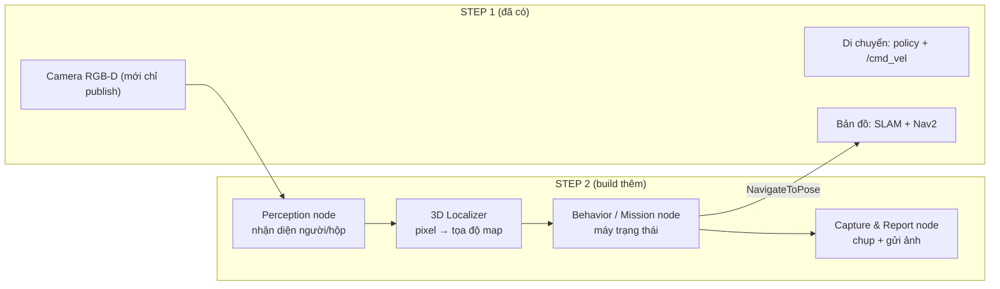
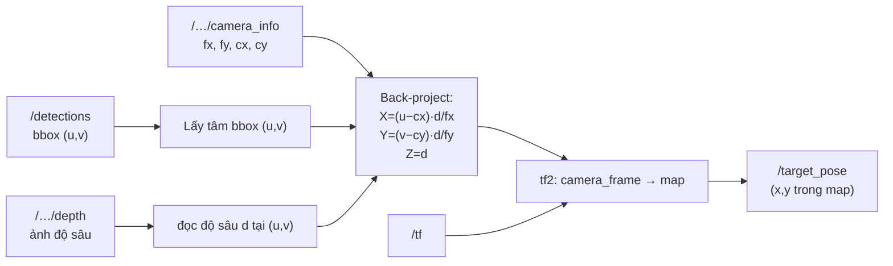
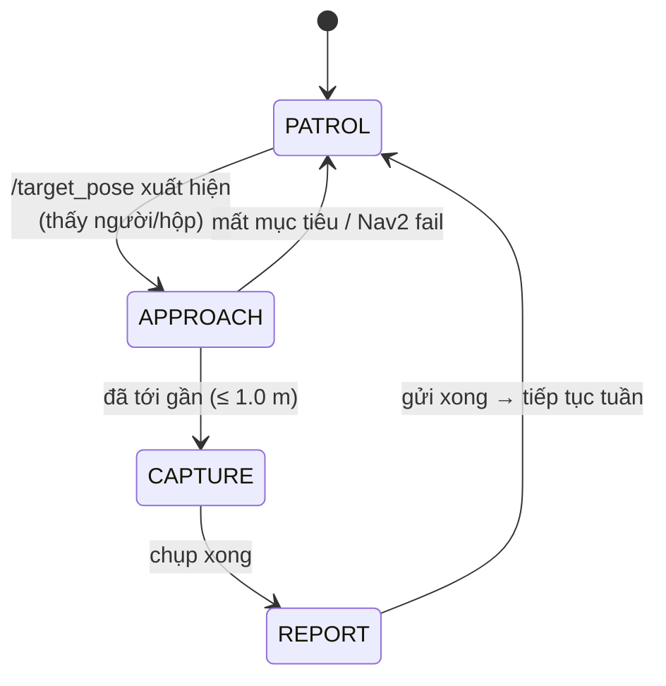
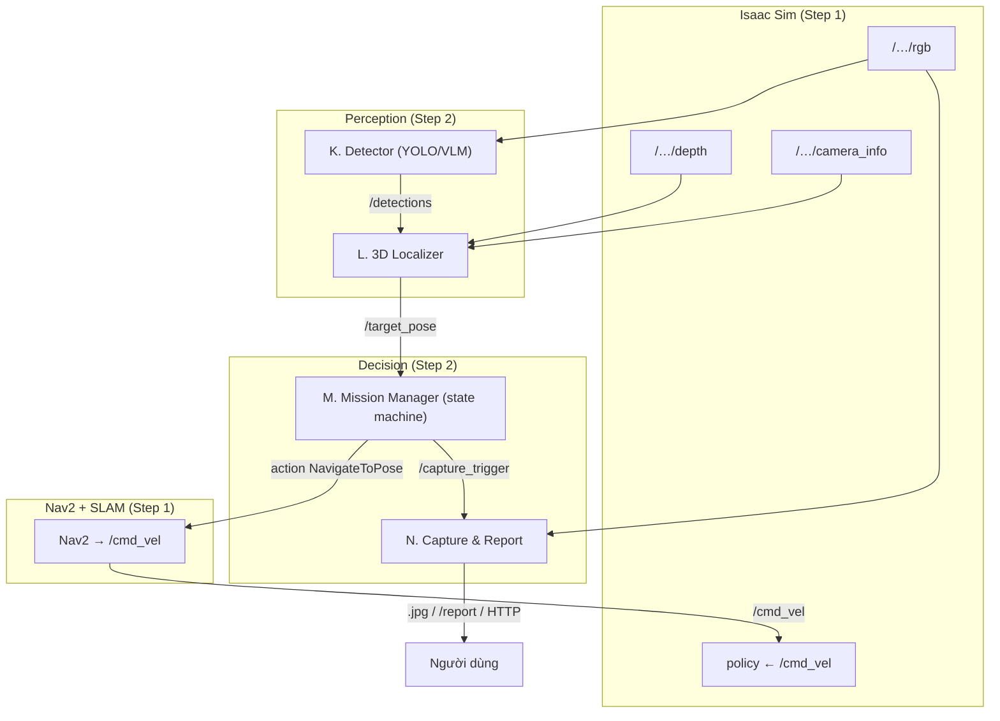
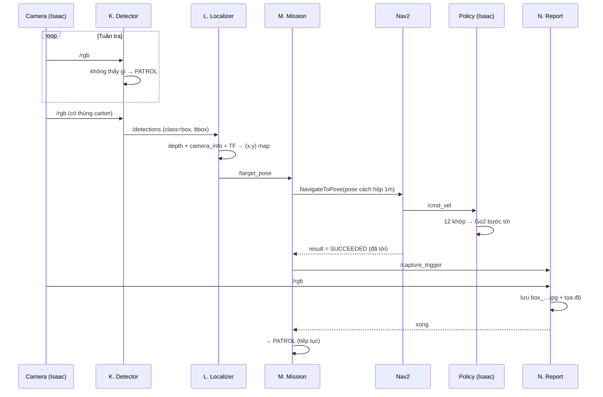

# STEP 2 — Cho Go2 làm nhiệm vụ: thấy người/hộp → chạy đến → chụp ảnh → gửi về

> **Mục tiêu Step 2:** Trên nền Step 1 (Go2 đã đi được, có `/cmd_vel`, camera RGB-D, `/scan`, SLAM, Nav2), thêm **lớp nhận thức (perception)** và **lớp ra quyết định (behavior)** để robot **tự làm nhiệm vụ cụ thể**. Ví dụ mẫu: *"đi tuần, khi thấy người hoặc thùng carton thì chạy tới, chụp ảnh, gửi ảnh về."*
>
> Tài liệu này liệt kê **thành phần mới cần build**, mỗi cái **được cụ thể hóa bằng gì**, **tại sao cần**, và **giao tiếp với nhau qua topic/action nào**.

---

## 0. Step 1 cho gì, Step 2 thêm gì

Step 1 giải quyết **"đi ở đâu, đi thế nào"** (di chuyển + bản đồ). Nó **không biết** trong ảnh có gì, cũng không tự quyết định phải làm gì.

Step 2 thêm 2 năng lực còn thiếu:

| Năng lực | Câu hỏi trả lời | Thiếu ở Step 1 vì |
|----------|-----------------|-------------------|
| **Perception (nhận thức)** | "Trước mặt là **cái gì**? ở **đâu** trên bản đồ?" | Nav2 chỉ thấy vật cản (occupied), không biết đó là *người* hay *hộp* |
| **Behavior (ra quyết định)** | "Thấy rồi thì **làm gì tiếp**?" | Nav2 chỉ đi tới 1 goal cho sẵn, không tự sinh nhiệm vụ |

---

## 1. Bảng tổng hợp thành phần mới ở Step 2

| # | Thành phần | Cụ thể hóa bằng | Tác dụng | Giao tiếp (in → out) |
|---|-----------|-----------------|----------|----------------------|
| K | **Perception / Object Detection** | ROS 2 node chạy YOLO / Isaac ROS / VLM | Tìm "person", "cardboard box" trong ảnh RGB | in `/…/rgb` → out `/detections` |
| L | **3D Localizer** | ROS 2 node (numpy + tf2) | Biến pixel vật thể → điểm 3D trong `map` | in `/detections` + `/…/depth` + `/…/camera_info` + `/tf` → out `/target_pose` |
| M | **Behavior / Mission Manager** | ROS 2 node (máy trạng thái) hoặc Behavior Tree | Quyết định: tuần → thấy → tới → chụp → báo | in `/target_pose` → out action `NavigateToPose`, cờ `capture` |
| N | **Capture & Report** | ROS 2 node | Chụp ảnh lúc tới nơi + gửi về (file/topic/web) | in `/…/rgb` + cờ `capture` → out file `.jpg` / `/report` / HTTP |
| O | **(tùy chọn) Object Memory / Map annotation** | node lưu danh sách vật thể đã thấy | Tránh chụp lại 1 vật, đánh dấu lên map | in `/target_pose` → out `/object_markers` |

---

## 2. Thành phần K — Perception / Object Detection

- **Nhiệm vụ:** đọc ảnh màu, trả về "trong ảnh có gì, hộp bao (bounding box) ở đâu, độ tự tin bao nhiêu".
- **Đầu vào:** `/go2/front_cam/rgb` (`sensor_msgs/Image`).
- **Đầu ra:** `/detections` (`vision_msgs/Detection2DArray`) — mỗi detection gồm: class (`person` / `box`), score, bbox (x, y, w, h) tính bằng pixel.

**3 lựa chọn triển khai** (chọn theo GPU A10-24Q của bạn — thừa sức mọi cách):

| Cách | Cụ thể hóa | Ưu | Nhược |
|------|-----------|----|-------|
| **YOLO** (khuyến nghị bắt đầu) | `ultralytics` YOLOv8/v11 trong 1 node Python | Nhanh, real-time, class `person` + `box` sẵn (COCO) | Class cố định theo tập train |
| **Isaac ROS Detection** | `isaac_ros_yolov8` / `isaac_ros_detectnet` (TensorRT) | Tối ưu GPU NVIDIA, độ trễ thấp | Cài đặt nặng hơn |
| **VLM (Gemini/GPT-V/LLaVA)** | node gọi VLM, hỏi bằng ngôn ngữ tự nhiên | Zero-shot: nhận "thùng carton" không cần train | Chậm hơn, cần API / model lớn |

> Dự án tham khảo `elder_and_dog` dùng đúng combo Go2 + Isaac Sim + slam_toolbox + Nav2 và **VLM (Gemini)** để nhận diện zero-shot rồi điều hướng tới vật — rất sát nhu cầu của bạn.

**Vì sao cần:** Nav2 costmap chỉ biết "có vật cản" chứ không phân biệt *người* với *kệ hàng*. Phải có detector để dán nhãn ngữ nghĩa.

Nguồn: https://github.com/roy4222/elder_and_dog · https://github.com/NVIDIA-ISAAC-ROS/isaac_ros_object_detection

---

## 3. Thành phần L — 3D Localizer (pixel → tọa độ trên map)

Detector chỉ cho biết vật ở **pixel (u, v)** trong ảnh. Muốn Nav2 đi tới, cần **tọa độ (x, y) trên map**. Đây là bước biến "thấy" thành "biết chỗ".

- **Đầu vào:** `/detections` + `/…/depth` + `/…/camera_info` + `/tf`.
- **Công thức back-projection** (từ pixel + độ sâu về điểm 3D trong hệ camera):
  - `X = (u − cx) · d / fx`
  - `Y = (v − cy) · d / fy`
  - `Z = d`
  (với `fx, fy, cx, cy` lấy từ `camera_info`; `d` là depth tại pixel tâm bbox)
- **Đổi hệ:** dùng `tf2` biến điểm từ `front_cam` frame → `map` frame (chuỗi TF này Step 1 đã dựng).
- **Đầu ra:** `/target_pose` (`geometry_msgs/PoseStamped`, frame `map`).

**Vì sao cần:** đây là mắt xích nối **camera (Step 2)** với **Nav2 (Step 1)**. Không có nó, detection chỉ là con số pixel vô nghĩa với bộ điều hướng.

Nguồn: https://github.com/roy4222/elder_and_dog

---

## 4. Thành phần M — Behavior / Mission Manager (bộ não nhiệm vụ)

Đây là nơi quyết định **trình tự hành động**. Cụ thể hóa bằng một **máy trạng thái** (state machine) hoặc **Behavior Tree**.

| Trạng thái | Làm gì | Ra lệnh gì |
|-----------|--------|-----------|
| **PATROL** (tuần) | Đi lòng vòng quét môi trường | gửi các goal tuần tới Nav2, hoặc quay `/cmd_vel` spin |
| **APPROACH** (tiếp cận) | Có `/target_pose` → tính pose dừng cách vật ~1 m → gửi Nav2 | action `NavigateToPose` |
| **CAPTURE** (chụp) | Tới nơi → dừng → ra cờ chụp | publish `/capture_trigger` |
| **REPORT** (báo) | Đợi ảnh gửi xong | — |

- **Đầu vào:** `/target_pose`, feedback/result của action `NavigateToPose`.
- **Đầu ra:** gọi **action client** `NavigateToPose` (tới Nav2), publish `/capture_trigger`.
- **Giao tiếp với Nav2:** qua **ROS 2 Action** (không phải topic) — vì hành trình có bắt đầu/feedback/kết quả, hủy được giữa chừng.

**Vì sao cần:** Nav2 chỉ biết "đi tới 1 điểm". Việc *quyết định điểm nào, khi nào chụp, khi nào tuần tiếp* là logic nhiệm vụ — phải có node riêng cầm nhịp.

Nguồn: https://docs.nav2.org/concepts/index.html (NavigateToPose action)

---

## 5. Thành phần N — Capture & Report (chụp ảnh + gửi về)

- **Nhiệm vụ:** khi nhận cờ `/capture_trigger`, chộp 1 frame `/…/rgb`, lưu và **gửi về**.
- **Đầu vào:** `/go2/front_cam/rgb` + `/capture_trigger` (+ kèm `/target_pose` để ghi metadata "chụp cái gì, ở đâu").
- **"Gửi về" — chọn kênh tùy nhu cầu:**

| Kênh gửi | Cụ thể hóa | Dùng khi |
|----------|-----------|----------|
| **Lưu file** | ghi `~/go2_reports/box_2026-07-13_14-05.jpg` | Đơn giản nhất, xem sau |
| **ROS 2 topic** | publish `/report` (`sensor_msgs/Image` hoặc `CompressedImage`) | Xem realtime trong RViz / node khác |
| **Web dashboard** | HTTP POST ảnh + tọa độ lên server nhỏ (Flask/FastAPI) | Xem từ máy khác qua trình duyệt |
| **Thông báo** | gửi qua bot (Telegram/Slack/email) | Cảnh báo tức thời |

- **Đầu ra:** file `.jpg` / `/report` / HTTP tùy chọn ở trên.

**Vì sao cần:** hoàn thành đúng yêu cầu "**chụp ảnh và gửi ảnh về**". Tách riêng node giúp đổi kênh gửi mà không đụng vào logic nhiệm vụ.

---

## 6. Thành phần O — Object Memory (tùy chọn, nên có khi tuần lâu)

- **Cụ thể hóa:** node lưu danh sách vật đã chụp `[(class, x, y, thời gian)]`.
- **Tác dụng:** tránh chụp đi chụp lại cùng 1 thùng; đánh dấu vị trí vật lên map (`visualization_msgs/MarkerArray` → hiện chấm trong RViz).
- **Giao tiếp:** in `/target_pose` → out `/object_markers`.

---

## 7. Toàn cảnh Step 2 ghép với Step 1

---

## 8. Luồng nhiệm vụ đầy đủ "thấy hộp → tới → chụp → gửi"

---

## 9. Ma trận giao tiếp Step 2 (ai nói với ai, bằng gì)

| Từ | Đến | Kênh | Message / Interface |
|----|-----|------|---------------------|
| Camera (Isaac) | K. Detector | topic | `/…/rgb` `sensor_msgs/Image` |
| K. Detector | L. Localizer | topic | `/detections` `vision_msgs/Detection2DArray` |
| Camera depth + info | L. Localizer | topic | `Image` + `CameraInfo` |
| L. Localizer | M. Mission | topic | `/target_pose` `geometry_msgs/PoseStamped` |
| M. Mission | Nav2 | **action** | `nav2_msgs/action/NavigateToPose` |
| Nav2 | Policy (Isaac) | topic | `/cmd_vel` `geometry_msgs/Twist` |
| M. Mission | N. Report | topic | `/capture_trigger` `std_msgs/Empty` |
| N. Report | Người dùng | file / topic / HTTP | `.jpg` / `/report` / POST |
| L. Localizer | O. Memory | topic | `/target_pose` → `/object_markers` |

---

## 10. Vì sao cần từng thành phần (tóm tắt logic)

1. **Detector (K)** — để robot **phân biệt** người/hộp với vật cản thường. Không có → chỉ biết "có gì đó chắn đường".
2. **3D Localizer (L)** — để **nối mắt (camera) với chân (Nav2)**: pixel → tọa độ map. Không có → biết có hộp nhưng không biết đi tới đâu.
3. **Mission Manager (M)** — để **tự sinh nhiệm vụ và cầm nhịp** (tuần → tới → chụp → tuần). Không có → chỉ đi tới 1 điểm rồi đứng im.
4. **Capture & Report (N)** — để **hoàn thành mục tiêu** (chụp + gửi). Đây là "sản phẩm" người dùng nhận.
5. **Object Memory (O)** — để nhiệm vụ **bền vững** khi chạy lâu (không lặp, có bản đồ vật thể).

---

## 11. Lộ trình triển khai Step 2 (thứ tự nên làm)

| Giai đoạn | Làm gì | Nghiệm thu |
|-----------|--------|-----------|
| 2.1 | Viết **Detector node** (YOLO), in `/detections` | `ros2 topic echo /detections` thấy class person/box |
| 2.2 | Viết **Localizer node**, in `/target_pose` | RViz thấy mũi tên pose đúng chỗ thùng |
| 2.3 | Viết **Mission node** gọi `NavigateToPose` khi có target | Go2 tự đi tới thùng |
| 2.4 | Viết **Capture & Report node** | Có file `.jpg` xuất ra khi tới nơi |
| 2.5 | Ghép máy trạng thái đầy đủ (PATROL↔APPROACH↔CAPTURE↔REPORT) | Chạy tuần liên tục, gặp là xử lý |
| 2.6 (mở rộng) | Thêm Object Memory, nhiều class, nhiều nhiệm vụ | Marker trên map, không chụp trùng |

---

## 12. Mở rộng về sau (định hướng)

- **Nhiều loại nhiệm vụ:** đổi bảng "class → hành động" (thấy người → chào/ghi hình; thấy hộp → chụp; thấy lửa → báo động).
- **Ngôn ngữ tự nhiên:** dùng VLM để ra lệnh kiểu "tìm cho tôi cái thùng màu nâu" (như `elder_and_dog`).
- **Semantic map:** kết hợp `/object_markers` với `/map` → bản đồ ngữ nghĩa (biết chỗ nào có gì).
- **Sim → Real:** vì toàn bộ dùng ROS 2 chuẩn, cùng stack này cắm sang Go2 thật chỉ cần đổi nguồn topic (Isaac → SDK Go2 thật).

---

## 13. Nguồn tham khảo

| # | Nguồn | URL |
|---|-------|-----|
| 1 | elder_and_dog — Go2 + Isaac + SLAM + Nav2 + VLM tìm vật | https://github.com/roy4222/elder_and_dog |
| 2 | Isaac ROS Object Detection (YOLOv8/DetectNet) | https://github.com/NVIDIA-ISAAC-ROS/isaac_ros_object_detection |
| 3 | Ultralytics YOLO | https://github.com/ultralytics/ultralytics |
| 4 | Nav2 — NavigateToPose action & concepts | https://docs.nav2.org/concepts/index.html |
| 5 | vision_msgs (Detection2DArray) | https://github.com/ros-perception/vision_msgs |
| 6 | isaac-go2-ros2 (camera/lidar/odom publisher) | https://github.com/Zhefan-Xu/isaac-go2-ros2 |
| 7 | (Tham chiếu nội bộ) `step1-go2-ros2-nav2-pipeline.md` | — |
